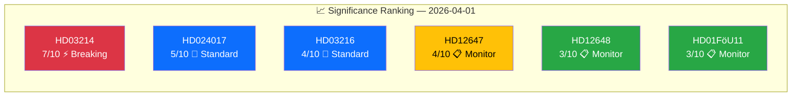

# 📈 Significance Scoring — 2026-04-01

## 📋 Context

| Field | Value |
|-------|-------|
| **Scoring ID** | SIG-2026-04-01-001 |
| **Date** | 2026-04-01 10:33 UTC |
| **Documents Scored** | 6 |
| **Produced By** | news-realtime-monitor |

---

## 📊 Scoring Results

### Detailed Scoring

| dok_id | Title | Base | Defense | Budget | Parties | Minister | Approval | Recent | **Total** | Decision |
|--------|-------|:----:|:------:|:------:|:-------:|:--------:|:--------:|:------:|:---------:|----------|
| HD03214 | Cybersecurity Center | 2 | +2 | 0 | +1 | +1 | +1 | 0 | **7** | ⚡ Breaking |
| HD024017 | S vs bidragstak | 1 | 0 | +2 | +1 | 0 | 0 | 0 | **5** | 📰 Standard |
| HD03216 | Municipal healthcare | 2 | 0 | 0 | 0 | +1 | +1 | 0 | **4** | 📰 Standard |
| HD12647 | Nuclear guarantees | 1 | +2 | 0 | +1 | +1 | 0 | 0 | **4** | 📋 Monitor |
| HD12648 | Iran embassy | 1 | 0 | 0 | +1 | +1 | 0 | 0 | **3** | 📋 Monitor |
| HD01FöU11 | Maritime rescue | 1 | +1 | 0 | 0 | 0 | +1 | 0 | **3** | 📋 Monitor |

---

## 📋 Document Control

| **Created** | 2026-04-01 10:33 UTC | **Framework** | Significance Scoring v2.1 |
