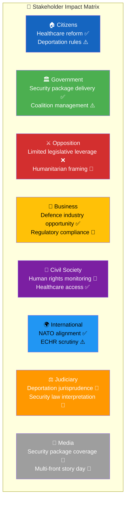

# Stakeholder Impact Analysis — 2026-04-01

**Generated**: 2026-04-01 14:43 UTC
**Documents Analyzed**: 66
**Confidence**: HIGH

---

## 📊 Stakeholder Impact Dashboard

## Detailed Stakeholder Assessment

### 🏠 Citizens

| Impact Area | Assessment | Key Document | Confidence |
|-------------|-----------|:------------:|:----------:|
| Healthcare quality | Positive — HD03216 strengthens municipal medical competence | HD03216 | H |
| Criminal justice safety | Mixed — HD03235 stricter deportation may improve safety but raises rights concerns | HD03235 | M |
| Social services | Under debate — SoU19 children/youth services contested by 7 parties | SoU19 debate | H |
| Elderly care | Positive — SoU26 language requirements improve care quality | HDC320260401SoU26 | H |
| Cybersecurity | Positive — HD03214 strengthens national cyber defense | HD03214 | H |

### 🏛️ Government Coalition

| Impact Area | Assessment | Key Document | Confidence |
|-------------|-----------|:------------:|:----------:|
| Tidö Agreement delivery | Strong — deportation + security package fulfills core commitments | HD03235, HD03228, HD03214 | H |
| SD relationship | Stabilized — migration reform secures cooperation agreement | HD03235 | H |
| Pre-election positioning | Favorable — security + healthcare dual narrative | All propositions | M |
| Coalition cohesion | Minor strain — L on migration, KD on healthcare | HD03235, HD03216 | M |

### ⚔️ Opposition (S + V + MP)

| Impact Area | Assessment | Key Document | Confidence |
|-------------|-----------|:------------:|:----------:|
| Legislative influence | Limited — 96% motion rejection rate continues | Synthesis data | H |
| Healthcare counter-narrative | Opportunity — can highlight implementation gaps | HD03216 | M |
| Human rights positioning | V and MP can mobilize civil society on HD03235 | HD03235 | M |
| Defense consensus trap | Constrained — S supports NATO, limiting attack surface on HD03228 | HD03228 | H |

### 💼 Business Sector

| Impact Area | Assessment | Key Document | Confidence |
|-------------|-----------|:------------:|:----------:|
| Defence industry | Major opportunity — Saab, BAE Bofors benefit from HD03228 | HD03228 | H |
| Cybersecurity sector | Growth catalyst — HD03214 creates demand for cyber services | HD03214 | M |
| Healthcare providers | New requirements — HD03216 competence mandates affect staffing | HD03216 | M |

### 🌍 International Community

| Impact Area | Assessment | Key Document | Confidence |
|-------------|-----------|:------------:|:----------:|
| NATO allies | Positive signal — Sweden modernizes defense framework | HD03228, HD03214 | H |
| EU institutions | ECHR scrutiny expected on deportation reform | HD03235 | M |
| Human rights organizations | Alert status — deportation rule changes require monitoring | HD03235 | H |

### ⚖️ Judiciary

| Impact Area | Assessment | Key Document | Confidence |
|-------------|-----------|:------------:|:----------:|
| Migration courts | Significant workload change — reduced judicial discretion on deportation | HD03235 | H |
| Administrative courts | Security protection cases may increase from JuU29 | HDC320260401JuU29 | M |

### 📰 Media

| Impact Area | Assessment | Key Document | Confidence |
|-------------|-----------|:------------:|:----------:|
| News cycle | High — multi-front story day with security package, healthcare, and terrorism votes | All | H |
| Investigative angles | ECHR implications, arms export destinations, municipal cost burden | HD03235, HD03228, HD03216 | M |
