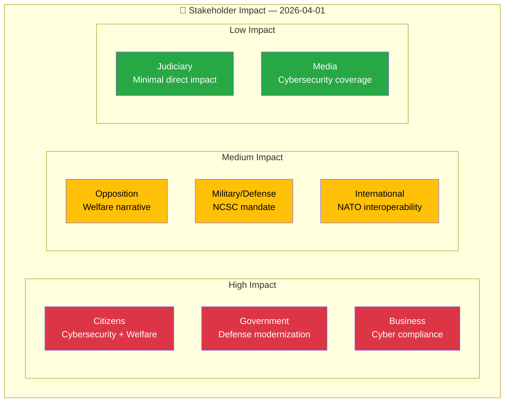

# 👥 Stakeholder Impact Analysis — 2026-04-01

## 📋 Context

| Field | Value |
|-------|-------|
| **Analysis ID** | STK-2026-04-01-001 |
| **Date** | 2026-04-01 10:32 UTC |
| **Produced By** | news-realtime-monitor |

---

## 📊 Stakeholder Impact Matrix

### Summary Matrix

| Stakeholder | Cybersecurity (HD03214) | Welfare Reform (HD024017) | Healthcare (HD03216) | Iran Policy (HD12648) |
|-------------|:-----------------------:|:------------------------:|:--------------------:|:---------------------:|
| Citizens | ✅ Positive | ❓ Contested | ✅ Positive | ↔ Neutral |
| Government | ✅ Positive | ↔ Expected | ✅ Positive | ↔ Managed |
| Opposition | ↔ Likely support | 📢 Core message | ↔ Likely support | ↔ Varied |
| Business | ✅ Clarity | ↔ Indirect | ↔ Indirect | ↔ Neutral |
| Civil Society | ✅ Digital rights | ⚠️ Concern | ✅ Positive | ↔ Neutral |
| International | ✅ NATO aligned | ↔ Neutral | ↔ Neutral | 🔍 Monitoring |
| Judiciary | ↔ Minimal | ↔ Implementation | ↔ Minimal | ↔ Minimal |
| Media | 📰 High interest | 📰 Electoral angle | 📰 Moderate | 📰 Diplomatic angle |

---

## 📋 Document Control

| **Created** | 2026-04-01 10:32 UTC | **Framework** | Stakeholder Impact v2.1 |
