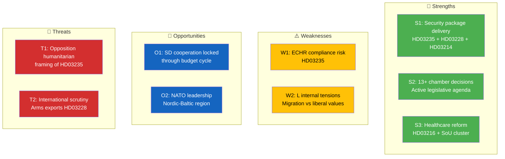
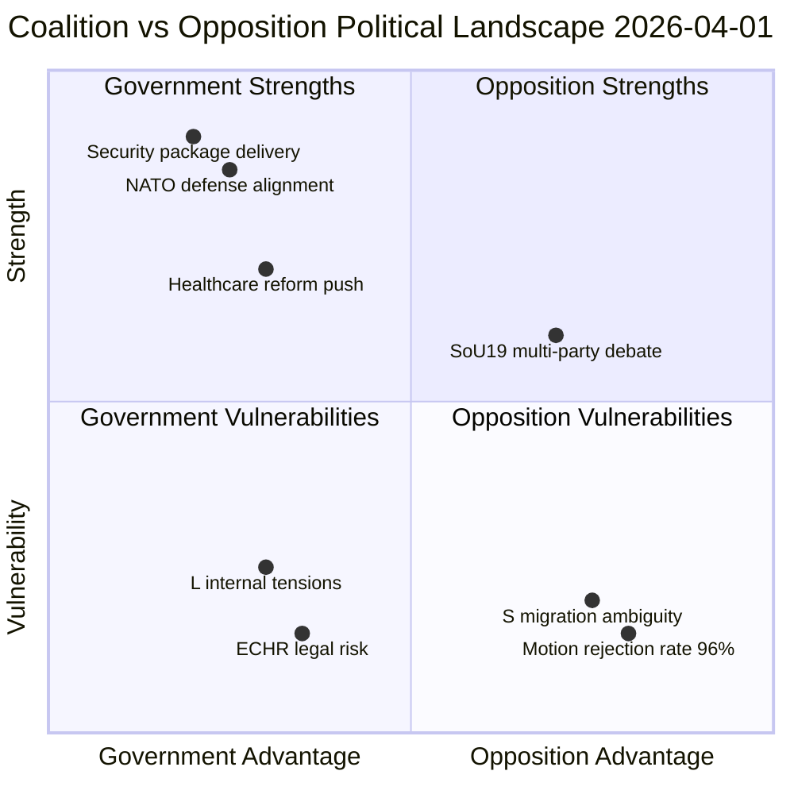

# Political SWOT Analysis — 2026-04-01

**Generated**: 2026-04-01 14:40 UTC
**Data Sources**: get_propositioner, get_betankanden, search_dokument, search_voteringar, search_anforanden, search_regering
**Documents Analyzed**: 66
**Confidence**: HIGH

---

## 📋 SWOT Context

| Field | Value |
|-------|-------|
| **SWOT ID** | SWT-2026-04-01-001 |
| **Analysis Date** | 2026-04-01 14:40 UTC |
| **Analysis Scope** | Government coalition + Main opposition |
| **Reference Period** | 2026-W14 (April 1) |
| **Produced By** | news-realtime-monitor |
| **Primary MCP Sources** | get_propositioner, get_betankanden, search_dokument, search_regering |
| **Validity Window** | Valid until 2026-04-08 |

---

## 📊 SWOT Overview

---

## 🏛️ Section 1: Government Coalition SWOT

### ✅ Strengths — Government Coalition

| # | Strength Statement | Evidence (dok_id) | Confidence | Impact | Entry Date |
|---|-------------------|-------------------|:----------:|:------:|:----------:|
| S1 | Delivers comprehensive national security package — arms regulation (HD03228), cybersecurity center (HD03214), stricter deportation (HD03235) on single day | HD03228, HD03214, HD03235 | H | H | 2026-04-01 |
| S2 | Active legislative agenda with 13+ chamber decisions demonstrates governing capacity | HDC320260401JuU14, HDC320260401FöU6, HDC320260401UU7 | H | H | 2026-04-01 |
| S3 | Healthcare reform push (HD03216, SoU16, SoU17, SoU22, SoU26) addresses voter concerns | HD03216, HD01SoU16, HD01SoU17 | H | M | 2026-04-01 |
| S4 | Bipartisan support expected on cybersecurity and defense — reduces coalition vulnerability | HD03214, HD03228 | M | H | 2026-04-01 |

**Coalition Strength Summary:** The government demonstrates strong legislative output with a coordinated security-healthcare policy package. The simultaneous release of defense and migration propositions signals strategic messaging discipline ahead of the 2026 election cycle.

---

### ⚠️ Weaknesses — Government Coalition

| # | Weakness Statement | Evidence (dok_id) | Confidence | Impact | Entry Date |
|---|-------------------|-------------------|:----------:|:------:|:----------:|
| W1 | Deportation reform (HD03235) creates potential ECHR compliance risk — may generate legal challenges | HD03235 | M | H | 2026-04-01 |
| W2 | L faces internal tension between liberal migration stance and coalition loyalty on HD03235 | HD03235 | M | M | 2026-04-01 |
| W3 | Arms export liberalization (HD03228) risks reputational damage if end-use controls weaken | HD03228 | M | M | 2026-04-01 |
| W4 | Healthcare competence mandate (HD03216) imposes unfunded costs on municipalities | HD03216 | M | M | 2026-04-01 |

**Coalition Weakness Summary:** The migration-security package, while politically advantageous, carries legal and internal cohesion risks. L's dual identity as liberal party supporting stricter migration creates a latent fault line.

---

### 🚀 Opportunities — Government Coalition

| # | Opportunity Statement | Evidence (dok_id) | Confidence | Impact | Entry Date |
|---|----------------------|-------------------|:----------:|:------:|:----------:|
| O1 | Security package locks in SD cooperation through budget cycle, stabilizing minority government | HD03235, HD03228, HD03214 | H | H | 2026-04-01 |
| O2 | NATO-aligned defense reforms position Sweden as alliance leader in Nordic-Baltic region | HD03228, HD03214 | H | H | 2026-04-01 |
| O3 | Healthcare reform wave addresses 2026 election priority — healthcare consistently top voter concern | HD03216, HD01SoU16, HD01SoU17 | H | H | 2026-04-01 |

**Coalition Opportunity Summary:** The government has a window to consolidate security and healthcare narratives as dual election pillars, with SD support secured through Tidö deliverables.

---

### 🔴 Threats — Government Coalition

| # | Threat Statement | Evidence (dok_id) | Confidence | Impact | Entry Date |
|---|-----------------|-------------------|:----------:|:------:|:----------:|
| T1 | Opposition may unite on humanitarian grounds against deportation reform, framing government as extreme | HD03235 | M | H | 2026-04-01 |
| T2 | International scrutiny of arms export liberalization could damage Sweden's peace-building brand | HD03228 | M | M | 2026-04-01 |
| T3 | Pre-election cycle intensifies — every policy becomes electoral ammunition | All today's propositions | H | M | 2026-04-01 |

**Coalition Threat Summary:** The main risk vector is opposition framing of the migration package as disproportionate, especially if ECHR challenges materialize. The pre-election dynamic amplifies all policy disputes.

---

## 🏛️ Section 2: Main Opposition SWOT

**Opposition Subject:** Social Democrats (S) + V + MP bloc

### ✅ Strengths — Opposition

| # | Strength Statement | Evidence (dok_id) | Confidence | Impact | Entry Date |
|---|-------------------|-------------------|:----------:|:------:|:----------:|
| S1 | Multi-party debate on SoU19 (children in social services) shows opposition engagement across 7 parties | SoU19 debate (M, S, SD, V, MP, L, C speakers) | H | M | 2026-04-01 |
| S2 | S healthcare policy expertise provides counter-narrative to government's HD03216 | HD03216, HD01SoU16 | M | M | 2026-04-01 |

### ⚠️ Weaknesses — Opposition

| # | Weakness Statement | Evidence (dok_id) | Confidence | Impact | Entry Date |
|---|-------------------|-------------------|:----------:|:------:|:----------:|
| W1 | High motion rejection rate (96% denial) limits legislative impact | synthesis data | H | H | 2026-04-01 |
| W2 | S migration policy ambiguity — caught between pragmatism and progressive base | HD03235 context | M | H | 2026-04-01 |

### 🚀 Opportunities — Opposition

| # | Opportunity Statement | Evidence (dok_id) | Confidence | Impact | Entry Date |
|---|----------------------|-------------------|:----------:|:------:|:----------:|
| O1 | ECHR challenge to HD03235 could validate opposition human rights critique | HD03235 | M | H | 2026-04-01 |
| O2 | Healthcare quality concerns create electoral opening if municipal implementation fails | HD03216 | M | M | 2026-04-01 |

### 🔴 Threats — Opposition

| # | Threat Statement | Evidence (dok_id) | Confidence | Impact | Entry Date |
|---|-----------------|-------------------|:----------:|:------:|:----------:|
| T1 | Government security package resonates with voters, squeezing S on law-and-order | HD03235, HD03228, HD03214 | H | H | 2026-04-01 |
| T2 | Bipartisan defense consensus on NATO issues removes opposition attack surface | HD03228, HD03214 | H | M | 2026-04-01 |

---

## 🔄 SWOT Quadrant Mapping

---

## 🔄 TOWS Strategic Options

| Strategy | Description | Evidence |
|----------|-------------|----------|
| **SO (Strength-Opportunity)** | Government leverages security package to lock SD support and dominate election narrative on safety | HD03235 + HD03228 + HD03214 |
| **WO (Weakness-Opportunity)** | L trades migration discomfort for coalition influence on liberal economic policy | HD03235 + coalition dynamics |
| **ST (Strength-Threat)** | Government uses bipartisan defense consensus to neutralize opposition criticism | HD03228 + HD03214 |
| **WT (Weakness-Threat)** | Opposition exploits ECHR risk to frame government as reckless on rights | HD03235 + international law |

---

## 📊 Strategic Implications

### Key Watch Items

1. **S party board response** to deportation proposition within 1-2 weeks
2. **Committee assignment** of HD03235, HD03228, HD03214 — timing signals government urgency
3. **Municipal response** to healthcare mandates (SKR position expected within weeks)
4. **Pre-election campaign** framing of today's security package

### Document Control

| Field | Value |
|-------|-------|
| **Version** | 1.0 |
| **Classification** | Public |
| **Next Review** | 2026-04-08 |
