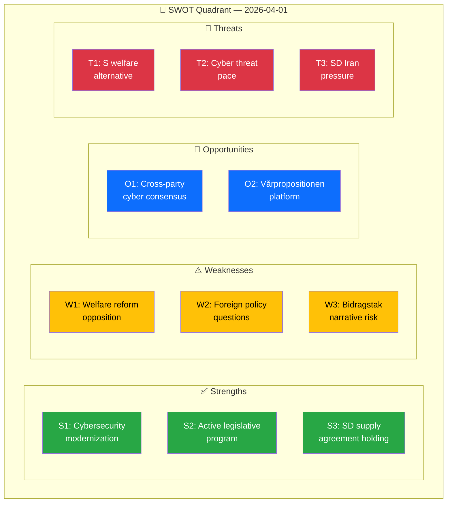

# 💼 Political SWOT Analysis — 2026-04-01

## 📋 SWOT Context

| Field | Value |
|-------|-------|
| **SWOT ID** | SWT-2026-04-01-001 |
| **Analysis Date** | 2026-04-01 10:30 UTC |
| **Analysis Scope** | Government coalition legislative activity |
| **Reference Period** | 2026-W14 (March 31 – April 1) |
| **Produced By** | news-realtime-monitor |
| **Primary MCP Sources** | get_propositioner, search_dokument, search_voteringar, search_regering |
| **Validity Window** | Valid until 2026-04-08 |

---

## 🏛️ Government Coalition SWOT

### ✅ Strengths

| # | Strength Statement | Evidence (dok_id) | Confidence | Impact | Entry Date |
|---|-------------------|-------------------|:----------:|:------:|:----------:|
| S1 | Government demonstrates proactive defense modernization with cybersecurity center legislation | HD03214 (prop 2025/26:214) | H | H | 2026-04-01 |
| S2 | Active legislative program — 2 new propositions submitted on single day spanning defense and healthcare | HD03214 + HD03216 | H | M | 2026-04-01 |
| S3 | Coalition maintaining working majority — SD supply agreement holding on security legislation | search_voteringar (AU10 passage) | H | H | 2026-04-01 |
| S4 | Government press releases show coordinated policy rollout across multiple departments | search_regering (12 press releases March 31) | M | M | 2026-04-01 |

**Coalition Strength Summary:** The Tidö coalition demonstrates legislative productivity and strategic focus on defense/security modernization, leveraging SD support to advance its security agenda.

---

### ⚠️ Weaknesses

| # | Weakness Statement | Evidence (dok_id) | Confidence | Impact | Entry Date |
|---|-------------------|-------------------|:----------:|:------:|:----------:|
| W1 | Welfare reform propositions facing coordinated S opposition — risk of political cost ahead of 2026 election | HD024017 + HD024016 (S counter-motions) | H | H | 2026-04-01 |
| W2 | Multiple written questions target government foreign policy handling — Iran, nuclear policy, human trafficking ambassador | HD12648, HD12647, HD12655 | M | M | 2026-04-01 |
| W3 | Government narrative challenged on welfare state — S framing bidragstak as attacking vulnerable families | HD024017 (motion text) | H | H | 2026-04-01 |

**Coalition Weakness Summary:** The government faces growing opposition pressure on both welfare reform and foreign policy, with S building a coordinated electoral counter-narrative.

---

### 🔄 Opportunities

| # | Opportunity Statement | Evidence (dok_id) | Confidence | Impact | Entry Date |
|---|----------------------|-------------------|:----------:|:------:|:----------:|
| O1 | Cybersecurity legislation likely to gain cross-party support — defense consensus in post-NATO environment | HD03214 + geopolitical context | H | H | 2026-04-01 |
| O2 | Vårpropositionen announcement (April 13) provides platform for government budget narrative | HD0I102 (föredragningslista) | H | H | 2026-04-01 |
| O3 | EU foreign ministers meeting provides government visibility on international stage | search_regering (Malmer Stenergard at EU meeting) | M | M | 2026-04-01 |

---

### 🔴 Threats

| # | Threat Statement | Evidence (dok_id) | Confidence | Impact | Entry Date |
|---|-----------------|-------------------|:----------:|:------:|:----------:|
| T1 | S building comprehensive welfare policy alternative ahead of 2026 election — bidragstak becomes symbolic issue | HD024017 + HD024016 | H | H | 2026-04-01 |
| T2 | Geopolitical cyber threats may outpace legislative response — NCSC reform timing critical | HD03214 context | M | H | 2026-04-01 |
| T3 | SD using parliamentary questions to push government on Iran — diplomatic pressure from supply partner | HD12648 + cluster | M | M | 2026-04-01 |

---

## 📊 SWOT Quadrant Map

---

## 🔀 TOWS Strategic Options

| Strategy | Combination | Option |
|----------|-------------|--------|
| **SO** (Strengths × Opportunities) | S1 + O1 | Leverage cybersecurity consensus to build broader defense cooperation narrative |
| **WO** (Weaknesses × Opportunities) | W1 + O2 | Use vårpropositionen to reframe welfare reform as investment in work incentives |
| **ST** (Strengths × Threats) | S3 + T3 | Use SD supply agreement to channel Iran pressure through diplomatic channels |
| **WT** (Weaknesses × Threats) | W3 + T1 | Counter S welfare narrative with data on employment outcomes |

---

## 📋 Document Control

| Field | Value |
|-------|-------|
| **Created** | 2026-04-01 10:30 UTC |
| **Framework** | SWOT Analysis v2.1 |
| **MCP Tools Used** | get_propositioner, search_dokument, search_voteringar, search_regering |
