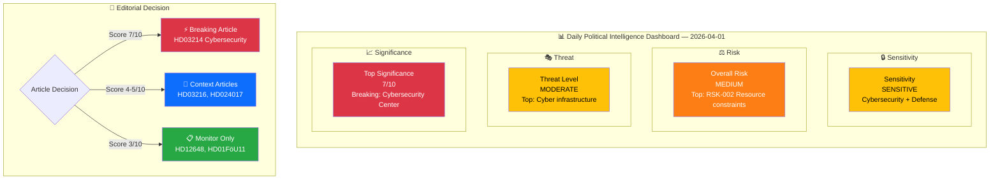

# 🧩 Political Intelligence Synthesis — 2026-04-01

## 📋 Synthesis Context

| Field | Value |
|-------|-------|
| **Synthesis ID** | SYN-2026-04-01-001 |
| **Analysis Date** | 2026-04-01 10:28 UTC |
| **Documents Analyzed** | 6 |
| **Analysis Period** | 2026-03-31 to 2026-04-01 |
| **Produced By** | news-realtime-monitor |
| **Overall Confidence** | MEDIUM |

---

## 📊 Intelligence Dashboard

---

## 🔑 Cross-Document Patterns

### Theme 1: Defense & National Security Modernization
The cybersecurity center proposition (HD03214) anchors today's legislative activity, supported by written questions on nuclear security guarantees (HD12647) and the FöU maritime rescue committee report (HD01FöU11). Pattern: the Tidö coalition is systematically strengthening Sweden's defense infrastructure post-NATO accession.

### Theme 2: Social Welfare Reform Battleground
S opposition motions (HD024017, HD024016) against the government's social assistance reform signal an intensifying ideological contest ahead of the 2026 election. The government proposes benefit caps and activity requirements; S frames this as attacking vulnerable families.

### Theme 3: Foreign Policy Assertiveness
The Iran embassy question cluster (HD12648, HD12634, HD12635, HD12639) by SD's Björn Söder tests the government's willingness to escalate diplomatically with Iran. Meanwhile, S probes nuclear security guarantees (HD12647). Both opposition flanks are pressuring the government on foreign policy.

---

## 📊 Document Significance Ranking

| Rank | dok_id | Title | Score | Rationale |
|------|--------|-------|:-----:|-----------|
| 1 | HD03214 | Cybersecurity Center (prop) | 7/10 | Defense/security legislation, national security infrastructure |
| 2 | HD024017 | S motion vs bidragstak | 5/10 | Budget implications, welfare ideological contest |
| 3 | HD03216 | Municipal healthcare (prop) | 4/10 | Healthcare reform, social policy |
| 4 | HD12647 | Nuclear security guarantees | 4/10 | Defense/foreign policy, NATO implications |
| 5 | HD12648 | Iran embassy cluster | 3/10 | Foreign policy, SD-M dynamics |
| 6 | HD01FöU11 | Maritime rescue audit | 3/10 | Defense committee, environmental safety |

---

## 🔮 Forward Intelligence

1. **Riksdag voting at 16:00** — KU29 "Offentlig förvaltning" debate with multi-party speakers scheduled
2. **Vårpropositionen** — Spring budget debate announced for April 13 (per today's föredragningslista HD0I102)
3. **FöU committee processing** of HD03214 — watch for fast-track signals
4. **SoU committee** will process both welfare reform propositions and S counter-motions

---

## 📋 Document Control

| Field | Value |
|-------|-------|
| **Created** | 2026-04-01 10:28 UTC |
| **Framework** | Synthesis v2.1 |
| **MCP Tools Used** | search_dokument, get_propositioner, get_betankanden, search_voteringar, search_anforanden, search_regering |
