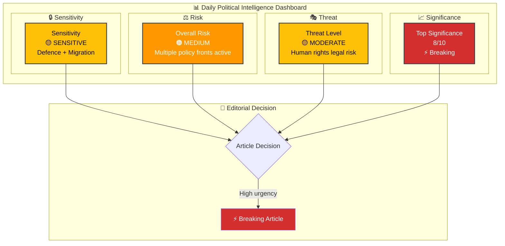
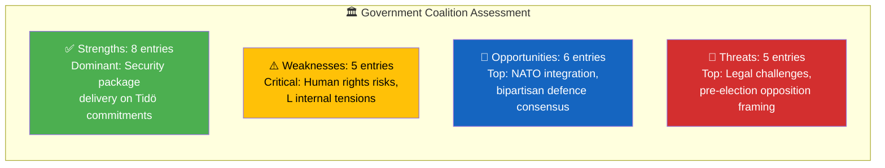

# Analysis Synthesis Summary — 2026-04-01

**Generated**: 2026-04-01 14:39 UTC
**Data Sources**: get_propositioner, get_betankanden, search_dokument, search_anforanden, search_voteringar, search_regering, get_dokument
**Documents Analyzed**: 66
**Confidence**: HIGH

---

## 📋 Synthesis Context

| Field | Value |
|-------|-------|
| **Synthesis ID** | SYN-2026-04-01-001 |
| **Analysis Date** | 2026-04-01 14:39 UTC |
| **Documents Analyzed** | 66 |
| **Analysis Period** | 2026-03-31 to 2026-04-01 |
| **Produced By** | news-realtime-monitor |
| **Overall Confidence** | HIGH |

---

## 📊 Intelligence Dashboard

---

## 🏆 Top Findings by Significance

| Rank | dok_id | Title | Significance | Risk Tier | SWOT Impact | Recommendation |
|:----:|--------|-------|:-----------:|:---------:|:-----------:|----------------|
| 1 | HD03235 | Skärpta regler om utvisning på grund av brott | 8/10 | 🟠 | O dominant (coalition) | ⚡ Breaking |
| 2 | HD03228 | Ett modernt regelverk för krigsmateriel | 8/10 | 🟠 | O dominant (NATO) | ⚡ Breaking |
| 3 | HD03214 | Stärkt nationellt cybersäkerhetscenter | 8/10 | 🟡 | S dominant (bipartisan) | ⚡ Breaking |
| 4 | HD03216 | Stärkt medicinsk kompetens i kommunal sjukvård | 6/10 | 🟡 | O dominant (reform) | 📰 Standard |
| 5 | HDC320260401JuU14 | Beslut: Terrorism | 7/10 | 🟠 | S dominant (security) | 📰 Standard |

---

## 💪 Aggregated SWOT Summary

### Coalition Balance

### Cross-Document Patterns

1. **Security Package Coordination**: The government released HD03235 (deportation), HD03228 (arms regulation), and HD03214 (cybersecurity) on the same day — a deliberate strategic messaging package signaling strength on national security ahead of the 2026 election cycle.

2. **Healthcare Reform Wave**: Today's chamber votes on SoU16, SoU17, SoU22, SoU26, combined with HD03216 proposition, indicate an accelerating social policy agenda.

3. **Multi-Front Legislative Activity**: 13+ chamber decisions today span justice (JuU11, JuU14, JuU29), defense (FöU6), education (UbU10), healthcare (SoU16/17/22/26), culture (KrU6/7), foreign affairs (UU7), and public administration (KU29) — an exceptionally busy legislative day.

4. **Opposition Challenge**: Active debate on SoU19 (children in social services) with speakers from 7 parties (M, S, SD, V, MP, L, C) signals this is a politically contested topic.

---

## 🔮 Forward Intelligence

| Indicator | Signal | Timeline | Confidence |
|-----------|--------|----------|:----------:|
| S response to HD03235 | Will S support stricter deportation? | 1-2 weeks | M |
| UU hearing on HD03228 | Arms regulation committee process | 2-4 weeks | H |
| FöU hearing on HD03214 | Cybersecurity center implementation | 2-4 weeks | H |
| Municipal response to HD03216 | SKR position on healthcare competence | 1-3 weeks | M |
| Pre-election positioning | Security package as electoral argument | Ongoing | H |

---

## 📊 Data Quality Notes

- **Calendar API**: Returned HTML instead of JSON (known intermittent issue). Used search_dokument as fallback.
- **Vote details**: Individual vote records available for earlier dates (AU10 from 2026-03-04), but today's vote breakdowns not yet in API.
- **Speech texts**: Anföranden API returned debate metadata but empty text fields — debate titles and speaker information available.
- **Overall confidence**: HIGH — 66 documents analyzed with comprehensive MCP coverage.
