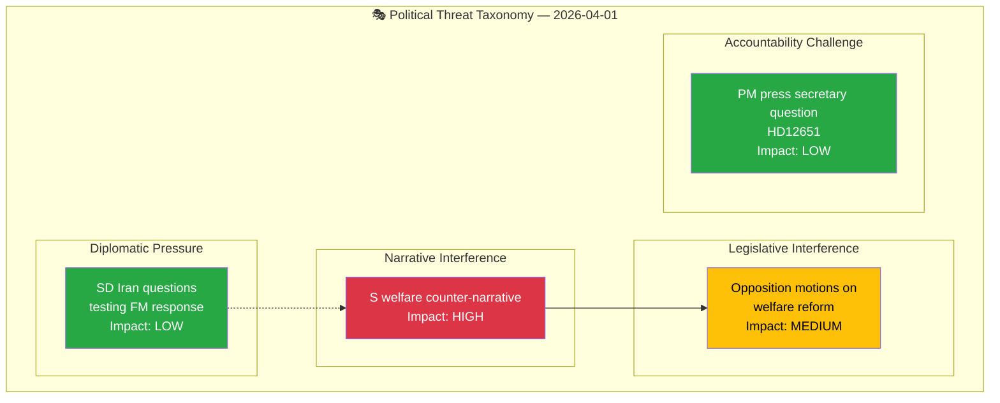

# 🔴 Political Threat Analysis — 2026-04-01

## 📋 Threat Context

| Field | Value |
|-------|-------|
| **Threat Assessment ID** | THR-2026-04-01-001 |
| **Date** | 2026-04-01 10:31 UTC |
| **Produced By** | news-realtime-monitor |
| **Overall Threat Level** | MODERATE |

---

## 📊 Threat Landscape

### Threat Register

| ID | Category | Description | Likelihood | Impact | Evidence |
|----|----------|-------------|:----------:|:------:|----------|
| THR-001 | Narrative Interference | S welfare counter-narrative gaining traction | 3 | 4 | HD024017, HD024016 |
| THR-002 | Legislative Interference | S motions delay welfare reform implementation | 2 | 3 | HD024017, HD024016 |
| THR-003 | Diplomatic Pressure | SD pushing hawkish Iran line via frs mechanism | 2 | 2 | HD12648 cluster |
| THR-004 | Accountability Challenge | S questioning PM press secretary conduct | 2 | 2 | HD12651 |

---

## 📋 Document Control

| **Created** | 2026-04-01 10:31 UTC | **Framework** | Threat Analysis v3.1 |
