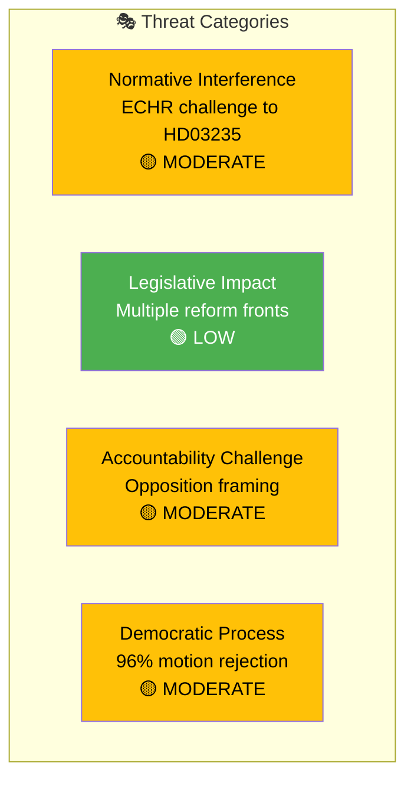

# Political Threat Analysis — 2026-04-01

**Generated**: 2026-04-01 14:41 UTC
**Documents Analyzed**: 66
**Confidence**: HIGH
**Threat Level**: 🟡 MODERATE

---

## 📊 Threat Landscape

## Threat Register

| Category | Threat | Actor | Target | Severity | Evidence |
|----------|--------|-------|--------|:--------:|----------|
| Normative Interference | ECHR/EU legal challenge to deportation reform | International courts | HD03235 implementation | 🟡 MODERATE | HD03235 human rights implications |
| Accountability Challenge | Opposition unity on humanitarian critique | S, V, MP | Government migration policy | 🟡 MODERATE | SoU19 multi-party debate |
| Democratic Process | High motion rejection rate limits opposition voice | Structural | Parliamentary balance | 🟡 MODERATE | 96% motion denial rate |
| Legislative Impact | Arms export framework change | Government | Defence industry regulation | 🟢 LOW | HD03228 — bipartisan expected |

## Key Threat Vectors

1. **International legal risk**: HD03235 (deportation) creates potential ECHR friction — the government must demonstrate proportionality safeguards
2. **Pre-election polarization**: The security package becomes electoral ammunition, increasing threat of policy over-simplification in public debate
3. **Coalition micro-fractures**: L's liberal identity creates quiet dissent risk on migration votes even if party leadership complies
