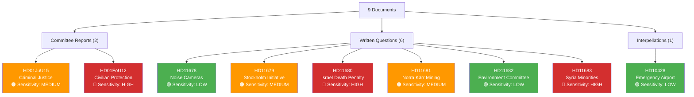

# Political Classification Results — 2026-04-02

**CLS-ID**: CLS-2026-04-02-001
**Generated**: 2026-04-02 18:15 UTC
**Riksmöte**: 2025/26
**Documents Classified**: 9
**Confidence**: MEDIUM

---

## Classification Decision Tree

## Per-Document Classification Table

| dok_id | Title | Type | Sensitivity | Domain | Urgency | Significance (0-10) |
|--------|-------|------|-------------|--------|---------|---------------------|
| HD01JuU15 | Kriminalvårdsfrågor | bet | MEDIUM | Justice & Law | MEDIUM | 6 |
| HD01FöU12 | Starkare skydd civilbefolkningen | bet | HIGH | Defense & Security | HIGH | 7 |
| HD11678 | Bullerkameror | fråga | LOW | Justice & Infrastructure | LOW | 3 |
| HD11679 | Stockholmsinitiativet | fråga | MEDIUM | Foreign Policy & Arms Control | MEDIUM | 5 |
| HD11680 | Israels dödsstraffslag | fråga | HIGH | Foreign Policy & Human Rights | HIGH | 7 |
| HD11681 | Norra Kärr | fråga | MEDIUM | Environment & Economy | MEDIUM | 5 |
| HD11682 | Miljömålsberedningen | fråga | LOW | Environment | LOW | 4 |
| HD11683 | Kristna i Syrien | fråga | HIGH | Foreign Policy & Human Rights | HIGH | 6 |
| HD10428 | Beredskapsflygplats | ip | LOW | Infrastructure & Defense | LOW | 4 |

## Data Quality Notes

Classification based on document metadata, titles, and available summaries. Full-text unavailable for committee reports. Confidence: MEDIUM.
