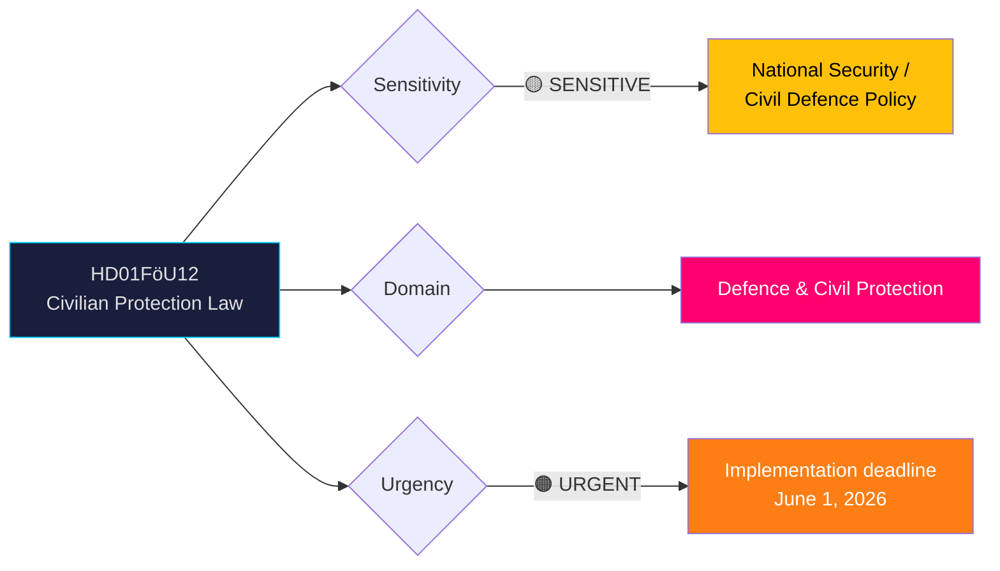
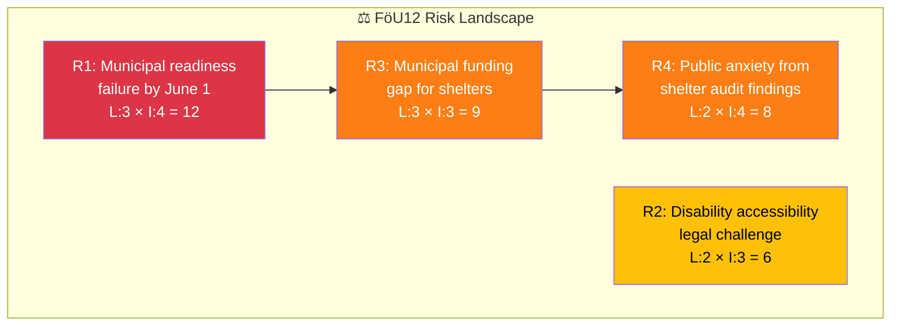
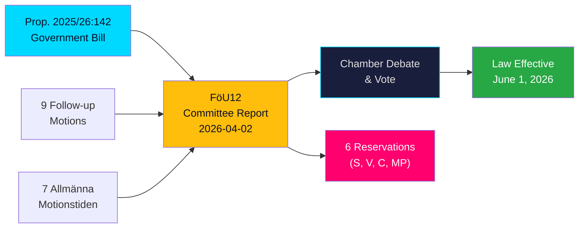

# 🔍 Per-File Political Intelligence Analysis

## 📋 Document Identity

| Field | Value |
|-------|-------|
| **Document ID** | `HD01FöU12` |
| **Document Type** | `committeeReports` |
| **Title** | Ett starkare skydd för civilbefolkningen vid höjd beredskap (Stronger Protection for Civilians During Heightened Preparedness) |
| **Date** | 2026-04-02 |
| **Riksmöte** | 2025/26 |
| **Committee** | FöU (Defence Committee) |
| **Source MCP Tool** | `get_betankanden` |
| **Analysis Timestamp** | 2026-04-03 04:51 UTC |
| **Analyst** | news-committee-reports |
| **Related Proposition** | Prop. 2025/26:142 |

---

## 🎯 Executive Summary

The Defence Committee (FöU) endorses the government's Proposition 2025/26:142 introducing a landmark new law on shelters and protected spaces, creating a modernized civilian protection framework for heightened preparedness. This is one of the most consequential civil defence bills in decades, establishing "skyddade utrymmen" (protected spaces) as a new category alongside traditional "skyddsrum" (shelters), mandating municipal information obligations, and strengthening property owner responsibilities. The law takes effect June 1, 2026. Opposition parties (S, V, C, MP) support the core legislation but filed 6 reservations on implementation feasibility, disability accessibility, and scope. This is a high-significance defence policy milestone with direct citizen impact. **[HIGH]**

---

## 📊 Political Classification

| Dimension | Value | Rationale |
|-----------|-------|-----------|
| **Sensitivity** | 🟡 SENSITIVE | Civil defence legislation with national security implications |
| **Domain** | Defence & Civil Protection | Shelter infrastructure, emergency preparedness, civilian safety |
| **Urgency** | 🟠 URGENT | Law effective June 1, 2026 — 2 months implementation window |
| **Significance** | 8/10 | Landmark civil defence reform; direct impact on all municipalities and property owners |

---

## 💼 SWOT Analysis

### ✅ Strengths — Government Coalition

| # | Statement | Evidence (dok_id) | Confidence | Impact | Entry Date |
|---|-----------|-------------------|:----------:|:------:|:----------:|
| S1 | Broad cross-party support for core shelter law — even opposition supports the fundamental legislation | HD01FöU12 — opposition reservations are on implementation details, not the law itself | HIGH | High | 2026-04-02 |
| S2 | Based on Prop. 2025/26:142, a well-prepared government bill with comprehensive new regulatory framework | HD01FöU12 — utskottet ställer sig bakom regeringens förslag | HIGH | High | 2026-04-02 |
| S3 | New "skyddade utrymmen" category expands civilian protection beyond traditional shelters | HD01FöU12 — new law introduces dual protection system | HIGH | High | 2026-04-02 |
| S4 | Clear implementation date (June 1, 2026) demonstrates policy delivery capability | HD01FöU12 — lagändringarna föreslås träda i kraft den 1 juni 2026 | HIGH | Medium | 2026-04-02 |

### ❌ Weaknesses — Government Coalition

| # | Statement | Evidence (dok_id) | Confidence | Impact | Entry Date |
|---|-----------|-------------------|:----------:|:------:|:----------:|
| W1 | Implementation feasibility questioned — S and V reservation (Reservation 1) challenges readiness | HD01FöU12, Reservation 1 (S, V) — förutsättningar för genomförbarhet | MEDIUM | High | 2026-04-02 |
| W2 | Disability accessibility not adequately addressed in original proposal — 3 opposition parties raise concerns independently | HD01FöU12, Reservations 2 (V), 3 (C), 4 (MP) — all raise tillgänglighet för funktionsnedsättning | HIGH | Medium | 2026-04-02 |
| W3 | Tight 2-month implementation window (April–June 2026) for municipalities | HD01FöU12 — effective June 1, 2026 | MEDIUM | Medium | 2026-04-02 |

### 🔄 Opportunities

| # | Statement | Evidence (dok_id) | Confidence | Impact | Entry Date |
|---|-----------|-------------------|:----------:|:------:|:----------:|
| O1 | Legislation strengthens Sweden's NATO interoperability on civil protection standards | HD01FöU12 — modernized framework aligns with NATO CIMIC expectations | MEDIUM | High | 2026-04-02 |
| O2 | Municipal information mandate creates new public engagement on preparedness | HD01FöU12 — kommunerna skyldiga att informera invånarna | HIGH | Medium | 2026-04-02 |

### ⚠️ Threats

| # | Statement | Evidence (dok_id) | Confidence | Impact | Entry Date |
|---|-----------|-------------------|:----------:|:------:|:----------:|
| T1 | Underfunded implementation could create paper compliance without real shelter capacity | HD01FöU12, Reservation 1 (S, V) — genomförbarhet concerns | MEDIUM | High | 2026-04-02 |
| T2 | Disability accessibility gaps could trigger discrimination complaints under UN CRPD | HD01FöU12, Reservations 2, 3, 4 — tillgänglighet concerns from V, C, MP independently | MEDIUM | Medium | 2026-04-02 |

---

## ⚠️ Risk Assessment

| Risk ID | Risk Description | Likelihood (1-5) | Impact (1-5) | L×I Score | Confidence |
|---------|-----------------|:-----------------:|:------------:|:---------:|:----------:|
| R1 | Municipal readiness failure — shelters not operational by June 1, 2026 | 3 | 4 | 12 | MEDIUM |
| R2 | Disability accessibility legal challenge under anti-discrimination law | 2 | 3 | 6 | MEDIUM |
| R3 | Funding gap — municipalities lack resources for shelter upgrades and information campaigns | 3 | 3 | 9 | MEDIUM |
| R4 | Public anxiety spike if shelter condition audits reveal widespread deficiencies | 2 | 4 | 8 | LOW |

---

## 👥 Stakeholder Impact (8 Groups)

| Stakeholder Group | Impact | Assessment | Evidence |
|-------------------|:------:|------------|----------|
| **Citizens** | High | Direct impact — new shelter and protected space obligations affect all residents; municipal information mandate | HD01FöU12 — kommunerna skyldiga att informera invånarna om tillgängliga skyddsalternativ |
| **Government Coalition** | Positive | Major policy delivery win — landmark civil defence legislation passed with committee support | HD01FöU12 — government proposition endorsed |
| **Opposition Bloc** | Constructive | Support core law but flag implementation concerns; accessibility reservations show policy depth | HD01FöU12, Reservations 1-6 |
| **Business/Industry** | High | Property owners bear direct new obligations for shelter readiness and maintenance | HD01FöU12 — fastighetsägares ansvar förstärks |
| **Civil Society** | High | Disability organizations directly affected — 3 parties independently raise accessibility concerns | HD01FöU12, Reservations 2 (V), 3 (C), 4 (MP) |
| **International/EU** | Medium | Strengthens Sweden's civil defence posture within NATO framework; signals serious preparedness investment | HD01FöU12 — modernized civil protection |
| **Judiciary/Constitutional** | Low | New regulatory framework will require administrative court capacity for enforcement | HD01FöU12 — new law with enforcement provisions |
| **Media/Public Opinion** | High | Shelter policy is highly visible since Russia-Ukraine war; public expects concrete preparedness measures | HD01FöU12 — addresses public concern |

---

## 🔮 Forward Indicators

| # | What to Watch | Trigger | Timeline | Confidence |
|---|---------------|---------|----------|:----------:|
| F1 | Chamber vote on FöU12 — broad bipartisan passage expected but watch roll-call on Reservations 1-6 | Scheduling of FöU12 chamber debate | Within 2 weeks | HIGH |
| F2 | Municipal implementation readiness assessments — are shelters being inspected? | MSB (Civil Contingencies Agency) reporting | April-May 2026 | HIGH |
| F3 | Related Prop. 2025/26:214 (cybersecurity center) — defence modernization package coherence | FöU committee processing | Q2 2026 | MEDIUM |
| F4 | Prop. 2025/26:228 (arms export modernization) — related defence policy stream | UU/FöU processing | Q2-Q3 2026 | MEDIUM |

---

## 📊 Legislative Pipeline

---

**Document Control:** Analysis generated 2026-04-03 04:51 UTC by news-committee-reports workflow. Classification: PUBLIC. Valid until 2026-04-16.
