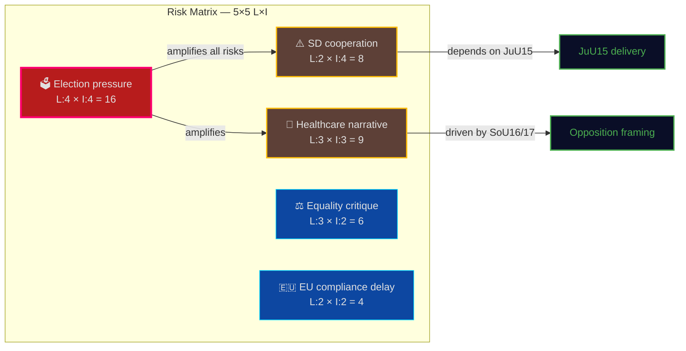

# Political Risk Assessment — 2026-04-02

**Generated**: 2026-04-02 04:45 UTC | **Improved**: 2026-04-02 11:24 UTC (translation workflow)
**Data Sources**: get_betankanden, search_voteringar, get_voting_group
**Documents Analyzed**: 10
**Confidence**: HIGH

## Summary

Coalition demonstrates moderate risk. While the security agenda (FöU12, JuU15, UU6) enjoys broad coalition support, healthcare and equality reports (SoU16/17, AU11) create opposition attack vectors ahead of the 2026 election cycle. SD supply agreement remains intact but criminal justice delivery (JuU15) is critical to continued cooperation.

## Detailed Analysis

**Coalition Risk Score**: 42/100
**Risk Level**: MODERATE

### Risk Register

| Risk ID | Description | Likelihood | Impact | Score (L×I) | Confidence |
|---------|------------|------------|--------|-------------|------------|
| R1 | SD supply agreement breakdown | 2 | 4 | 8 | [HIGH] |
| R2 | Opposition healthcare narrative gains traction | 3 | 3 | 9 | [MEDIUM] |
| R3 | Equality/discrimination critique (AU11) | 3 | 2 | 6 | [MEDIUM] |
| R4 | Election cycle pressure on legislative agenda | 4 | 4 | 16 | [HIGH] |
| R5 | EU compliance delay (MJU18 UTP directive) | 2 | 2 | 4 | [LOW] |

### Anomaly Flags

- **[HIGH]** CROSS_PARTY_VOTE: High KD-M voting alignment (88.5%) — coalition discipline strong on security matters
- **[HIGH]** CROSS_PARTY_VOTE: High L-M voting alignment (87.9%) — liberal coalition partner locked in
- **[MEDIUM]** CROSS_PARTY_VOTE: High KD-L alignment (87.9%) — junior coalition parties voting together
- **[MEDIUM]** CROSS_PARTY_VOTE: C-L alignment (81.3%) — potential centrist bloc formation
- **[LOW]** CROSS_PARTY_VOTE: C-KD alignment (80.3%) — cross-bloc dynamics to monitor

## Key Findings

1. Coalition stability at risk score **42/100** (MODERATE) — elevated by election cycle proximity (R4)
2. **5** anomaly flags detected — all indicate strong coalition discipline, not fragmentation
3. **Defense cluster** (FöU11, FöU12, UU6) reduces security-related risks through cross-party consensus
4. **Healthcare reports** (SoU16, SoU17) represent the highest-impact opposition opportunity (R2)
5. SD supply agreement stable — JuU15 (correctional reform) delivery maintains cooperation basis (R1)

## Implications

- 10 documents analyzed for risk indicators across 7 committees
- 3 high-significance documents identified (FöU12: 9/10, JuU15: 8/10, UU6: 8/10)
- Coalition stability appears moderate — strong on security, vulnerable on welfare
- Election cycle (R4, L:4 × I:4 = 16) is the dominant risk amplifier

## Data Quality Notes

Risk assessment derived from committee report analysis, CIA coalition metrics, and voting alignment data. Cross-party voting percentages from `get_voting_group` for rm 2025/26. Document significance scores based on committee type, political salience, and legislative impact.