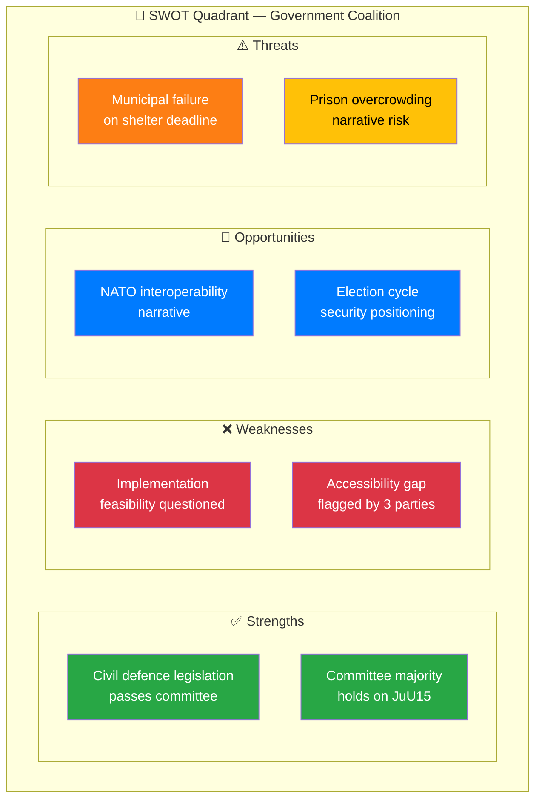

# 💼 Political SWOT Analysis — Committee Reports

## 📋 SWOT Context

| Field | Value |
|-------|-------|
| **SWOT ID** | SWT-2026-04-02-CR01 |
| **Analysis Date** | 2026-04-03 04:53 UTC |
| **Analysis Scope** | Government coalition vs. Opposition — Criminal Corrections & Civil Defence |
| **Reference Period** | 2026-W14 |
| **Produced By** | news-committee-reports |
| **Primary MCP Sources** | get_betankanden, get_dokument_innehall |
| **Validity Window** | Valid until 2026-04-16 |

---

## 🏛️ Section 1: Government Coalition SWOT

### ✅ Strengths

| # | Strength Statement | Evidence (dok_id) | Confidence | Impact | Entry Date |
|---|-------------------|-------------------|:----------:|:------:|:----------:|
| S1 | Landmark civil defence legislation passes committee with broad support | HD01FöU12 — utskottet ställer sig bakom Prop. 2025/26:142 | HIGH | High | 2026-04-02 |
| S2 | Committee majority holds on all 76 criminal corrections motions | HD01JuU15 — all motions recommended for rejection | HIGH | Medium | 2026-04-02 |
| S3 | New dual shelter system (skyddsrum + skyddade utrymmen) demonstrates policy innovation | HD01FöU12 — new protection category introduced | HIGH | High | 2026-04-02 |
| S4 | No cross-party defections from government bloc (M, KD, L, SD) on either report | HD01JuU15, HD01FöU12 — all reservations from S, V, C, MP only | HIGH | Medium | 2026-04-02 |

### ❌ Weaknesses

| # | Weakness Statement | Evidence (dok_id) | Confidence | Impact | Entry Date |
|---|-------------------|-------------------|:----------:|:------:|:----------:|
| W1 | Implementation feasibility questioned on FöU12 — tight June 1 deadline | HD01FöU12, Reservation 1 (S, V) | MEDIUM | High | 2026-04-02 |
| W2 | Disability accessibility gap identified by 3 parties independently | HD01FöU12, Reservations 2 (V), 3 (C), 4 (MP) | HIGH | Medium | 2026-04-02 |
| W3 | 76 corrections motions rejected without counter-proposals signals policy gap | HD01JuU15 — mass rejection citing ongoing work | MEDIUM | Medium | 2026-04-02 |
| W4 | No concrete Trygghetsberedningen implementation timeline | HD01JuU15, Reservation 1 (S, V, C, MP) | MEDIUM | Medium | 2026-04-02 |

### 🔄 Opportunities

| # | Opportunity Statement | Evidence (dok_id) | Confidence | Impact | Entry Date |
|---|----------------------|-------------------|:----------:|:------:|:----------:|
| O1 | Civil defence modernization strengthens NATO interoperability narrative | HD01FöU12 — aligns with NATO CIMIC standards | MEDIUM | High | 2026-04-02 |
| O2 | Security policy wins position government well for 2026 election cycle | HD01FöU12, HD01JuU15 — security agenda dominates | MEDIUM | High | 2026-04-02 |

### ⚠️ Threats

| # | Threat Statement | Evidence (dok_id) | Confidence | Impact | Entry Date |
|---|-----------------|-------------------|:----------:|:------:|:----------:|
| T1 | Municipal implementation failure could embarrass government on flagship defence policy | HD01FöU12, Reservation 1 — feasibility concerns | MEDIUM | High | 2026-04-02 |
| T2 | Disability accessibility becoming cross-party consensus issue could force government concessions | HD01FöU12, Reservations 2-4 | MEDIUM | Medium | 2026-04-02 |
| T3 | Prison overcrowding crisis without policy response risks opposition narrative of government neglect | HD01JuU15 — 76 motions rejected | LOW | Medium | 2026-04-02 |

---

## 🗳️ Section 2: Opposition Bloc SWOT

### ✅ Strengths

| # | Strength Statement | Evidence (dok_id) | Confidence | Impact | Entry Date |
|---|-------------------|-------------------|:----------:|:------:|:----------:|
| S1 | 4-party unity on Trygghetsberedningen (S, V, C, MP joint reservation) | HD01JuU15, Reservation 1 | HIGH | High | 2026-04-02 |
| S2 | Independent disability accessibility concerns from V, C, MP show genuine policy substance | HD01FöU12, Reservations 2, 3, 4 | HIGH | Medium | 2026-04-02 |
| S3 | Constructive stance on civil defence — support core law while flagging implementation risks | HD01FöU12, Reservation 1 (S, V) | HIGH | Medium | 2026-04-02 |

### ❌ Weaknesses

| # | Weakness Statement | Evidence (dok_id) | Confidence | Impact | Entry Date |
|---|-------------------|-------------------|:----------:|:------:|:----------:|
| W1 | All opposition reservations likely to be voted down given government committee majority | HD01JuU15, HD01FöU12 — committee recommends rejection | HIGH | Medium | 2026-04-02 |
| W2 | 76 criminal corrections motions represent scattered rather than focused alternative agenda | HD01JuU15 — broad motion scope | MEDIUM | Low | 2026-04-02 |

---

## 🔀 TOWS Strategic Options

| Option | SWOT Combination | Strategic Recommendation |
|--------|-----------------|--------------------------|
| **SO1** | S1 (civil defence win) + O1 (NATO narrative) | Government should amplify NATO civil protection alignment in communications |
| **WT1** | W1 (implementation concerns) + T1 (municipal failure) | Government should pre-emptively announce MSB support package for municipalities before June 1 deadline |
| **WO1** | W2 (accessibility gap) + O2 (election positioning) | Government could accept accessibility amendments to demonstrate responsiveness before 2026 elections |

---

## 📊 SWOT Quadrant Mapping

---

**Document Control:** SWOT generated 2026-04-03 04:53 UTC by news-committee-reports. Classification: PUBLIC.
