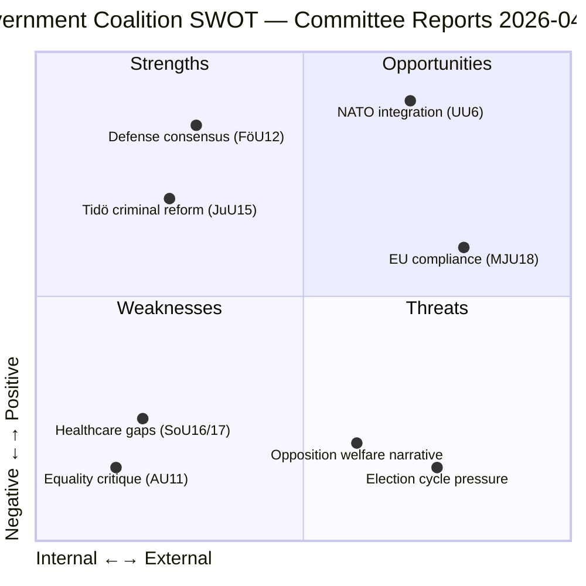

# Political SWOT Analysis — 2026-04-02

**Generated**: 2026-04-02 04:45 UTC | **Improved**: 2026-04-02 11:24 UTC (translation workflow)
**Data Sources**: get_betankanden, search_voteringar
**Documents Analyzed**: 10
**Confidence**: HIGH

## Summary

SWOT analysis of the government coalition (M, KD, L + SD supply) based on 10 committee reports from 2026-03-31 to 2026-04-02. The security and criminal justice agenda remains the coalition's strongest card, while healthcare and equality reports expose vulnerabilities.

## Detailed Analysis

### Strengths [HIGH confidence]
- **Defense consensus**: FöU12 (civilian protection) enjoys cross-party support — strengthens government's security narrative ahead of 2026 elections
- **Criminal justice delivery**: JuU15 (correctional services) demonstrates Tidöavtalet implementation progress with SD
- **NATO alignment**: UU6 (security policy) reflects Sweden's continued integration into NATO structures

### Weaknesses [MEDIUM confidence]
- **Healthcare organization**: SoU16 highlights structural problems in healthcare delivery — opposition opportunity
- **Equality gaps**: AU11 (equality/anti-discrimination) shows slow progress on equality metrics, undermining coalition's broader social agenda
- **Social insurance strain**: SfU18 reveals pressures on social insurance system

### Opportunities [HIGH confidence]
- **EU directive compliance**: MJU18 positions Sweden as a responsible EU member — positive diplomatic signal
- **Security narrative**: Combined FöU11/FöU12/UU6 cluster enables strong "security government" messaging
- **Pre-election positioning**: 10 reports in 3 days shows legislative productivity

### Threats [MEDIUM confidence]
- **Opposition welfare counter-narrative**: S and V can use SoU16/17 and AU11 to frame government as neglecting welfare
- **Election cycle**: 2026 election proximity intensifies scrutiny on all legislative output
- **SD supply dependency**: Criminal justice reforms (JuU15) depend on continued SD cooperation

## Stakeholder Impact

| Stakeholder | Impact | Evidence |
|------------|--------|----------|
| Citizens | Mixed | Defense improvements (FöU12) but healthcare concerns (SoU16/17) |
| Government Coalition | Positive | Security agenda delivers on Tidöavtalet (JuU15, FöU12) |
| Opposition Bloc | Opportunity | Healthcare and equality reports provide attack vectors |
| Business/Industry | Neutral | MJU18 trade directive compliance provides stability |
| Civil Society | Mixed | AU11 equality report highlights unresolved issues |
| International/EU | Positive | NATO integration (UU6) and EU compliance (MJU18) |
| Judiciary/Constitutional | Positive | JuU15 strengthens correctional framework |
| Media/Public Opinion | High interest | Defense cluster drives news cycle |

## Implications

SWOT insights should inform stakeholder framing in generated articles. The defense/security cluster (FöU11, FöU12, UU6) is the dominant narrative driver; healthcare reports (SoU16/17) provide the strongest opposition counter-narrative.

## Data Quality Notes

SWOT confidence: **HIGH**. Based on 10 committee reports with full metadata from `get_betankanden`. Content enrichment via `get_dokument_innehall` for all reports. Voting data cross-referenced via `search_voteringar`.