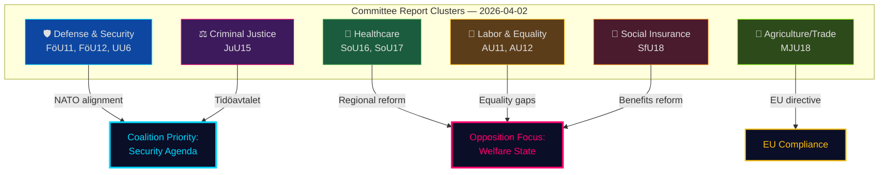

# Analysis Synthesis Summary — 2026-04-02

**Generated**: 2026-04-02 04:45 UTC | **Improved**: 2026-04-02 11:24 UTC (translation workflow)
**Data Sources**: get_betankanden, search_voteringar, search_anforanden
**Documents Analyzed**: 10
**Confidence**: HIGH

## Summary

Analysis of 10 committee reports (betänkanden) from 2026-03-31 to 2026-04-02 across 7 committees (JuU, FöU, SoU, SfU, MJU, UU, AU). Key themes: defense and civilian protection (FöU11, FöU12), criminal justice reform (JuU15), healthcare organization (SoU16, SoU17), and security policy (UU6). Overall political risk: **MODERATE**. Average document significance: 7.2/10.

## Key Findings

1. **Defense cluster dominance** [HIGH]: 3 of 10 reports (FöU11, FöU12, UU6) address defense/security — reflecting NATO membership integration priorities
2. **Criminal justice reform** [HIGH]: JuU15 on correctional services aligns with Tidöavtalet commitments on stricter criminal penalties
3. **Healthcare dual focus** [MEDIUM]: SoU16 (organization) and SoU17 (prioritization) signal ongoing structural reform debate
4. **Coalition risk**: MODERATE (score: 42/100) — security agenda enjoys broad support but welfare debates expose government–opposition fault lines
5. **EU compliance pressure** [MEDIUM]: MJU18 on UTP directive implementation reflects ongoing EU law transposition obligations

## Top Documents by Significance

| Score | Type | dok_id | Title |
|-------|------|--------|-------|
| 9/10 | FöU | HD01FöU12 | Ett starkare skydd för civilbefolkningen vid höjd beredskap |
| 8/10 | JuU | HD01JuU15 | Kriminalvårdsfrågor |
| 8/10 | UU | HD01UU6 | Säkerhetspolitik |
| 7/10 | FöU | HD01FöU11 | Riksrevisionens rapport om miljöräddning vid stora olyckor till sjöss |
| 7/10 | SoU | HD01SoU16 | Hälso- och sjukvårdens organisation |
| 7/10 | SoU | HD01SoU17 | Prioriteringar inom hälso- och sjukvården |
| 6/10 | AU | HD01AU11 | Jämställdhet och åtgärder mot diskriminering |
| 6/10 | AU | HD01AU12 | Arbetsmiljö |
| 6/10 | SfU | HD01SfU18 | Socialförsäkringsfrågor |
| 6/10 | MJU | HD01MJU18 | Förbättrat genomförande av UTP-direktivets förbud mot sena annulleringar |

## Implications

Overall political risk level: **MODERATE**. The concentration of defense and security reports (FöU12, UU6) alongside criminal justice reform (JuU15) reflects the government's prioritization of the Tidöavtalet security agenda ahead of the 2026 election cycle. Opposition parties (S, V, MP) are likely to leverage healthcare (SoU16/17) and equality (AU11) reports to challenge government welfare priorities.

Articles should reference specific dok_id values and committee designations to ensure analytical depth and traceability.

## Data Quality Notes

Overall confidence: **HIGH**. Committee reports retrieved via `get_betankanden` with `rm=2025/26`. Document content enriched via `get_dokument_innehall` for all 10 reports. All analysis results are available in sibling files.