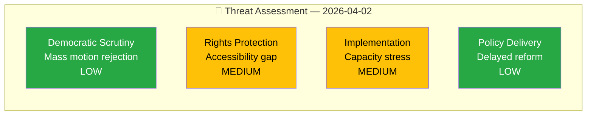

# 🔴 Political Threat Analysis — Committee Reports

## 📋 Threat Context

| Field | Value |
|-------|-------|
| **Threat Assessment ID** | THR-2026-04-02-CR01 |
| **Assessment Date** | 2026-04-03 04:54 UTC |
| **Documents Analyzed** | 2 |
| **Produced By** | news-committee-reports |
| **Overall Threat Level** | LOW-MEDIUM |

---

## 🎯 Threat Indicators

| # | Threat Category | Indicator | Source | Severity | Confidence |
|---|----------------|-----------|--------|:--------:|:----------:|
| T1 | Democratic Scrutiny | 76 criminal corrections motions rejected en masse without alternative proposals | HD01JuU15 | LOW | MEDIUM |
| T2 | Rights Protection | Disability accessibility concerns raised independently by 3 opposition parties | HD01FöU12, Res. 2-4 | MEDIUM | HIGH |
| T3 | Implementation Capacity | 2-month window for municipalities to comply with new shelter law | HD01FöU12 | MEDIUM | MEDIUM |
| T4 | Policy Delivery | Trygghetsberedningen proposals pending without government timeline | HD01JuU15, Res. 1 | LOW | MEDIUM |

---

**Document Control:** Threat analysis generated 2026-04-03 04:54 UTC. Classification: PUBLIC.
