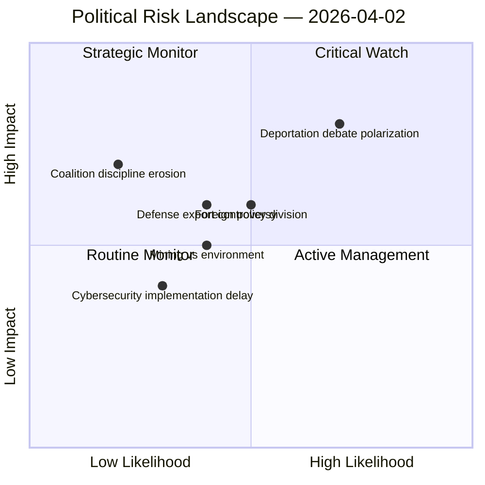

# Political Risk Assessment — 2026-04-02

**RSK-ID**: RSK-2026-04-02-001
**Generated**: 2026-04-02 18:15 UTC
**Riksmöte**: 2025/26
**Documents Analyzed**: 9
**Confidence**: MEDIUM

---

## Risk Heat Map

## Risk Matrix (5×5 Likelihood × Impact)

| Risk ID | Risk Description | L (1-5) | I (1-5) | L×I Score | Level | Evidence |
|---------|-----------------|---------|---------|-----------|-------|----------|
| RSK-01 | Deportation proposition (HD03235) triggers polarized public debate | 4 | 4 | 16 | 🔴 HIGH | Gov press release confirms stricter rules; opposition questions expected |
| RSK-02 | Foreign policy divisions on Israel death penalty (HD11680) and Syria minorities (HD11683) | 3 | 3 | 9 | 🟠 MEDIUM | Two written questions from opposition; coalition position uncertain |
| RSK-03 | Norra Kärr mining (HD11681) exposes coalition environment-economy tension | 3 | 3 | 9 | 🟠 MEDIUM | MP question to KD Energy Minister; biosfärsområde vs. mining concession |
| RSK-04 | Coalition discipline weakening (anomaly: cross-party voting 80%+) | 2 | 4 | 8 | 🟡 MEDIUM | CIA metrics show high cross-party alignment C-L, KD-L, C-KD |
| RSK-05 | Cybersecurity center (HD03214) implementation faces interagency delays | 2 | 3 | 6 | 🟡 MEDIUM | Complex multi-agency coordination required |
| RSK-06 | Military export framework (HD03228) draws international scrutiny | 3 | 2 | 6 | 🟡 MEDIUM | NATO alignment positive but human rights concerns possible |

## Coalition Stability Assessment

**Overall Score**: 4/100 (LOW RISK) [HIGH confidence]

Cross-party voting alignment metrics show strong coalition discipline with KD-M (88.5%), L-M (87.9%), and KD-L (87.9%) alignment rates. These high alignment rates indicate stable coalition governance.

## Forward Risk Indicators

| Indicator | Trigger | Timeline | Monitoring |
|-----------|---------|----------|------------|
| JuU15/FöU12 debate scheduling | Chamber debate announcement | 1-2 weeks | Calendar API |
| HD03235 committee referral | Justice committee hearing | 2-4 weeks | get_betankanden |
| Norra Kärr government decision | Mining concession ruling | 1-3 months | search_regering |

## Data Quality Notes

Risk assessment based on 9 documents analyzed plus MCP coalition metrics. Full-text unavailable for committee reports — risk scores may shift when debate transcripts emerge. Confidence: MEDIUM.
