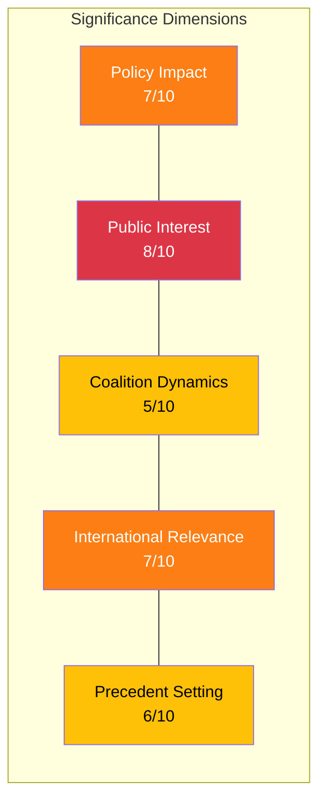

# Significance Scoring — 2026-04-02

**SIG-ID**: SIG-2026-04-02-001
**Generated**: 2026-04-02 18:15 UTC
**Riksmöte**: 2025/26
**Documents Scored**: 9
**Confidence**: MEDIUM

---

## 5-Dimension Scoring

| Dimension | Score | Rationale |
|-----------|-------|-----------|
| Policy Impact | 7/10 | 4 propositions including deportation reform and cybersecurity legislation |
| Public Interest | 8/10 | Deportation rules and criminal justice highly salient to public |
| Coalition Dynamics | 5/10 | Low risk score (4/100) but environmental tension emerging |
| International Relevance | 7/10 | NATO alignment, Israel/Syria human rights, arms control |
| Precedent Setting | 6/10 | Cybersecurity center creates new institutional framework |

## Composite Score

**Overall Significance: 6.6/10** — Publication decision: **PUBLISH** [HIGH confidence]

The day's parliamentary output is significant with multiple policy-relevant propositions and active opposition oversight. Deportation proposition (HD03235) and defense modernization (HD03214, HD03228) are the lead stories.

## Publication Decision

✅ **PUBLISH** — Evening analysis warranted. Lead with security/justice policy agenda, secondary focus on foreign policy accountability and environmental tensions.
