# Stakeholder Impact Analysis — 2026-04-02

**STA-ID**: STA-2026-04-02-001
**Generated**: 2026-04-02 18:15 UTC
**Riksmöte**: 2025/26
**Documents Analyzed**: 9
**Confidence**: MEDIUM

---

## Impact Radar

```mermaid
graph TD
    CENTER["Parliamentary Activity<br/>2026-04-02"] --> CIT["👥 Citizens"]
    CENTER --> GOV["🏛️ Government Coalition"]
    CENTER --> OPP["⚔️ Opposition Bloc"]
    CENTER --> BIZ["💼 Business/Industry"]
    CENTER --> CIV["🌍 Civil Society"]
    CENTER --> INT["🇪🇺 International/EU"]
    CENTER --> JUD["⚖️ Judiciary/Constitutional"]
    CENTER --> MED["📰 Media/Public Opinion"]

    CIT --> CIT1["Civilian protection strengthened<br/>FöU12: Impact HIGH"]
    CIT --> CIT2["Criminal justice reform<br/>JuU15: Impact MEDIUM"]
    GOV --> GOV1["Legislative agenda advancing<br/>4 props: Impact HIGH"]
    GOV --> GOV2["Security narrative dominant<br/>Impact HIGH"]
    OPP --> OPP1["Foreign policy probing<br/>3 questions: Impact MEDIUM"]
    OPP --> OPP2["Environmental accountability<br/>2 questions: Impact MEDIUM"]
    BIZ --> BIZ1["Military export opportunities<br/>HD03228: Impact HIGH"]
    BIZ --> BIZ2["Mining sector uncertainty<br/>HD11681: Impact MEDIUM"]
    CIV --> CIV1["Human rights scrutiny<br/>HD11680, HD11683: Impact MEDIUM"]
    INT --> INT1["NATO interoperability<br/>HD03228: Impact HIGH"]
    INT --> INT2["Cybersecurity cooperation<br/>HD03214: Impact HIGH"]
    JUD --> JUD1["Deportation law changes<br/>HD03235: Impact HIGH"]
    MED --> MED1["Deportation debate coverage<br/>Impact HIGH"]
    MED --> MED2["Defense investment narrative<br/>Impact MEDIUM"]

    style CENTER fill:#6f42c1,color:#fff
    style CIT fill:#28a745,color:#fff
    style GOV fill:#0d6efd,color:#fff
    style OPP fill:#dc3545,color:#fff
    style BIZ fill:#ffc107,color:#000
    style CIV fill:#28a745,color:#fff
    style INT fill:#0d6efd,color:#fff
    style JUD fill:#fd7e14,color:#fff
    style MED fill:#ffc107,color:#000
```

## Impact Summary Matrix

| Stakeholder Group | Impact Level | Key Developments | Primary dok_id |
|-------------------|-------------|-----------------|----------------|
| 👥 Citizens | HIGH | Civilian protection (FöU12), criminal justice reform (JuU15), healthcare improvements (HD03216) | HD01FöU12, HD01JuU15 |
| 🏛️ Government Coalition | HIGH | Strong legislative output (4 props), security-first agenda dominating | HD03235, HD03214, HD03228 |
| ⚔️ Opposition Bloc | MEDIUM | Active oversight via questions (6 filed), foreign policy probing | HD11679-HD11683 |
| 💼 Business/Industry | MEDIUM | Military export modernization (HD03228), mining uncertainty (HD11681), noise regulation (HD11678) | HD03228, HD11681 |
| 🌍 Civil Society | MEDIUM | Human rights questions on Israel/Syria, environmental concerns on Norra Kärr | HD11680, HD11683, HD11681 |
| 🇪🇺 International/EU | HIGH | NATO alignment (military export + cybersecurity), Stockholm Initiative arms control | HD03228, HD03214, HD11679 |
| ⚖️ Judiciary/Constitutional | HIGH | Deportation law reform (HD03235), criminal justice committee report (JuU15) | HD03235, HD01JuU15 |
| 📰 Media/Public Opinion | HIGH | Deportation debate likely dominant media narrative; defense spending also salient | HD03235, HD03214 |

## Data Quality Notes

All 8 mandatory stakeholder groups assessed. Confidence: MEDIUM — based on document metadata, summaries, and government press releases. Full committee report texts not yet available.
