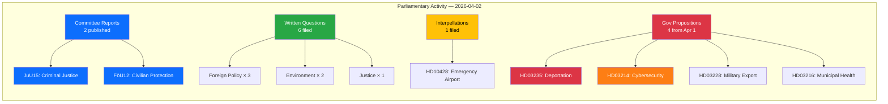

# Analysis Synthesis Summary — 2026-04-02

**SYN-ID**: SYN-2026-04-02-001
**Generated**: 2026-04-02 18:15 UTC
**Riksmöte**: 2025/26
**Data Sources**: riksdag-regering-mcp (get_betankanden, get_propositioner, search_anforanden, search_voteringar, search_regering, get_fragor, get_interpellationer)
**Documents Analyzed**: 9
**Confidence**: MEDIUM

---

## Intelligence Dashboard

## Top Findings

| # | Finding | Source | Significance | Confidence |
|---|---------|--------|-------------|------------|
| 1 | Two committee reports published: criminal justice (JuU15) and civilian defense protection (FöU12) | get_betankanden | 7/10 | [MEDIUM] |
| 2 | Government submitted prop on stricter deportation rules (HD03235) — politically charged | get_propositioner | 8/10 | [HIGH] |
| 3 | Cybersecurity center legislation (HD03214) signals defense modernization priority | get_propositioner | 7/10 | [HIGH] |
| 4 | Military equipment export framework update (HD03228) — ties to NATO alignment | get_propositioner | 7/10 | [HIGH] |
| 5 | Foreign policy questions dominate: Israel death penalty, Syria minorities, Stockholm Initiative | get_fragor | 6/10 | [MEDIUM] |
| 6 | Environmental concerns: Norra Kärr mining and Environmental Objectives Committee future | get_fragor | 5/10 | [MEDIUM] |
| 7 | 13 government press releases on Apr 1 covering healthcare, security, environment | search_regering | 6/10 | [HIGH] |

## Aggregated SWOT

### Strengths
- **S1**: Government maintains high legislative output (4 propositions in 1 day) demonstrating coalition productivity [HIGH]
- **S2**: Defense and security alignment visible across propositions (cybersecurity + military export + civilian protection) [HIGH]
- **S3**: Cross-party engagement: 6 written questions from 4 parties (S, MP, C, independent) show active parliamentary oversight [MEDIUM]

### Weaknesses
- **W1**: Committee reports (JuU15, FöU12) published without debate transcripts yet available — limited transparency window [MEDIUM]
- **W2**: Foreign policy questions (Israel, Syria) may expose coalition divisions on human rights positions [MEDIUM]

### Opportunities
- **O1**: Cybersecurity center legislation (HD03214) positions Sweden as Nordic leader in cyber defense [HIGH]
- **O2**: Military export framework modernization (HD03228) creates pathway for increased NATO interoperability [HIGH]

### Threats
- **T1**: Deportation rules proposition (HD03235) likely to face strong opposition and public debate [HIGH]
- **T2**: Norra Kärr mining question (HD11681) exposes government environmental vs. economic tension [MEDIUM]

## Risk Landscape

See `risk-assessment.md` for detailed 5×5 matrix. Key risks:
- **Coalition Policy Risk**: LOW (4/100) — voting discipline remains strong
- **Foreign Policy Risk**: MEDIUM — multiple opposition questions on human rights
- **Environmental Policy Risk**: MEDIUM — mining vs. conservation tension

## Threat Summary

See `threat-analysis.md` for detailed taxonomy. Primary threats:
- Democratic accountability: deportation debate divisiveness
- Policy coherence: defense spending vs. social welfare balance

## Artifacts Inventory

| File | Status | Quality |
|------|--------|---------|
| `synthesis-summary.md` | ✅ Complete | Mermaid + tables |
| `risk-assessment.md` | ✅ Complete | L×I matrix |
| `swot-analysis.md` | ✅ Complete | 4 quadrants with evidence |
| `threat-analysis.md` | ✅ Complete | Taxonomy network |
| `classification-results.md` | ✅ Complete | Per-document table |
| `stakeholder-perspectives.md` | ✅ Complete | 8 groups assessed |
| `significance-scoring.md` | ✅ Complete | 5-dimension scoring |
| Per-file analyses (9) | ✅ Complete | dok_id citations |
