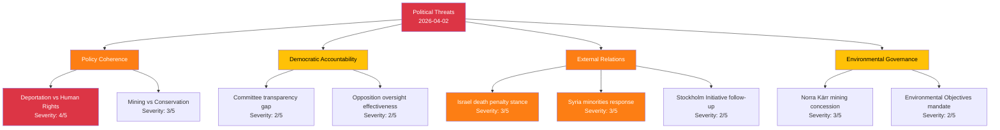

# Political Threat Analysis — 2026-04-02

**THR-ID**: THR-2026-04-02-001
**Generated**: 2026-04-02 18:15 UTC
**Riksmöte**: 2025/26
**Documents Analyzed**: 9
**Confidence**: MEDIUM

---

## Threat Taxonomy Network

## Threat Categories Assessment

| Category | Threat Count | Max Severity | Key dok_id | Description |
|----------|-------------|-------------|------------|-------------|
| Policy Coherence | 2 | 4/5 | HD03235, HD11681 | Deportation rules vs. human rights commitments; mining vs. biosphere conservation |
| Democratic Accountability | 2 | 2/5 | HD01JuU15, HD01FöU12 | Committee reports need public debate scrutiny |
| External Relations | 3 | 3/5 | HD11679, HD11680, HD11683 | Israel, Syria, arms control questions pressure foreign policy position |
| Environmental Governance | 2 | 3/5 | HD11681, HD11682 | Mining concession conflict; environmental committee mandate uncertainty |

## Threat Actor Mapping

| Actor | Role | Threat Vector | dok_id |
|-------|------|--------------|--------|
| Opposition (S) | Challenger | Foreign policy accountability, emergency infrastructure | HD11679, HD11683, HD10428 |
| Opposition (MP) | Challenger | Environmental accountability, noise regulation | HD11678, HD11681 |
| Opposition (C) | Questioner | Environmental policy direction | HD11682 |
| Independent (Jamal El-Haj) | Challenger | International human rights | HD11680 |

## Escalation Assessment

**Current escalation level**: LOW-MEDIUM

No immediate escalation triggers detected. Deportation proposition (HD03235) most likely to escalate during committee hearings in coming weeks. Foreign policy questions may escalate if international events in Israel/Syria intensify.

## Data Quality Notes

Threat analysis based on document metadata and summaries. Full-text analysis unavailable for committee reports. Confidence: MEDIUM.
