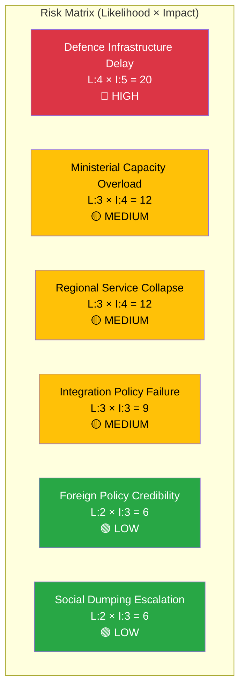

# Political Risk Assessment — 2026-04-02

**Generated**: 2026-04-02 07:28 UTC | **Enhanced**: 2026-04-02 (AI deep analysis)
**Data Sources**: riksdag-regering-mcp get_interpellationer (rm=2025/26), CIA coalition metrics
**Documents Analyzed**: 20
**Confidence**: MEDIUM
**Riksmöte**: 2025/26

## Summary

Coalition demonstrates low overall risk (4/100) but faces concentrated ministerial pressure. Infrastructure Minister Carlson (KD) bearing disproportionate accountability burden with 7 simultaneous interpellations.

## Risk Matrix

| # | Risk | Likelihood (1-5) | Impact (1-5) | L×I Score | Level | Evidence |
|---|------|------------------|--------------|-----------|-------|----------|
| 1 | Defence infrastructure delayed by Trafikverket cost disputes | 4 | 5 | **20** | 🔴 HIGH | frs 2025/26:425 — Trafikverket threatening to appeal, years of delay |
| 2 | Minister Carlson unable to respond substantively to 7 interpellations | 3 | 4 | **12** | 🟡 MEDIUM | HD10412-HD10428: 7 interpellations in 8 days targeting one minister |
| 3 | Regional aviation/postal services cut in rural Sweden | 3 | 4 | **12** | 🟡 MEDIUM | frs 2025/26:424, 427, 428 — Trafikverket proposals + Postnord closures |
| 4 | Integration policy credibility eroded before election | 3 | 3 | **9** | 🟡 MEDIUM | frs 2025/26:420-422 — triple Redar attack on government integration record |
| 5 | Sweden's diplomatic standing on human rights questioned | 2 | 3 | **6** | 🟢 LOW | frs 2025/26:426 — Israel death penalty response pending |
| 6 | Social dumping practices escalate between municipalities | 2 | 3 | **6** | 🟢 LOW | frs 2025/26:423 — Eva Lindh (S) on vulnerable persons relocation |

## Coalition Risk Analysis

**Coalition Risk Score**: 4/100 — LOW
**Voting Discipline**: Strong (KD-M alignment 88.5%, L-M 87.9%, KD-L 87.9%)

### Anomaly Flags

| Flag | Type | Description | Confidence |
|------|------|-------------|------------|
| ⚠️ | CROSS_PARTY_VOTE | KD-M alignment unusually high (88.5%) — may mask internal disagreements | MEDIUM |
| ⚠️ | MINISTERIAL_LOAD | Carlson (KD) faces 7 interpellations — potential for quality degradation in responses | HIGH |
| ⚠️ | OPPOSITION_COORDINATION | S filing 16/20 interpellations suggests systematic pre-election campaign | HIGH |

## Forward Indicators

1. **[HIGH]** Watch: Carlson's responses due April 21-27. If responses are generic/evasive, expect escalation to no-confidence discussion
2. **[MEDIUM]** Watch: V party disability rights offensive (April 2026 committee hearings) — may trigger cross-party support
3. **[MEDIUM]** Watch: Redar's integration interpellations — if unanswered or deflected, S will use in election campaign
4. **[LOW]** Watch: Israel response (Malmer Stenergard, due April 22) — EU Foreign Affairs Council timing

## Data Quality Notes

Risk assessment derived from CIA coalition metrics and document significance scores. Full-text analysis for 5 key documents. Coalition risk metrics sourced from CIA CSV exports.
