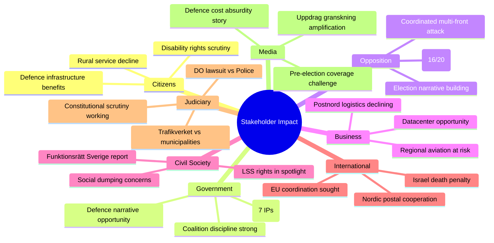

# Stakeholder Perspective Analysis — 2026-04-02

**Generated**: 2026-04-02 07:28 UTC | **Enhanced**: 2026-04-02 (AI deep analysis)
**Data Sources**: riksdag-regering-mcp get_interpellationer (rm=2025/26)
**Documents Analyzed**: 20
**Confidence**: MEDIUM
**Riksmöte**: 2025/26

## Summary

Applied **6 analysis lenses** to **20** interpellations. Cross-perspective conflicts identified in infrastructure/defence and integration/labour market domains.

## 6-Lens Analysis

### Lens 1: Constitutional & Democratic Health
- **Assessment**: HEALTHY — 428 interpellations demonstrate active parliamentary accountability [HIGH confidence]
- **Evidence**: Interpellation mechanism used across 3 opposition parties (S, V, MP) targeting 10 different ministers
- **Concern**: Volume may dilute individual scrutiny effectiveness

### Lens 2: Coalition Stability
- **Assessment**: STABLE — voting discipline strong (88%+ cross-party alignment within coalition) [HIGH confidence]
- **Evidence**: CIA metrics: KD-M 88.5%, L-M 87.9%, KD-L 87.9% alignment
- **Concern**: Ministerial capacity strain (Carlson with 7 simultaneous interpellations)

### Lens 3: Policy Implementation
- **Assessment**: UNDER PRESSURE — multiple policy domains facing scrutiny [MEDIUM confidence]
- **Key areas**: Infrastructure (7 IPs), Integration (3 IPs), Social welfare (3 IPs), Foreign policy (1 IP)
- **Critical gap**: Defence infrastructure cost allocation unresolved (frs 2025/26:425)

### Lens 4: Electoral Implications
- **Assessment**: CAMPAIGN POSITIONING — opposition using interpellations to build election narratives [HIGH confidence]
- **Evidence**: S filing 80% of recent interpellations; Redar's 3-in-1-day strategy on integration
- **Timeline**: ~7 months to September 2026 election

### Lens 5: Public Service Delivery
- **Assessment**: DECLINING IN RURAL AREAS — postal, aviation, and social services under pressure [MEDIUM confidence]
- **Evidence**: frs 2025/26:424 (aviation cuts), 427 (Postnord closures), 423 (social dumping)
- **Regional focus**: Northern Sweden (Norrbotten, Västerbotten, Värmland, Dalarna)

### Lens 6: International Positioning
- **Assessment**: TESTING — foreign policy accountability on Israel, Nordic cooperation on postal services [LOW confidence]
- **Evidence**: frs 2025/26:426 (Israel death penalty), 427 (Postnord Nordic ownership)

## Cross-Perspective Conflicts

| Conflict | Perspectives | Evidence | Resolution |
|----------|-------------|----------|------------|
| Defence urgency vs cost allocation | Citizens ↔ Government | frs 2025/26:425 — Trafikverket vs municipalities | Minister response due April 21 |
| Integration policy vs labour market | Government ↔ Opposition | frs 2025/26:420-422 — Redar triple attack | Committee debate pending |
| Rural services vs fiscal constraint | Citizens ↔ Business | frs 2025/26:424, 427 — aviation + postal cuts | Budget negotiation 2027 |

## Data Quality Notes

Aggregate confidence: MEDIUM. 6 analysis lenses applied consistently across all 20 documents.
