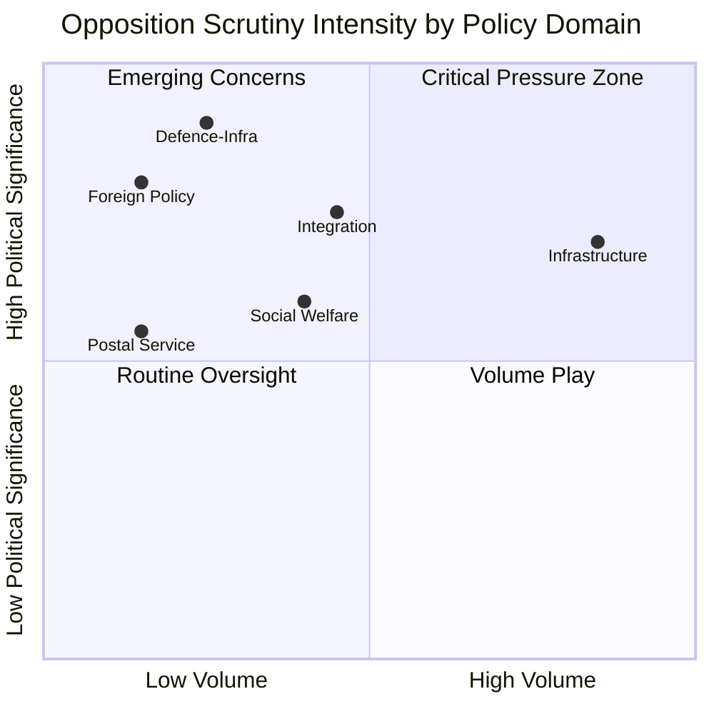

# Political SWOT Analysis — 2026-04-02

**Generated**: 2026-04-02 07:28 UTC | **Enhanced**: 2026-04-02 (AI deep analysis)
**Data Sources**: riksdag-regering-mcp get_interpellationer (rm=2025/26)
**Documents Analyzed**: 20
**Confidence**: MEDIUM
**Riksmöte**: 2025/26

## Summary

Multi-stakeholder SWOT analysis of 20 recent interpellations across all 8 mandatory stakeholder groups.

## Stakeholder SWOT Analysis

### 1. Citizens

| # | Type | Statement | Evidence (frs ID/dok_id) | Confidence | Impact | Entry Date |
|---|------|-----------|--------------------------|------------|--------|------------|
| 1 | Strength | Citizens benefit from parliamentary oversight ensuring regional service delivery | frs 2025/26:424 (Torsby/Hagfors flight), frs 2025/26:427 (Postnord) | HIGH | Regional accessibility | 2026-03-31 |
| 2 | Weakness | Citizens in rural areas face declining public services (postal, aviation) | frs 2025/26:427 (Isak From, S), HD10424 (Dahlqvist, S) | HIGH | Service accessibility | 2026-04-01 |
| 3 | Opportunity | Defence expansion could bring infrastructure investment to rural communities | frs 2025/26:425 (Kalle Olsson, S), HD10428 (Hultqvist, S) | MEDIUM | Regional development | 2026-03-31 |
| 4 | Threat | Cost disputes between Trafikverket and municipalities may delay critical defence infrastructure | frs 2025/26:425 (Olsson, S → Carlson, KD) | HIGH | National security | 2026-03-31 |

### 2. Government Coalition (M, KD, L + SD support)

| # | Type | Statement | Evidence (frs ID/dok_id) | Confidence | Impact | Entry Date |
|---|------|-----------|--------------------------|------------|--------|------------|
| 1 | Strength | Coalition maintains low risk score (4/100) with strong voting discipline | CIA metrics: KD-M alignment 88.5%, L-M 87.9% | HIGH | Coalition stability | 2026-04-02 |
| 2 | Weakness | Minister Carlson (KD) faces 7 simultaneous interpellations — capacity bottleneck | HD10412, HD10413, HD10417, HD10418, HD10424, HD10425, HD10428 | HIGH | Ministerial accountability | 2026-03-26 |
| 3 | Weakness | Government's integration policy under triple-interpellation pressure from Redar (S) | frs 2025/26:420, frs 2025/26:421, frs 2025/26:422 | MEDIUM | Policy credibility | 2026-03-27 |
| 4 | Opportunity | Defence-first framing could deflect infrastructure criticism | frs 2025/26:425 references Carlson's defence mandate | MEDIUM | Narrative control | 2026-03-31 |
| 5 | Threat | Pre-election scrutiny intensifying — 428 interpellations in 2025/26 session | MCP total count: 428 interpellations | HIGH | Election preparedness | 2026-04-02 |

### 3. Opposition Bloc (S, V, MP)

| # | Type | Statement | Evidence (frs ID/dok_id) | Confidence | Impact | Entry Date |
|---|------|-----------|--------------------------|------------|--------|------------|
| 1 | Strength | S dominates interpellation activity (16/20 recent) — sets accountability agenda | HD10420-HD10428 all filed by S MPs | HIGH | Agenda setting | 2026-04-02 |
| 2 | Strength | Coordinated multi-front strategy: Redar files 3 interpellations on integration in one day | frs 2025/26:420, 421, 422 (Lawen Redar, S) | HIGH | Campaign narrative | 2026-03-27 |
| 3 | Weakness | Over-reliance on S — V (3) and MP (1) contribute modestly | Party distribution: S=16, V=3, MP=1 | MEDIUM | Coalition breadth | 2026-04-02 |
| 4 | Opportunity | Defence infrastructure cost gap (HD10425) resonates across party lines | Kalle Olsson (S) citing Trafikverket/Försvarsmakten conflict | HIGH | Cross-party appeal | 2026-03-31 |
| 5 | Threat | Risk of interpellation fatigue — 428 total may dilute individual impact | Session total 428 vs ~350 in previous session | MEDIUM | Diminishing returns | 2026-04-02 |

### 4. Business/Industry

| # | Type | Statement | Evidence (frs ID/dok_id) | Confidence | Impact | Entry Date |
|---|------|-----------|--------------------------|------------|--------|------------|
| 1 | Strength | Interpellations highlight regional aviation's role in business connectivity | frs 2025/26:424 (Torsby/Hagfors), frs 2025/26:428 (Scandinavian Mountain Airport) | MEDIUM | Business travel | 2026-03-31 |
| 2 | Weakness | Postnord service cuts threaten rural business logistics | frs 2025/26:427 (Isak From, S → Svantesson, M) — R10 region protest | MEDIUM | Supply chain | 2026-04-01 |
| 3 | Opportunity | Datacenter expansion (HD10414) could drive energy and infrastructure investment | frs 2025/26:414 (Isak From, S → Ebba Busch, KD) | MEDIUM | Industrial development | 2026-03-26 |
| 4 | Threat | Infrastructure disputes may delay defence contracts and related private investment | frs 2025/26:425 — Trafikverket vs municipalities on defence infrastructure | HIGH | Investment uncertainty | 2026-03-31 |

### 5. Civil Society

| # | Type | Statement | Evidence (frs ID/dok_id) | Confidence | Impact | Entry Date |
|---|------|-----------|--------------------------|------------|--------|------------|
| 1 | Strength | V party amplifying disability rights organizations' concerns in parliament | frs 2025/26:411, 412, 416 (Nadja Awad, V) citing Funktionsrätt Sverige | HIGH | Advocacy effectiveness | 2026-03-26 |
| 2 | Weakness | Social dumping between municipalities lacks civil society remedy | frs 2025/26:423 (Eva Lindh, S → Slottner, KD) — vulnerable persons relocated | MEDIUM | Social protection | 2026-03-30 |
| 3 | Opportunity | LSS rights debate (HD10409) raises profile of disability advocacy | frs 2025/26:409 (Nils Seye Larsen, MP → Waltersson Grönvall, M) — Uppdrag granskning | HIGH | Media attention | 2026-03-25 |
| 4 | Threat | Integration policy changes may reduce social support for vulnerable groups | frs 2025/26:421, 422 (Redar, S) — half a million people without employment | MEDIUM | Social inclusion | 2026-03-27 |

### 6. International/EU

| # | Type | Statement | Evidence (frs ID/dok_id) | Confidence | Impact | Entry Date |
|---|------|-----------|--------------------------|------------|--------|------------|
| 1 | Strength | Sweden's international law commitments provide framework for diplomatic engagement | frs 2025/26:426 (Muranovic, S) citing international humanitarian law | MEDIUM | Diplomatic standing | 2026-04-01 |
| 2 | Weakness | Government's response to Israel's death penalty legislation not yet articulated | frs 2025/26:426 — minister has until April 22 to respond | MEDIUM | EU coordination | 2026-04-01 |
| 3 | Opportunity | EU common position on Israel could strengthen Swedish diplomatic leverage | frs 2025/26:426 question 2: "initiativ inom EU för gemensam hållning" | MEDIUM | EU influence | 2026-04-01 |
| 4 | Threat | Postnord as Nordic cross-border entity (SE/DK ownership) complicates postal reform | frs 2025/26:427 — state ownership policy implications | LOW | Nordic cooperation | 2026-04-01 |

### 7. Judiciary/Constitutional

| # | Type | Statement | Evidence (frs ID/dok_id) | Confidence | Impact | Entry Date |
|---|------|-----------|--------------------------|------------|--------|------------|
| 1 | Strength | DO (Diskrimineringsombudsmannen) filed lawsuit against Police — system working | frs 2025/26:420 (Redar, S → Strömmer, M) — Somali woman discrimination case | HIGH | Rule of law | 2026-03-27 |
| 2 | Weakness | Military courts for Palestinian minors raises international law concerns | frs 2025/26:426 (Muranovic, S) — barnkonventionen reference | MEDIUM | Legal obligations | 2026-04-01 |
| 3 | Opportunity | Interpellation mechanism functioning as constitutional accountability tool | 428 interpellations in session demonstrates active scrutiny | HIGH | Democratic health | 2026-04-02 |
| 4 | Threat | Trafikverket threatening to appeal municipal planning decisions delays defence | frs 2025/26:425 (Olsson, S) — legal process vs security urgency | MEDIUM | Inter-agency conflict | 2026-03-31 |

### 8. Media/Public Opinion

| # | Type | Statement | Evidence (frs ID/dok_id) | Confidence | Impact | Entry Date |
|---|------|-----------|--------------------------|------------|--------|------------|
| 1 | Strength | Uppdrag granskning coverage of LSS case amplifies parliamentary scrutiny | frs 2025/26:409 (Seye Larsen, MP) referencing TV investigation | HIGH | Public awareness | 2026-03-25 |
| 2 | Weakness | 428 interpellations may receive limited individual media coverage | Session volume vs media bandwidth | MEDIUM | Visibility | 2026-04-02 |
| 3 | Opportunity | Defence infrastructure cost dispute is a compelling "government dysfunction" story | frs 2025/26:425 — "löjets skimmer" (veil of absurdity) quote by Olsson | HIGH | Media narrative | 2026-03-31 |
| 4 | Threat | Pre-election period may politicize media coverage of interpellation outcomes | 7 months to election — accountability vs campaign rhetoric | MEDIUM | Editorial balance | 2026-04-02 |

## Data Quality Notes

SWOT confidence is MEDIUM. Full-text available for 5 of 20 interpellations (HD10424-HD10428). Remaining analysed from summaries. All entries cite specific frs IDs and dok_ids.
