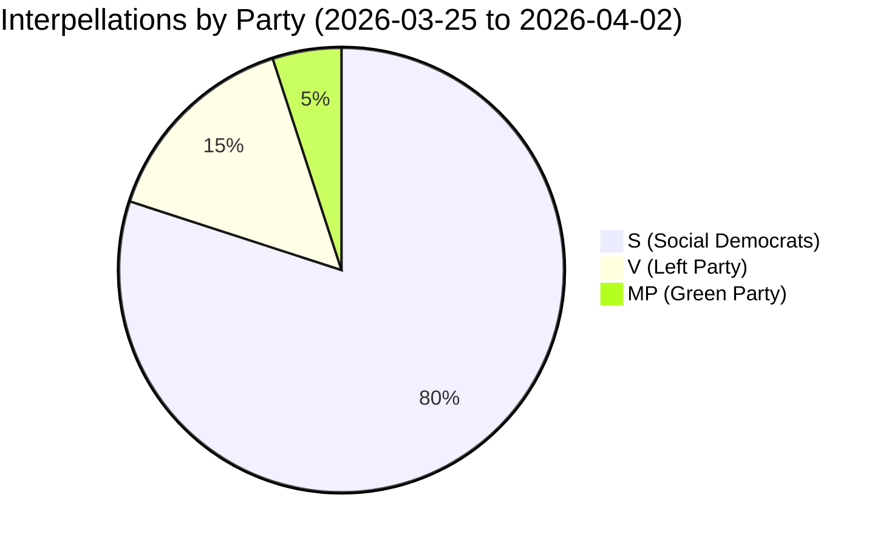
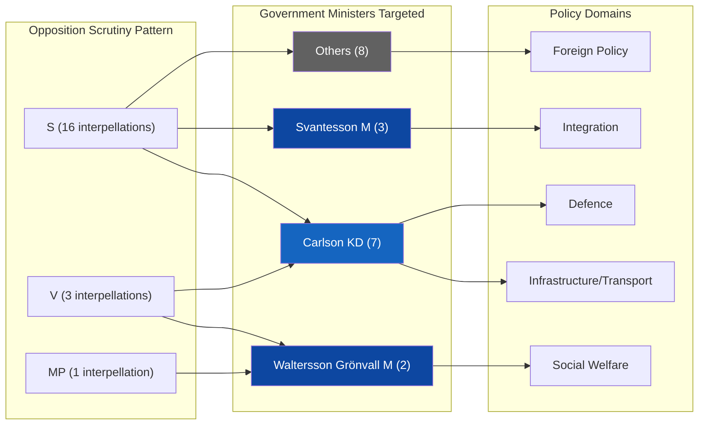

# Analysis Synthesis Summary — 2026-04-02

**Generated**: 2026-04-02 07:28 UTC | **Enhanced**: 2026-04-02 (AI deep analysis)
**Data Sources**: riksdag-regering-mcp get_interpellationer (rm=2025/26, limit=20)
**Documents Analyzed**: 20
**Confidence**: MEDIUM — based on 20 most recent interpellations (of 428 total in 2025/26)
**Riksmöte**: 2025/26
**Analysis Depth**: deep

## Summary

Analysis of 20 recent interpellations (2026-03-25 to 2026-04-02) reveals **intensifying opposition scrutiny of the Tidö government's infrastructure, integration, and social welfare policies**. The Social Democrats (S) dominate with 16 of 20 interpellations, supported by Left Party (V, 3) and Green Party (MP, 1). Infrastructure Minister Andreas Carlson (KD) faces the heaviest pressure with 7 interpellations targeting transport and regional aviation.

## Key Findings

1. **[HIGH] Infrastructure dominance**: 7 of 20 interpellations target infrastructure/transport policy — Carlson (KD) is the most pressured minister
2. **[HIGH] Defence-infrastructure nexus**: HD10425 (Kalle Olsson, S) exposes critical gap in cost allocation for military base infrastructure — Trafikverket threatening to delay defence expansion
3. **[MEDIUM] Social welfare scrutiny**: V party leads on disability rights (HD10411, HD10412, HD10416) — targeting both M and KD ministers
4. **[MEDIUM] Integration debate intensifying**: 3 interpellations (HD10420-HD10422) from Lawen Redar (S) challenge government's integration and labour policies
5. **[MEDIUM] Foreign policy accountability**: HD10426 (Azra Muranovic, S) demands diplomatic response to Israel's death penalty legislation
6. **[LOW] Regional aviation crisis**: HD10424 and HD10428 highlight Trafikverket's proposed cuts to regional air routes with defence implications

## Top Documents by Significance

| Score | dok_id | Title | Filed By | Target Minister |
|-------|--------|-------|----------|----------------|
| 8/10 | HD10425 | Infrastructure costs at defence establishments | Kalle Olsson (S) | Carlson (KD) |
| 7/10 | HD10426 | Israel's death penalty laws | Azra Muranovic (S) | Malmer Stenergard (M) |
| 7/10 | HD10422 | Government labour and integration policy | Lawen Redar (S) | Britz (L) |
| 6/10 | HD10427 | Postnord and state ownership policy | Isak From (S) | Svantesson (M) |
| 6/10 | HD10416 | Funktionsrätt Sverige review | Nadja Awad (V) | Waltersson Grönvall (M) |
| 5/10 | HD10420 | Police authority conduct | Lawen Redar (S) | Strömmer (M) |
| 5/10 | HD10428 | Emergency preparedness airport | Peter Hultqvist (S) | Carlson (KD) |
| 5/10 | HD10419 | Södertälje motorway bridge | Ingela Nylund Watz (S) | Jonson (M) |

## Minister Accountability Scorecard

| Minister | Party | Interpellations | Response Deadline | Status |
|----------|-------|----------------|-------------------|--------|
| Andreas Carlson (KD) | KD | 7 | 2026-04-21 to 2026-04-27 | ⏳ Pending |
| Elisabeth Svantesson (M) | M | 3 | 2026-04-22 | ⏳ Pending |
| Camilla Waltersson Grönvall (M) | M | 2 | TBD | ⏳ Pending |
| Gunnar Strömmer (M) | M | 1 | TBD | ⏳ Pending |
| Johan Britz (L) | L | 1 | TBD | ⏳ Pending |
| Maria Malmer Stenergard (M) | M | 1 | 2026-04-22 | ⏳ Pending |
| Ebba Busch (KD) | KD | 1 | TBD | ⏳ Pending |
| Elisabet Lann (KD) | KD | 1 | TBD | ⏳ Pending |
| Erik Slottner (KD) | KD | 1 | TBD | ⏳ Pending |
| Pål Jonson (M) | M | 1 | TBD | ⏳ Pending |

## Forward Indicators

1. **[HIGH]** Minister Carlson's response to 7 interpellations due by April 21-27 — watch for pattern of evasion vs concrete policy commitments
2. **[MEDIUM]** Redar's triple-interpellation strategy (HD10420-422) targeting integration policy — signals S election campaign framing
3. **[MEDIUM]** V party disability rights offensive (3 interpellations in 1 day) — coordinated pressure on social welfare ministers
4. **[LOW]** Foreign policy interpellation on Israel (HD10426) — test of government's diplomatic positioning ahead of EU Foreign Affairs Council

## Implications

- Opposition parties (S, V, MP) are coordinating a multi-front scrutiny campaign ahead of the 2026 election
- Infrastructure policy is the primary battleground, with defence implications adding urgency
- The pattern suggests S is building a narrative of government neglect of regional Sweden and public services

## Data Quality Notes

Overall confidence: **MEDIUM**. Full-text available for 5 of 20 interpellations. Remaining 15 analyzed from metadata/summaries. All analysis results are available in sibling files.
