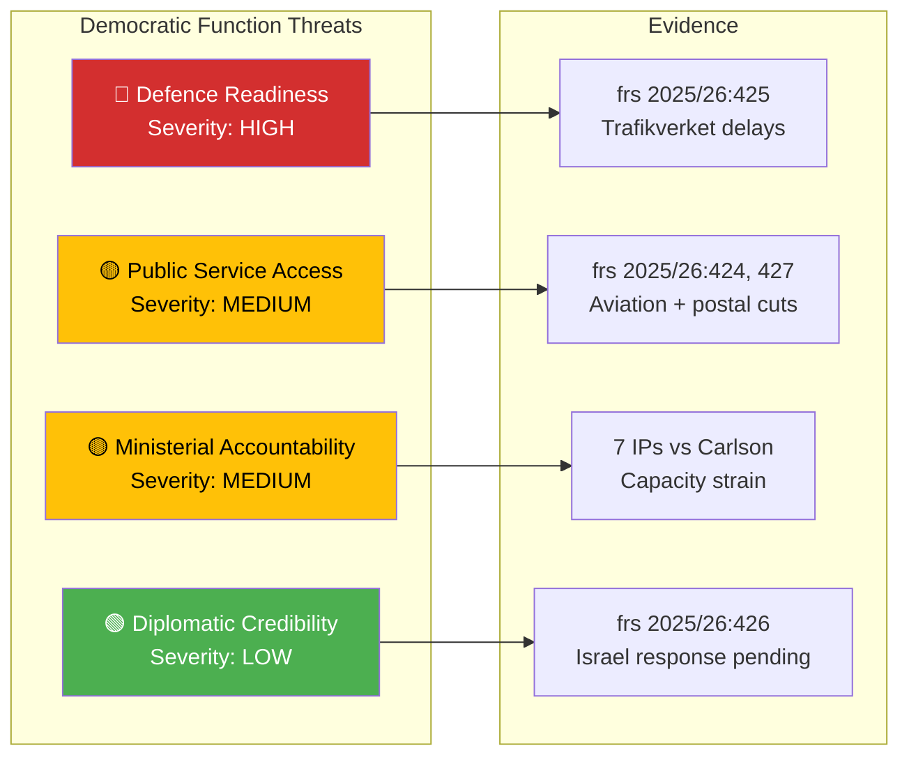

# Political Threat Analysis — 2026-04-02

**Generated**: 2026-04-02 07:28 UTC | **Enhanced**: 2026-04-02 (AI deep analysis)
**Data Sources**: riksdag-regering-mcp get_interpellationer (rm=2025/26)
**Documents Analyzed**: 20
**Confidence**: MEDIUM
**Riksmöte**: 2025/26

## Summary

Identified **4** threat indicators across 20 interpellations targeting democratic functions and public service delivery.

## Threat Assessment Table

| # | Threat Category | Severity | Target | Evidence | Confidence |
|---|----------------|----------|--------|----------|------------|
| 1 | Defence Readiness | HIGH | National security infrastructure | frs 2025/26:425 — Trafikverket cost disputes delaying military base construction | HIGH |
| 2 | Public Service Access | MEDIUM | Rural citizens | frs 2025/26:424, 427, 428 — aviation routes and postal services threatened | MEDIUM |
| 3 | Ministerial Accountability | MEDIUM | Democratic oversight | 7 interpellations targeting Carlson (KD) — response quality risk | MEDIUM |
| 4 | Diplomatic Credibility | LOW | International standing | frs 2025/26:426 — Swedish response to Israel death penalty legislation pending | LOW |

## Forward Indicators

1. **Defence**: Monitor Trafikverket-Försvarsmakten resolution timeline (April-May 2026)
2. **Services**: Track Trafikverket decision on regional aviation routes (Q2 2026)
3. **Accountability**: Assess quality of Carlson's 7 responses (due April 21-27)
4. **Diplomacy**: Watch EU Foreign Affairs Council position on Israel (April-May 2026)

## Data Quality Notes

Analysis confidence: MEDIUM. Threat indicators sourced from full-text analysis of 5 interpellations and metadata of 15 additional.
