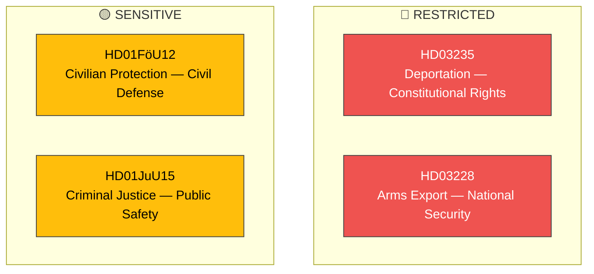

# 🔒 Political Classification — Realtime Monitor 2026-04-02

**Date:** 2026-04-02 | **Analyst:** news-realtime-monitor | **Classification:** PUBLIC

## Classification Results

| dok_id | Sensitivity | Domain | Temperature | Urgency |
|--------|------------|--------|-------------|---------|
| HD03235 | 🔴 RESTRICTED | Immigration-Criminal Nexus | 🔴 HOT | 🟠 URGENT |
| HD03228 | 🔴 RESTRICTED | Defense Export / Foreign Policy | 🔴 HOT | 🟠 URGENT |
| HD01FöU12 | 🟡 SENSITIVE | National Security / Civil Defense | 🔴 HOT | 🟠 URGENT |
| HD01JuU15 | 🟡 SENSITIVE | Justice Policy / Public Safety | 🟠 WARM | 🔵 ELEVATED |

## Classification Rationale

All four documents carry elevated classification due to their intersection with national security, constitutional rights, and international obligations. The deportation proposition (HD03235) is classified RESTRICTED due to its direct impact on constitutional rights (proportionality, non-refoulement) while the arms export reform (HD03228) carries RESTRICTED status due to national security and alliance obligations implications.
