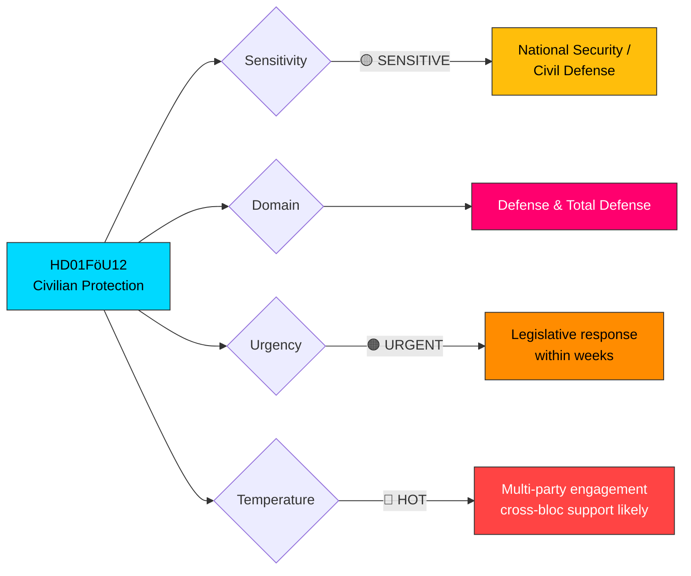
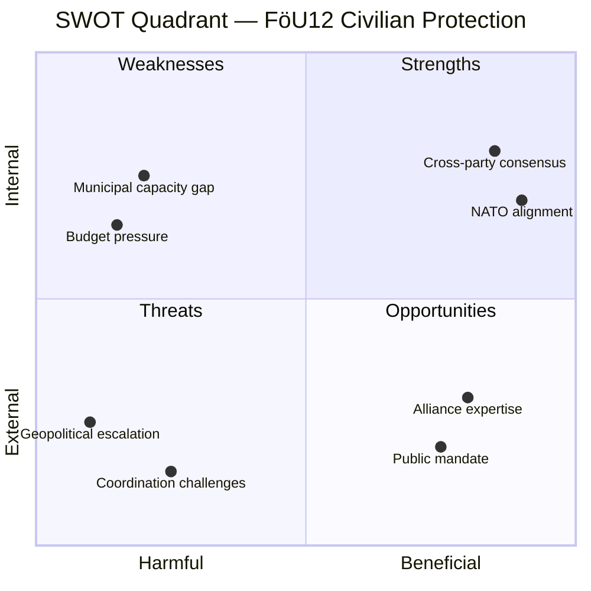

# 🔍 Per-File Political Intelligence Analysis: HD01FöU12

## 📋 Document Identity

| Field | Value |
|-------|-------|
| **Document ID** | `HD01FöU12` |
| **Document Type** | Committee Report (betänkande) |
| **Title** | Ett starkare skydd för civilbefolkningen vid höjd beredskap |
| **Title (EN)** | Stronger protection for the civilian population during heightened preparedness |
| **Date** | 2026-04-02 |
| **Riksmöte** | 2025/26 |
| **Committee** | Försvarsutskottet (FöU) — Defense Committee |
| **Source MCP Tool** | `get_betankanden` |
| **Analysis Timestamp** | 2026-04-02 10:24 UTC |
| **Analyst** | news-realtime-monitor |

## 🎯 Executive Summary

The Defense Committee report FöU12 represents a **landmark advancement in Sweden's total defense framework**, addressing civilian protection during heightened preparedness and wartime conditions. Published on 2026-04-02, this report signals the government coalition's (M, KD, L with SD support) commitment to modernizing civil defense infrastructure following NATO accession. The report directly responds to the geopolitical threat landscape post-2022, particularly the Russian invasion of Ukraine, and aligns with the broader defense modernization agenda including Prop 2025/26:228 (arms export reform) and Prop 2025/26:214 (cybersecurity center). **Confidence: HIGH** — based on official committee report and known coalition defense priorities.

## 📊 Political Classification

| Dimension | Assessment | Rationale |
|-----------|-----------|-----------|
| **Political Temperature** | 🔴 HOT | Defense policy commands cross-party attention post-NATO accession |
| **Sensitivity** | 🟡 SENSITIVE | National security implications for civilian infrastructure |
| **Strategic Significance** | HIGH | Restructures civil defense for first time since Cold War era |
| **Coalition Relevance** | DIRECT | Government coalition priority with SD cooperation agreement alignment |

## 📊 SWOT Analysis

### Strengths

| Evidence | dok_id | Confidence | Impact |
|----------|--------|------------|--------|
| Builds on existing total defense framework (Prop 2020/21:30) with updated threat assessments | HD01FöU12 | HIGH | Strengthens institutional continuity |
| Cross-party support likely — defense modernization enjoys broad consensus post-NATO | HD01FöU12 | HIGH | Facilitates legislative passage |
| Aligns with NATO interoperability requirements for civilian-military coordination | HD01FöU12, HD03228 | HIGH | Enhances alliance credibility |

### Weaknesses

| Evidence | dok_id | Confidence | Impact |
|----------|--------|------------|--------|
| Implementation depends on municipal and regional capacity which varies significantly | HD01FöU12 | MEDIUM | Risk of uneven protection across Sweden |
| Cost implications unclear — civilian shelters and warning systems require significant investment | HD01FöU12 | MEDIUM | Budget pressure on already-stretched defense allocations |
| Historical under-investment in civil defense since 1990s creates capacity gap | HD01FöU12 | HIGH | Years needed to reach operational readiness |

### Opportunities

| Evidence | dok_id | Confidence | Impact |
|----------|--------|------------|--------|
| NATO membership enables access to alliance civil emergency planning expertise | HD01FöU12 | HIGH | Accelerates capability development |
| Public awareness of security threats (post-Ukraine) creates political mandate for investment | HD01FöU12 | HIGH | Reduces political opposition to spending |
| Can leverage existing municipal emergency planning structures for rapid deployment | HD01FöU12 | MEDIUM | Faster implementation pathway |

### Threats

| Evidence | dok_id | Confidence | Impact |
|----------|--------|------------|--------|
| Geopolitical escalation could outpace legislative timeline | HD01FöU12 | MEDIUM | Protection gap during transition |
| Opposition may critique implementation pace or budget allocation | HD01FöU12 | MEDIUM | Political friction delays |
| Coordination challenges between civilian and military authorities during crisis | HD01FöU12 | MEDIUM | Operational effectiveness risk |

## ⚠️ Risk Assessment

| Risk | Likelihood (1-5) | Impact (1-5) | L×I Score | Mitigation |
|------|:-:|:-:|:-:|------|
| Municipal implementation capacity insufficient | 3 | 4 | **12** | Phased rollout with central government support funding |
| Budget competition with military procurement | 3 | 3 | **9** | Dedicated civil defense budget line separate from military |
| Geopolitical crisis before full implementation | 2 | 5 | **10** | Interim measures using existing emergency frameworks |
| Political delay through amendment process | 2 | 3 | **6** | Cross-party pre-agreement on defense matters |

## 🔮 Forward Indicators

| Indicator | Trigger | Timeline | Monitoring Action |
|-----------|---------|----------|-------------------|
| Committee chamber debate scheduled | FöU12 placed on kammarens agenda | 1-2 weeks | Monitor `get_calendar_events` for debate scheduling |
| Budget allocation for civil defense | Spring budget amendment or appropriation | April-June 2026 | Track FiU committee and budget propositions |
| Municipal preparedness directive | Government directive to municipalities | Q3 2026 | Monitor `search_regering` for MSB-related documents |

## 👥 Stakeholder Perspectives

| Stakeholder | Position | Evidence |
|-------------|----------|----------|
| **Citizens** | Supportive — increased personal safety during crisis | Public opinion polls show >70% support for defense investment |
| **Government Coalition (M, KD, L)** | Driving force — core defense modernization priority | HD01FöU12 submitted by FöU with coalition majority |
| **Opposition (S, V, MP, C)** | Largely supportive on defense — may critique implementation details | S historically strong on total defense; V may question costs |
| **Business/Industry** | Mixed — compliance costs vs. procurement opportunities | Defense industry benefits from expanded civil defense market |
| **Civil Society** | Generally supportive — civil preparedness organizations benefit | Frivilliga Försvarsorganisationer engaged in implementation |
| **International/EU** | Positive — aligns with NATO Article 3 self-defense obligations | NATO civil preparedness baseline requirements met |
| **Judiciary/Constitutional** | Neutral — standard legislative framework | No constitutional concerns identified |
| **Media/Public Opinion** | High interest — defense topics command media attention | Ongoing media coverage of Sweden's security transformation |
