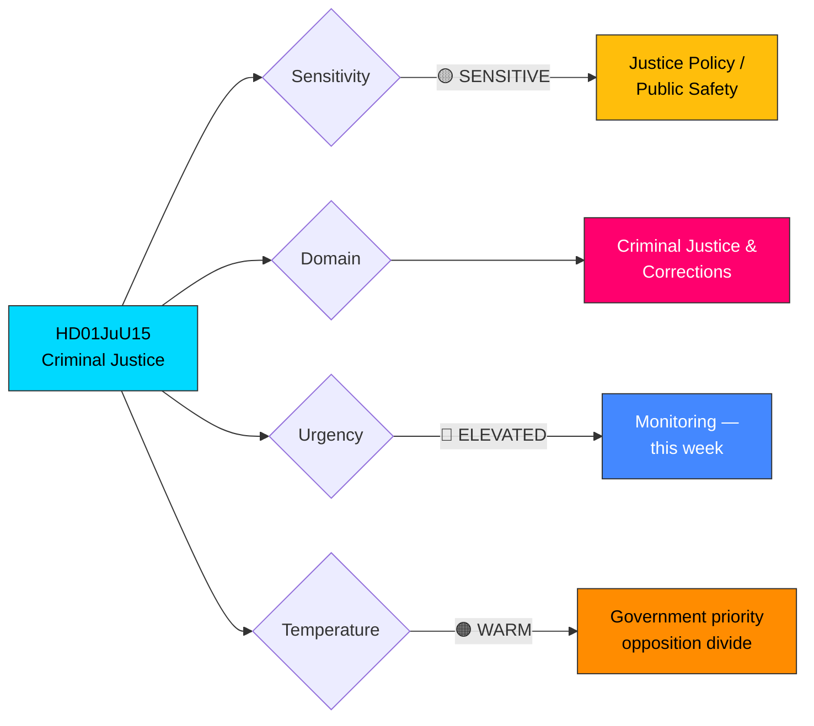

# 🔍 Per-File Political Intelligence Analysis: HD01JuU15

## 📋 Document Identity

| Field | Value |
|-------|-------|
| **Document ID** | `HD01JuU15` |
| **Document Type** | Committee Report (betänkande) |
| **Title** | Kriminalvårdsfrågor |
| **Title (EN)** | Criminal Justice Issues |
| **Date** | 2026-04-02 |
| **Riksmöte** | 2025/26 |
| **Committee** | Justitieutskottet (JuU) — Justice Committee |
| **Source MCP Tool** | `get_betankanden` |
| **Analysis Timestamp** | 2026-04-02 10:25 UTC |
| **Analyst** | news-realtime-monitor |

## 🎯 Executive Summary

The Justice Committee report JuU15 on criminal justice issues arrives alongside a **concerted government push on law enforcement and criminal justice reform**, including Prop 2025/26:235 (stricter deportation rules for criminal offenders) and Prop 2025/26:227 (improved investigation of youth crime). This report consolidates the Riksdag's position on prison capacity, rehabilitation programs, and correctional service modernization — a central policy pillar for the Tidöavtalet coalition (M, KD, L with SD cooperation). **Confidence: HIGH** — based on official committee report and known government priorities on crime.

## 📊 Political Classification

| Dimension | Assessment | Rationale |
|-----------|-----------|-----------|
| **Political Temperature** | 🟠 WARM | Criminal justice is a key dividing line between government and left opposition |
| **Sensitivity** | 🟡 SENSITIVE | Impacts prison population and public safety |
| **Strategic Significance** | MEDIUM-HIGH | Part of government's flagship crime-fighting agenda |
| **Coalition Relevance** | DIRECT | Core Tidöavtalet commitment area |

## 📊 SWOT Analysis

### Strengths

| Evidence | dok_id | Confidence | Impact |
|----------|--------|------------|--------|
| Addresses documented prison overcrowding crisis with capacity expansion plans | HD01JuU15 | HIGH | Improves correctional system functionality |
| Aligned with broader criminal justice reform package (Prop 235, Prop 227) | HD01JuU15, HD03235, HD03227 | HIGH | Coherent policy framework |
| Government coalition unified on tough-on-crime approach with SD backing | HD01JuU15 | HIGH | Strong legislative majority |

### Weaknesses

| Evidence | dok_id | Confidence | Impact |
|----------|--------|------------|--------|
| Prison expansion costs competing with defense and welfare budgets | HD01JuU15 | MEDIUM | Fiscal pressure on multiple fronts |
| Rehabilitation effectiveness may decrease with overcrowding | HD01JuU15 | MEDIUM | Long-term recidivism risk |
| Staff recruitment challenges in correctional services | HD01JuU15 | HIGH | Capacity bottleneck |

### Opportunities

| Evidence | dok_id | Confidence | Impact |
|----------|--------|------------|--------|
| Integration with deportation reform (Prop 235) may reduce prison population pressure | HD01JuU15, HD03235 | MEDIUM | Combined policy effectiveness |
| Digital monitoring and electronic tagging as prison alternatives | HD01JuU15 | MEDIUM | Cost-effective capacity expansion |
| Cross-party agreement possible on evidence-based rehabilitation | HD01JuU15 | LOW | Broader political support base |

### Threats

| Evidence | dok_id | Confidence | Impact |
|----------|--------|------------|--------|
| V and MP opposition to punitive approach may intensify debate | HD01JuU15 | HIGH | Political polarization |
| International human rights scrutiny of prison conditions | HD01JuU15 | MEDIUM | Reputational risk for Sweden |
| Gang-related crime trends may outpace policy response | HD01JuU15 | MEDIUM | Public safety concern |

## ⚠️ Risk Assessment

| Risk | Likelihood (1-5) | Impact (1-5) | L×I Score | Mitigation |
|------|:-:|:-:|:-:|------|
| Prison overcrowding worsens before new capacity online | 4 | 3 | **12** | Emergency capacity measures and temporary facilities |
| Staff shortages delay prison expansion | 3 | 3 | **9** | Improved recruitment packages and training programs |
| Opposition frames reforms as punitive overreach | 3 | 2 | **6** | Evidence-based communication on crime reduction outcomes |
| International criticism of detention conditions | 2 | 3 | **6** | Proactive engagement with monitoring bodies |

## 🔮 Forward Indicators

| Indicator | Trigger | Timeline | Monitoring Action |
|-----------|---------|----------|-------------------|
| Chamber debate on JuU15 | Scheduled in kammarens arbetsplan | 1-2 weeks | Monitor `get_calendar_events` |
| Prop 235 committee referral (deportation) | SfU committee assigned | April 2026 | Track `search_dokument` for SfU activity |
| Kriminalvården budget allocation | Spring budget supplementary proposal | May-June 2026 | Monitor FiU appropriations |

## 👥 Stakeholder Perspectives

| Stakeholder | Position | Evidence |
|-------------|----------|----------|
| **Citizens** | Strongly supportive of crime reduction — public safety a top voter concern | Crime consistently top-3 election issue in polling |
| **Government Coalition (M, KD, L)** | Driving force — Tidöavtalet crime-fighting commitment | JuU15 and Prop 235 from M-led Justice Ministry |
| **Opposition Bloc** | Divided — S supportive on some measures, V/MP oppose punitive expansion | S has moved rightward on crime; V/MP maintain rehabilitation focus |
| **Business/Industry** | Supportive — crime impacts business climate | Business associations favor stronger law enforcement |
| **Civil Society** | Split — victims' advocates support; human rights organizations cautious | Brottsofferjouren vs. Civil Rights Defenders perspectives diverge |
| **International/EU** | Monitoring — European Prison Rules compliance expected | Council of Europe CPT oversight ongoing |
| **Judiciary/Constitutional** | Professional engagement — courts and prosecutors central actors | Judicial capacity must match legislative changes |
| **Media/Public Opinion** | High interest — crime dominates media agenda | Extensive TV and newspaper coverage of crime policy |
