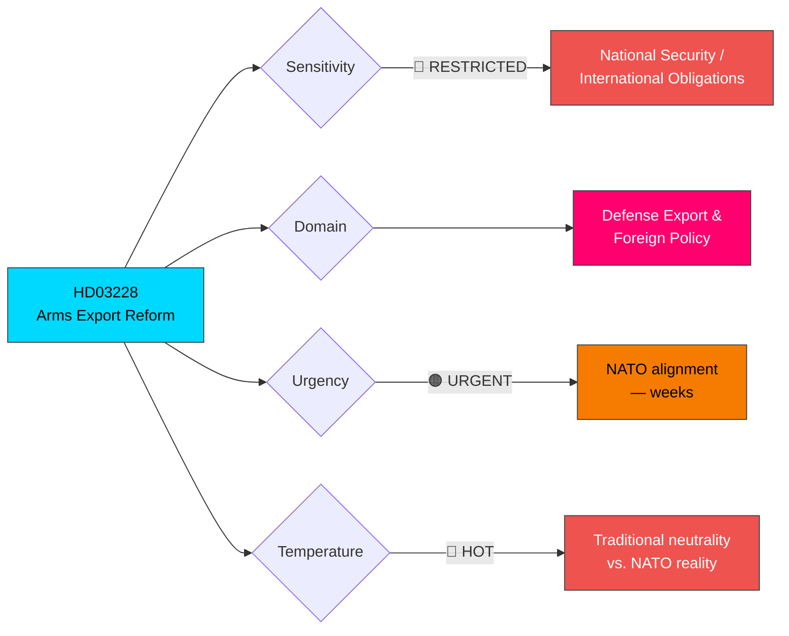

# 🔍 Per-File Political Intelligence Analysis: HD03228

## 📋 Document Identity

| Field | Value |
|-------|-------|
| **Document ID** | `HD03228` |
| **Document Type** | Government Proposition |
| **Title** | Ett modernt och anpassat regelverk för krigsmateriel |
| **Title (EN)** | A modern and adapted framework for war materiel |
| **Date** | 2026-04-01 |
| **Riksmöte** | 2025/26 |
| **Ministry** | Utrikesdepartementet |
| **Minister** | Benjamin Dousa (M) |
| **Source MCP Tool** | `get_propositioner` |
| **Analysis Timestamp** | 2026-04-02 10:25 UTC |
| **Analyst** | news-realtime-monitor |

## 🎯 Executive Summary

Proposition 2025/26:228 proposes a **comprehensive modernization of Sweden's arms export regulatory framework**, submitted by Foreign Minister Benjamin Dousa (M). This represents a fundamental shift in Swedish defense export policy, driven by NATO membership obligations and the need to support allied nations' defense capabilities. The proposition updates the Krigsmateriellagen (War Materiel Act), likely expanding export criteria while maintaining human rights safeguards. This is politically significant as it touches Sweden's long tradition of restrictive arms export policy and will face scrutiny from V, MP, and parts of S. **Confidence: HIGH** — official government proposition with clear policy direction.

## 📊 Political Classification

## 📊 SWOT Analysis

### Strengths

| Evidence | dok_id | Confidence | Impact |
|----------|--------|------------|--------|
| NATO interoperability requirement provides strong strategic rationale | HD03228 | HIGH | Alliance credibility strengthened |
| Swedish defense industry benefits — Saab, BAE Hägglunds, Bofors competitiveness enhanced | HD03228 | HIGH | Economic and industrial growth |
| Bipartisan support likely — S supported NATO accession, defense export reform follows logically | HD03228 | MEDIUM | Broad parliamentary majority achievable |

### Weaknesses

| Evidence | dok_id | Confidence | Impact |
|----------|--------|------------|--------|
| Challenges Sweden's international image as peace-promoting nation | HD03228 | MEDIUM | Soft power erosion |
| Complex regulatory change — War Materiel Inspectorate (ISP) needs restructuring | HD03228 | HIGH | Implementation timeline risk |
| End-user certificate enforcement remains problematic internationally | HD03228 | MEDIUM | Diversion risk |

### Opportunities

| Evidence | dok_id | Confidence | Impact |
|----------|--------|------------|--------|
| Growing European defense market post-Ukraine creates export demand | HD03228 | HIGH | Revenue and industrial growth |
| Joint production agreements with NATO allies (e.g., NLAW, Gripen) | HD03228 | HIGH | Strategic partnerships deepened |
| Ukraine support framework can be regularized through updated legislation | HD03228 | HIGH | Policy coherence |

### Threats

| Evidence | dok_id | Confidence | Impact |
|----------|--------|------------|--------|
| V and MP will frame as abandoning Swedish peace tradition | HD03228 | HIGH | Public opinion pressure |
| Arms reaching conflict zones despite safeguards — reputational risk | HD03228 | MEDIUM | International criticism |
| Dependence on US/NATO defense policy shifts | HD03228 | LOW | Strategic autonomy concern |

## ⚠️ Risk Assessment

| Risk | Likelihood (1-5) | Impact (1-5) | L×I Score | Mitigation |
|------|:-:|:-:|:-:|------|
| Opposition frames reform as militarization | 4 | 2 | **8** | Evidence-based communication on NATO obligations |
| Arms diversion to conflict zones | 2 | 5 | **10** | Strengthened end-user certificate requirements |
| ISP regulatory capacity insufficient | 3 | 3 | **9** | Additional staffing and budget allocation |
| Public opinion shift against arms exports | 2 | 3 | **6** | Transparent reporting to parliament |

## 🔮 Forward Indicators

| Indicator | Trigger | Timeline | Monitoring Action |
|-----------|---------|----------|-------------------|
| UU committee referral and hearing schedule | Proposition assigned to UU | April 2026 | Track `search_dokument` for UU activity |
| Defense industry reaction statements | Saab, BAE Hägglunds public positions | Days | Monitor government press conferences |
| International reaction (NATO allies, NGOs) | Diplomatic and NGO responses | 1-2 weeks | Monitor `search_regering` for foreign policy statements |

## 👥 Stakeholder Perspectives

| Stakeholder | Position | Evidence |
|-------------|----------|----------|
| **Citizens** | Divided — security vs. peace tradition | Public opinion shifting toward defense acceptance |
| **Government Coalition** | Unified — NATO-driven modernization | Benjamin Dousa (M) as proposing minister |
| **Opposition Bloc** | Split — S likely supportive, V/MP opposed, C likely supportive | S co-drove NATO accession; V/MP maintain antimilitarist position |
| **Business/Industry** | Strongly supportive — defense industry growth opportunity | Saab, Bofors, BAE Hägglunds benefit directly |
| **Civil Society** | Opposed — peace organizations and arms trade critics | Svenska Freds, Amnesty likely to campaign against |
| **International/EU** | NATO allies supportive — strengthens alliance cooperation | US, UK, Norway welcome Swedish defense engagement |
| **Judiciary/Constitutional** | Technical review — ISP and court system adaptation needed | Lagrådet review completed pre-submission |
| **Media/Public Opinion** | High interest — touches Swedish identity questions | Major media debate expected on peace tradition vs. NATO reality |
