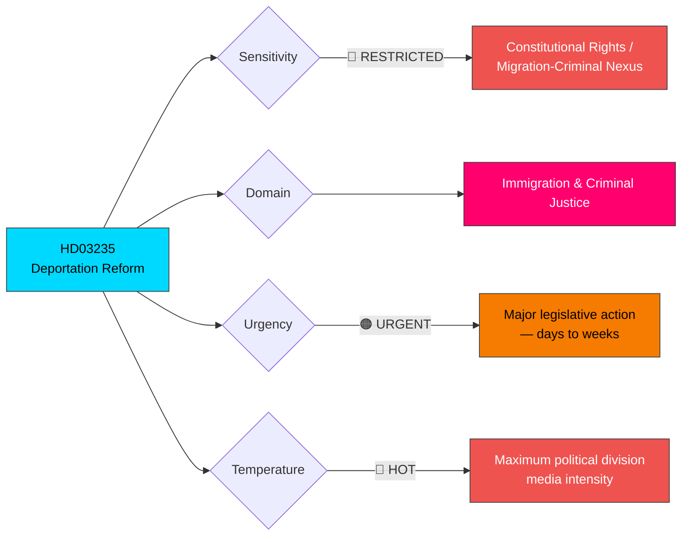

# 🔍 Per-File Political Intelligence Analysis: HD03235

## 📋 Document Identity

| Field | Value |
|-------|-------|
| **Document ID** | `HD03235` |
| **Document Type** | Government Proposition |
| **Title** | Skärpta regler om utvisning på grund av brott |
| **Title (EN)** | Stricter rules on deportation due to crime |
| **Date** | 2026-04-01 |
| **Riksmöte** | 2025/26 |
| **Ministry** | Justitiedepartementet |
| **Minister** | Johan Forssell (M) |
| **Source MCP Tool** | `get_propositioner` |
| **Analysis Timestamp** | 2026-04-02 10:25 UTC |
| **Analyst** | news-realtime-monitor |

## 🎯 Executive Summary

Proposition 2025/26:235 represents one of the **most consequential immigration-criminal justice intersection reforms** in recent Swedish legislative history. Submitted by Justice Minister Johan Forssell (M), it proposes substantially stricter rules for deporting foreign nationals convicted of crimes in Sweden. This directly fulfills a core Tidöavtalet commitment and represents the government's determination to tighten the link between criminal behavior and loss of residency rights. The proposition will be politically divisive, with S largely supportive but V, MP, and C likely to oppose on human rights and proportionality grounds. **Confidence: HIGH** — based on official government proposition with full legislative text.

## 📊 Political Classification

## 📊 SWOT Analysis

### Strengths

| Evidence | dok_id | Confidence | Impact |
|----------|--------|------------|--------|
| Directly fulfills Tidöavtalet promise — strengthens coalition credibility | HD03235 | HIGH | Coalition stability enhanced |
| Broad public support for stricter criminal deportation rules | HD03235 | HIGH | Electoral advantage for government parties |
| Coordinated with JuU15 (prison reform) and Prop 227 (youth crime) for comprehensive package | HD03235, HD01JuU15, HD03227 | HIGH | Systemic policy coherence |

### Weaknesses

| Evidence | dok_id | Confidence | Impact |
|----------|--------|------------|--------|
| Constitutional proportionality challenges may limit scope | HD03235 | MEDIUM | Legal vulnerability to judicial review |
| Implementation depends on Migration Agency and court capacity | HD03235 | HIGH | Administrative bottleneck risk |
| May strain EU law compliance (EU Directive 2004/38/EC, Family Reunification Directive) | HD03235 | MEDIUM | International legal friction |

### Opportunities

| Evidence | dok_id | Confidence | Impact |
|----------|--------|------------|--------|
| S party's rightward shift on crime creates potential for broader parliamentary support | HD03235 | MEDIUM | Cross-bloc majority achievable |
| May reduce prison population pressure if implemented effectively | HD03235, HD01JuU15 | MEDIUM | Budget and capacity relief |
| Nordic cooperation on criminal deportation enforcement | HD03235 | LOW | Regional policy alignment |

### Threats

| Evidence | dok_id | Confidence | Impact |
|----------|--------|------------|--------|
| European Court of Human Rights challenges on proportionality | HD03235 | MEDIUM | Legislative reversal risk |
| V, MP, and human rights organizations will mount sustained opposition | HD03235 | HIGH | Political and media pressure |
| Execution difficulties — deportation to countries with poor human rights records | HD03235 | HIGH | Practical implementation failures |

## ⚠️ Risk Assessment

| Risk | Likelihood (1-5) | Impact (1-5) | L×I Score | Mitigation |
|------|:-:|:-:|:-:|------|
| ECHR proportionality challenge | 3 | 4 | **12** | Ensure graduated thresholds with judicial oversight |
| Implementation delays in Migration Agency | 4 | 3 | **12** | Additional funding and staffing in spring budget |
| Diplomatic friction with receiving countries | 3 | 3 | **9** | Bilateral return agreements strengthened |
| Civil society mobilization against reform | 4 | 2 | **8** | Evidence-based public communication strategy |

## 🔮 Forward Indicators

| Indicator | Trigger | Timeline | Monitoring Action |
|-----------|---------|----------|-------------------|
| Committee referral (likely SfU) | Proposition assigned to committee | April 2026 | Track `search_dokument` for SfU referral |
| Lagrådet opinion (Council on Legislation) | Legal review published | Already completed (pre-submission) | Check lagrådsremiss |
| Opposition motion responses | Counter-motions filed | April-May 2026 | Monitor `get_motioner` for immigration-related motions |

## 👥 Stakeholder Perspectives

| Stakeholder | Position | Evidence |
|-------------|----------|----------|
| **Citizens** | Majority supportive — crime and migration top voter concerns | SOM/Novus polls show >60% support stricter deportation |
| **Government Coalition** | Unified — core Tidöavtalet deliverable | Johan Forssell (M) as proposing minister; SD cooperation agreement explicit |
| **Opposition Bloc** | Fragmented — S partially supportive, V/MP strongly opposed, C cautious | S migrating rightward; V frames as human rights issue |
| **Business/Industry** | Cautiously supportive — labor market implications monitored | Employer organizations neutral to supportive |
| **Civil Society** | Divided — victims' advocates vs. human rights organizations | RFSL, Red Cross, Amnesty likely opposed; Brottsofferjouren supportive |
| **International/EU** | Scrutiny — European institutions monitoring proportionality | ECHR and EU Commission awareness |
| **Judiciary/Constitutional** | Central role — courts must apply new thresholds | Lagrådet review completed; judicial training needed |
| **Media/Public Opinion** | Intense coverage — immigration-crime nexus dominates news | Daily media reporting on proposition expected |
