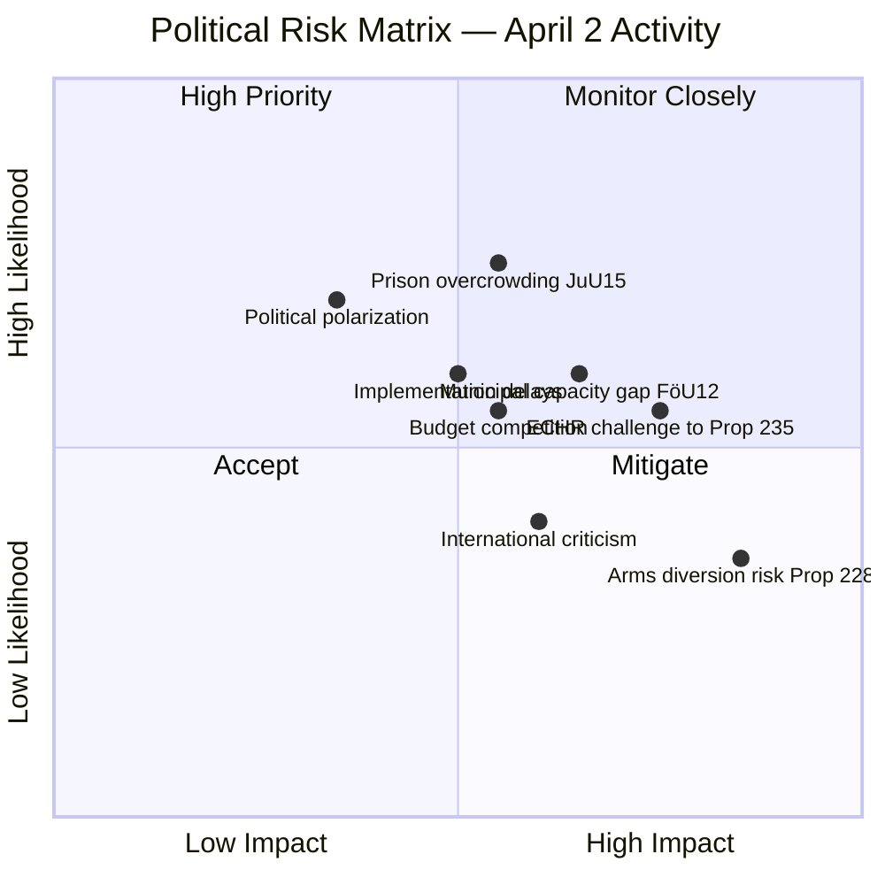

# ⚠️ Risk Assessment — Realtime Monitor 2026-04-02

**Date:** 2026-04-02 | **Analyst:** news-realtime-monitor | **Classification:** PUBLIC

## Consolidated Risk Matrix

## Top Risks by L×I Score

| # | Risk | Source | L (1-5) | I (1-5) | L×I | Category |
|---|------|--------|:-:|:-:|:-:|----------|
| 1 | ECHR proportionality challenge to deportation reform | HD03235 | 3 | 4 | **12** | Legal |
| 2 | Municipal civilian protection capacity insufficient | HD01FöU12 | 3 | 4 | **12** | Implementation |
| 3 | Migration Agency implementation delays | HD03235 | 4 | 3 | **12** | Administrative |
| 4 | Prison overcrowding before new capacity online | HD01JuU15 | 4 | 3 | **12** | Operational |
| 5 | Arms diversion to conflict zones | HD03228 | 2 | 5 | **10** | Reputational |
| 6 | Budget competition between defense tracks | Multiple | 3 | 3 | **9** | Fiscal |
| 7 | ISP regulatory capacity for arms exports | HD03228 | 3 | 3 | **9** | Administrative |
| 8 | Opposition political polarization intensifies | All docs | 3 | 2 | **6** | Political |

## Risk Interconnections

The four documents share interconnected risk pathways:

- **Budget competition**: FöU12 (civilian defense), JuU15 (prison expansion), and Prop 228 (ISP capacity) all compete for limited fiscal space
- **Implementation capacity**: Multiple agencies (MSB, Kriminalvården, Migrationsverket, ISP) face simultaneous reform mandates
- **Political timeline**: With September 2026 elections, compressed implementation creates execution risk

## Aggregated Risk Level: **ELEVATED** (multiple HIGH-scoring risks across interconnected policy domains)
