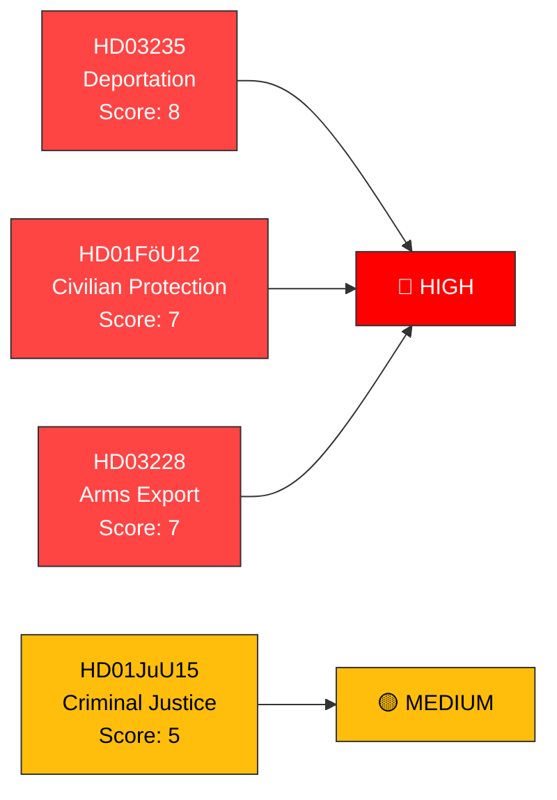

# 🎯 Significance Scoring — Realtime Monitor 2026-04-02

**Date:** 2026-04-02 | **Analyst:** news-realtime-monitor | **Classification:** PUBLIC

## Scoring Methodology

Based on the severity scoring formula:
- +3 if coalition majority at risk
- +2 if > 3 parties involved
- +2 if budget/fiscal implications
- +2 if defense/security policy
- +2 if criminal justice or social welfare reform
- +1 if involves named minister
- +1 if committee report approves government proposal
- -2 if similar topic covered in last 6 hours

## Document Scores

| dok_id | Title | Score Breakdown | Total | Tier |
|--------|-------|-----------------|:-----:|------|
| HD03235 | Skärpta regler om utvisning | +2 (criminal justice) +2 (>3 parties) +2 (immigration/security) +1 (minister Forssell) +1 (government proposal) | **8** | 🔴 HIGH |
| HD01FöU12 | Starkare skydd civilbefolkningen | +2 (defense/security) +2 (>3 parties) +2 (budget implications) +1 (committee report) | **7** | 🔴 HIGH |
| HD03228 | Modernt regelverk krigsmateriel | +2 (defense/security) +2 (>3 parties) +1 (minister Dousa) +2 (NATO/international) | **7** | 🔴 HIGH |
| HD01JuU15 | Kriminalvårdsfrågor | +2 (criminal justice) +2 (budget implications) +1 (committee report) | **5** | 🟡 MEDIUM |

## Aggregate Assessment

**Combined Day Score: 8/10 (HIGH)** — Three documents reach HIGH threshold independently. The combined effect of a defense, criminal justice, and immigration push on the same day elevates the aggregate significance further.

**Article Generation Decision: GENERATE BREAKING** — Multiple HIGH-severity events warrant breaking news coverage.
