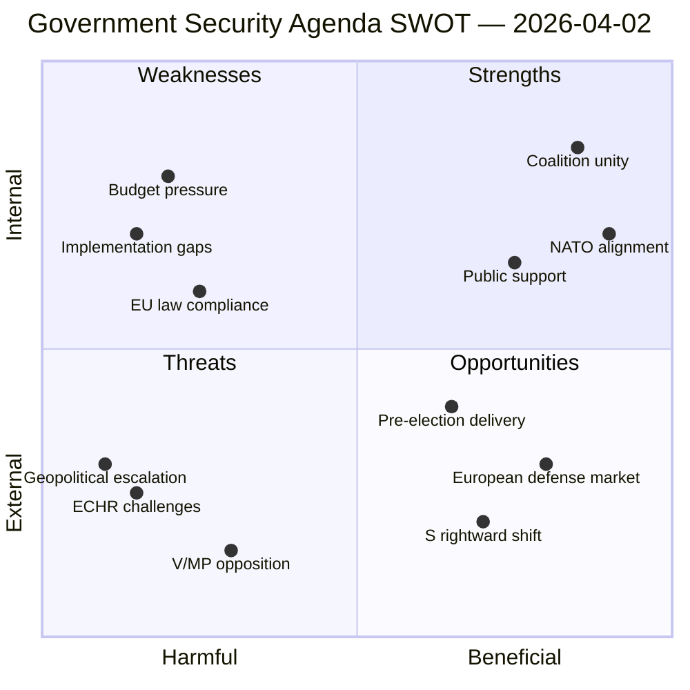

# 📊 SWOT Analysis — Realtime Monitor 2026-04-02

**Date:** 2026-04-02 | **Analyst:** news-realtime-monitor | **Classification:** PUBLIC

## Context

| Field | Value |
|-------|-------|
| **Documents Analyzed** | 4 (FöU12, JuU15, Prop 235, Prop 228) |
| **Policy Domains** | Defense, Criminal Justice, Immigration, Arms Export |
| **Key Actors** | Johan Forssell (M), Benjamin Dousa (M), Carl-Oskar Bohlin (M) |
| **Coalition Dynamics** | M-KD-L government with SD cooperation agreement |

## SWOT Quadrant Mapping

## Strengths — Evidence Table

| # | Strength | dok_id | Confidence | Impact |
|---|----------|--------|------------|--------|
| S1 | Coalition fully unified on security agenda — all 4 documents from M-led ministries with SD backing | HD01FöU12, HD01JuU15, HD03235, HD03228 | HIGH | Strong legislative majority for passage |
| S2 | NATO membership provides institutional framework and international legitimacy for defense reforms | HD01FöU12, HD03228 | HIGH | Reduces domestic political opposition |
| S3 | Public opinion strongly favors both crime reduction and defense investment | HD01JuU15, HD03235 | HIGH | Electoral mandate for action |
| S4 | Coherent policy package — defense, justice, and immigration reforms mutually reinforcing | All four documents | HIGH | Strategic narrative dominance |

## Weaknesses — Evidence Table

| # | Weakness | dok_id | Confidence | Impact |
|---|----------|--------|------------|--------|
| W1 | Budget competition across multiple reform tracks — defense, prisons, immigration enforcement all need funding | FöU12, JuU15, HD03235 | HIGH | Fiscal sustainability risk |
| W2 | Implementation capacity strained — multiple agencies face simultaneous reform mandates | All four documents | MEDIUM | Execution quality risk |
| W3 | Constitutional proportionality constraints on deportation reform | HD03235 | MEDIUM | Legal vulnerability |
| W4 | Historical civil defense underinvestment creates years-long capacity gap | HD01FöU12 | HIGH | Protection readiness delayed |

## Opportunities — Evidence Table

| # | Opportunity | dok_id | Confidence | Impact |
|---|------------|--------|------------|--------|
| O1 | Growing European defense market creates export revenue for Swedish industry | HD03228 | HIGH | Economic growth and fiscal space |
| O2 | S party's rightward movement on crime and defense opens cross-bloc cooperation | HD03235, HD01FöU12 | MEDIUM | Stronger legislative mandates |
| O3 | NATO integration accelerates civil-military coordination capability | HD01FöU12 | HIGH | Faster capability development |
| O4 | Pre-election delivery window motivates rapid implementation | All documents | HIGH | Accelerated policy execution |

## Threats — Evidence Table

| # | Threat | dok_id | Confidence | Impact |
|---|--------|--------|------------|--------|
| T1 | ECHR and EU legal challenges to deportation reform | HD03235 | MEDIUM | Legislative reversal risk |
| T2 | V, MP opposition campaigns framing reforms as authoritarian shift | HD03235, HD03228 | HIGH | Public opinion erosion |
| T3 | Geopolitical escalation outpacing legislative timeline | HD01FöU12 | MEDIUM | Protection gap during crisis |
| T4 | International reputational damage from arms export expansion | HD03228 | MEDIUM | Soft power erosion |

## Stakeholder Impact Matrix (All 8 Groups)

| Stakeholder Group | Net Impact | Key Concern | Primary Document |
|-------------------|-----------|-------------|-----------------|
| **Citizens** | ⬆️ Positive | Improved safety and security | FöU12, JuU15 |
| **Government Coalition** | ⬆️ Strongly Positive | Tidöavtalet delivery on all fronts | All four |
| **Opposition Bloc** | ➡️ Mixed | S partially aligned; V/MP strongly opposed | HD03235, HD03228 |
| **Business/Industry** | ⬆️ Positive | Defense industry growth; law enforcement market | HD03228 |
| **Civil Society** | ⬇️ Mixed-Negative | Human rights concerns vs. safety improvements | HD03235 |
| **International/EU** | ➡️ Mixed | NATO positive; ECHR scrutiny | HD03228, HD03235 |
| **Judiciary/Constitutional** | ➡️ Neutral | Adapting to new legal frameworks | HD03235, HD01JuU15 |
| **Media/Public Opinion** | ⬆️ High Interest | Security dominates spring agenda | All four |
