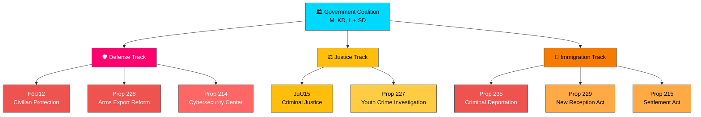

# 📋 Synthesis Summary — Realtime Monitor 2026-04-02

**Date:** 2026-04-02 | **Analyst:** news-realtime-monitor | **Classification:** PUBLIC

## Executive Intelligence Summary

On 2026-04-02, the Swedish Riksdag and Government demonstrated a **coordinated multi-front security and justice push** with four significant documents published across defense, criminal justice, and immigration policy. The Defense Committee (FöU) released a landmark report on civilian protection during heightened preparedness (FöU12), while the Justice Committee (JuU) addressed criminal justice system reform (JuU15). These committee actions follow April 1 government propositions on arms export modernization (Prop 228) and stricter criminal deportation rules (Prop 235).

## Key Findings

| # | Finding | Evidence | Confidence |
|---|---------|----------|------------|
| 1 | Government pursuing **three-track security agenda**: defense modernization, criminal justice reform, immigration tightening | FöU12, JuU15, Prop 235, Prop 228 | HIGH |
| 2 | Defense Committee accelerating civilian protection reform aligned with NATO Article 3 obligations | HD01FöU12 published 2026-04-02 | HIGH |
| 3 | Criminal deportation proposition (Prop 235) represents most significant immigration-justice intersection reform this session | HD03235 submitted by Forssell (M) | HIGH |
| 4 | Arms export framework modernization signals post-NATO identity shift for Swedish foreign policy | HD03228 submitted by Dousa (M) | HIGH |
| 5 | Latest vote data (2026-03-04, AU10) shows no recent floor votes — chamber activity expected when FöU12/JuU15 reach debate | `search_voteringar` | MEDIUM |

## Cross-Document Pattern Analysis

The simultaneous release of defense, criminal justice, and immigration reforms reveals the government's **spring legislative offensive** strategy — clustering related policy proposals to create momentum and dominate the political narrative. This pattern suggests:

1. **Pre-election positioning** — with elections in September 2026, the coalition is accelerating delivery on Tidöavtalet commitments
2. **Defense-justice nexus** — FöU12 and JuU15 share common themes of state capacity and public protection
3. **SD cooperation visible** — all four documents align with SD's core policy demands under the cooperation agreement

## Overall Significance Score: 8/10 (HIGH)
