# 🕵️ Threat Analysis — Realtime Monitor 2026-04-02

**Date:** 2026-04-02 | **Analyst:** news-realtime-monitor | **Classification:** PUBLIC

## Political Threat Landscape

```mermaid
graph TD
    ROOT["Political Threat<br/>Landscape April 2"] --> T1["Implementation<br/>Failure"]
    ROOT --> T2["Legal<br/>Challenge"]
    ROOT --> T3["Political<br/>Polarization"]
    ROOT --> T4["External<br/>Pressure"]
    
    T1 --> T1A["Municipal capacity gap<br/>FöU12 civilian protection"]
    T1 --> T1B["Agency overload<br/>Multiple reforms simultaneously"]
    T1 --> T1C["Budget competition<br/>Defense vs. justice vs. welfare"]
    
    T2 --> T2A["ECHR proportionality<br/>Prop 235 deportation"]
    T2 --> T2B["EU law compliance<br/>Prop 235 migration directives"]
    
    T3 --> T3A["V/MP opposition campaigns<br/>Framing as authoritarian"]
    T3 --> T3B["Media amplification<br/>Polarizing narratives"]
    
    T4 --> T4A["Geopolitical escalation<br/>Crisis before FöU12 implemented"]
    T4 --> T4B["Arms diversion<br/>Prop 228 end-user failures"]
    
    style ROOT fill:#00d9ff,stroke:#424242,color:#000000
    style T1 fill:#F57C00,stroke:#424242,color:#000000
    style T2 fill:#EF5350,stroke:#424242,color:#FFFFFF
    style T3 fill:#ffbe0b,stroke:#424242,color:#000000
    style T4 fill:#ff006e,stroke:#424242,color:#FFFFFF
    style T1A fill:#ffcc88,stroke:#424242,color:#000000
    style T1B fill:#ffcc88,stroke:#424242,color:#000000
    style T1C fill:#ffcc88,stroke:#424242,color:#000000
    style T2A fill:#ff8888,stroke:#424242,color:#000000
    style T2B fill:#ff8888,stroke:#424242,color:#000000
    style T3A fill:#ffe888,stroke:#424242,color:#000000
    style T3B fill:#ffe888,stroke:#424242,color:#000000
    style T4A fill:#ff88aa,stroke:#424242,color:#000000
    style T4B fill:#ff88aa,stroke:#424242,color:#000000
```

## Threat Assessment by Category

| Category | Threat | Source | Severity | Probability |
|----------|--------|--------|----------|-------------|
| Implementation | Municipal capacity gap | HD01FöU12 | HIGH | MEDIUM |
| Implementation | Multi-agency reform overload | All documents | MEDIUM | HIGH |
| Legal | ECHR proportionality challenge | HD03235 | HIGH | MEDIUM |
| Legal | EU directive compliance | HD03235 | MEDIUM | MEDIUM |
| Political | V/MP framing as authoritarian | HD03235, HD03228 | MEDIUM | HIGH |
| External | Geopolitical crisis timing | HD01FöU12 | HIGH | LOW |
| External | Arms diversion risk | HD03228 | HIGH | LOW |

## Aggregate Threat Level: **ELEVATED** — Multiple credible threat vectors across implementation, legal, and political domains
