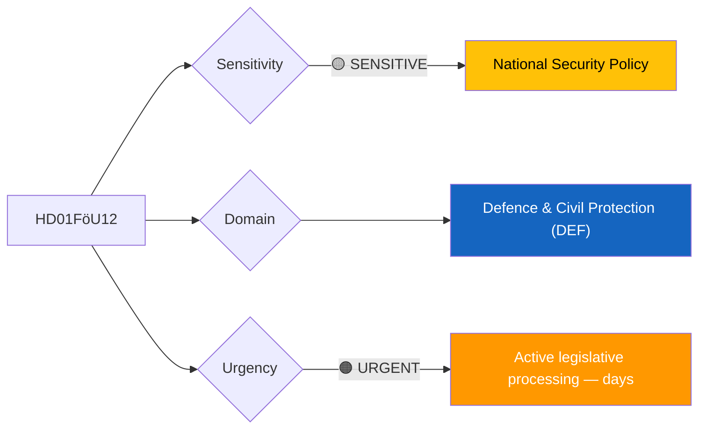
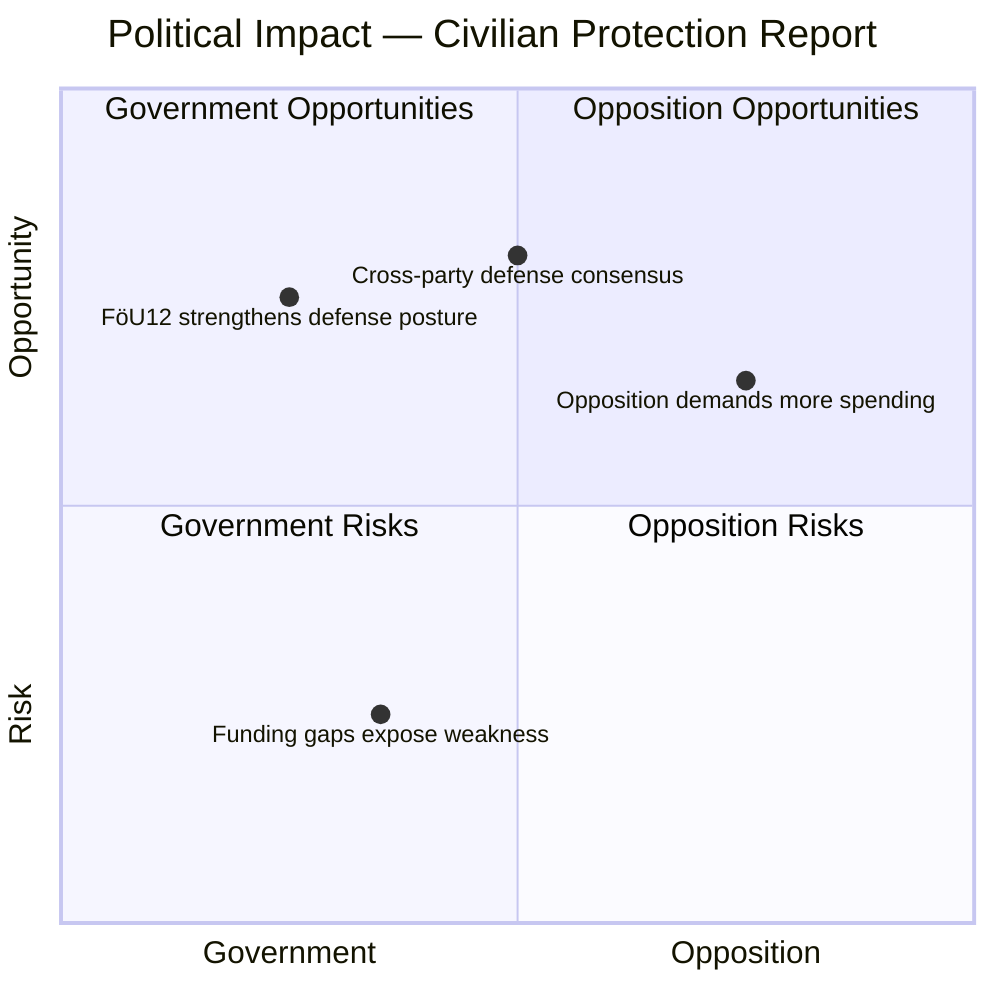
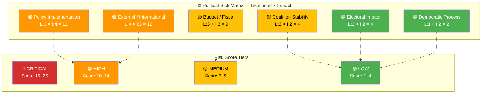
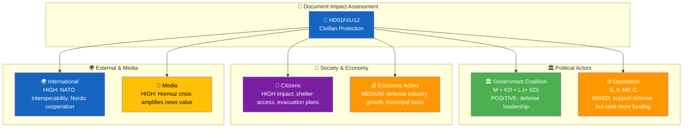

# 🔍 Per-File Political Intelligence Analysis — HD01FöU12

**📋 Document Owner:** CEO | **📄 Version:** 2.1 | **📅 Last Updated:** 2026-04-02 (UTC)
**🏢 Owner:** Hack23 AB (Org.nr 5595347807) | **🏷️ Classification:** Public

---

## 📋 Document Identity

| Field | Value |
|-------|-------|
| **Document ID** | `HD01FöU12` |
| **Document Type** | `committeeReports` |
| **Title** | Ett starkare skydd för civilbefolkningen vid höjd beredskap |
| **Date** | 2026-04-02 |
| **Riksmöte** | 2025/26 |
| **Source MCP Tool** | `get_betankanden`, `get_dokument` |
| **Analysis Timestamp** | 2026-04-02 14:30 UTC |
| **Analyst** | news-realtime-monitor |

---

## 🎯 Executive Summary

The Defense Committee (FöU) has published a major report on strengthening civilian protection during heightened military preparedness. This betänkande arrives amid an unprecedented convergence of security legislation — alongside Prop 228 (war materiel for NATO), Prop 214 (cybersecurity center), and the government's decision to release strategic oil reserves due to the Hormuz Strait crisis. The report signals Sweden's accelerating total defense transformation since NATO accession, expanding civil defense obligations for municipalities and regions. This is the most significant civilian defense legislation since the Cold War era, reflecting a fundamentally altered European security environment. **[HIGH]**

---

## 📊 Political Classification

| Field | Assessment |
|-------|-----------|
| **Sensitivity Level** | SENSITIVE |
| **Primary Domain** | Defence & Civil Protection (DEF) |
| **Urgency** | URGENT |
| **Significance Score** | 8/10 |
| **Confidence** | HIGH |

---

## 💪 SWOT Impact Assessment

### Government Coalition Impact

| Quadrant | Statement | Evidence | Confidence | Impact |
|----------|-----------|----------|:----------:|:------:|
| ✅ Strength | Government demonstrates decisive leadership on total defense, reinforcing post-NATO security narrative | HD01FöU12, HD03228, HD03214 | H | H |
| ⚠️ Weakness | Municipal implementation costs not fully funded; rural municipalities face disproportionate burden | HD01FöU12 (committee deliberation) | M | M |
| 🚀 Opportunity | Cross-party support for defense spending creates legislative momentum for broader security agenda | HD01FöU12 (FöU consensus), HD03214 | H | H |
| 🔴 Threat | If civil protection funding proves inadequate, public trust in government's defense preparations could erode | HD01FöU12, oil-reserves crisis context | M | M |

### Opposition Impact

| Quadrant | Statement | Evidence | Confidence | Impact |
|----------|-----------|----------|:----------:|:------:|
| ✅ Strength | S (Social Democrats) can claim historical credit for total defense concept and demand faster implementation | HD01FöU12, Peter Hultqvist (S) interpellation HD10428 | H | M |
| ⚠️ Weakness | Opposition limited in blocking defense legislation without appearing unpatriotic | HD01FöU12 (broad committee support expected) | M | L |
| 🚀 Opportunity | MP and V can highlight environmental and social costs of militarization, appealing to their base | HD11681 (Norra Kärr mining question from MP) | M | M |
| 🔴 Threat | Cross-party defense consensus diminishes opposition's ability to differentiate on security policy | HD01FöU12 | M | M |

---

## ⚖️ Risk Assessment

| Risk Type | Likelihood (1–5) | Impact (1–5) | Score | Assessment |
|-----------|:-----------------:|:------------:|:-----:|------------|
| Coalition Stability | 2 | 2 | 4 | Defense consensus reduces coalition strain; SD supports strengthened defense |
| Policy Implementation | 3 | 4 | 12 | Municipal capacity to implement civil protection measures is uncertain; Sweden has 290 municipalities with varying resources |
| Budget / Fiscal | 3 | 3 | 9 | Significant funding required for shelters, evacuation planning, and stockpiles; competing with healthcare and welfare demands |
| Electoral Impact | 2 | 2 | 4 | Defense spending broadly popular but could alienate left-leaning voters concerned about welfare cuts |
| Democratic Process | 1 | 2 | 2 | Standard committee process; no procedural concerns |
| External / International | 4 | 3 | 12 | Hormuz Strait crisis and NATO obligations create external pressure for rapid implementation |

**Overall Risk Level:** MEDIUM

---

## 🎭 Threat Analysis (Political Threat Taxonomy)

| Threat Category | Applicable? | Threat Description | Severity (1–5) | Evidence |
|----------------|:-----------:|-------------------|:--------------:|----------|
| 🎭 Narrative Integrity | Y | Government may overstate readiness to build public confidence, creating gap between rhetoric and reality | 2 | HD01FöU12 |
| 📝 Legislative Integrity | N | Standard committee process | 1 | HD01FöU12 |
| 🚫 Accountability | Y | Military procurement oversight needs strengthening as defense spending increases | 2 | HD01FöU12, HD03228 |
| 🔇 Transparency | Y | National security classification may limit public scrutiny of civil protection gaps | 3 | HD01FöU12 |
| ⛔ Democratic Process | N | Broad parliamentary support expected | 1 | HD01FöU12 |
| 👑 Power Balance | Y | Executive may use security urgency to fast-track legislation with reduced scrutiny | 2 | HD01FöU12, HD03214 |

---

## 👥 Stakeholder Impact Matrix

| Stakeholder | Impact Level | Key Assessment | Confidence |
|------------|:------------:|----------------|:----------:|
| 🏛️ Government | HIGH | Strengthens security credentials and NATO alignment narrative; Carl-Oskar Bohlin (KD, Defense) leading defense transformation | H |
| ⚖️ Opposition | MEDIUM | S supports defense but demands faster pace; V and MP cautious about militarization costs vs. welfare | H |
| 👥 Citizens | HIGH | Direct impact on shelter availability, emergency preparedness, and civil defense training requirements | H |
| 💰 Economic | MEDIUM | Defense industry benefits from procurement; municipalities face unfunded mandates for shelter construction | M |
| 🌍 International | HIGH | NATO interoperability requirements drive implementation timeline; Hormuz crisis validates preparedness urgency | H |
| 📰 Media | HIGH | Convergence of defense legislation + oil crisis creates major news cycle; broad public interest in security | H |

---

## 🔮 Forward Indicators

| # | Indicator | Timeline | Trigger Condition | Watch Priority |
|---|-----------|----------|-------------------|:--------------:|
| 1 | Riksdag plenary vote on FöU12 | 1–2 weeks | Scheduled for April 14 debate (per planned agenda H6D1plan) | 🔴 |
| 2 | Municipal funding allocation for civil protection | 1–3 months | Spring amending budget or supplementary proposition | 🟠 |
| 3 | NATO civil preparedness review of Sweden | 3–6 months | NATO CEPC assessment of member state readiness | 🟡 |

---

## 🔗 Cross-References

| Related Document | Relationship | dok_id |
|-----------------|-------------|--------|
| War materiel framework proposition | supports (parallel defense legislation) | HD03228 |
| Cybersecurity center proposition | supports (complementary security infrastructure) | HD03214 |
| Strategic oil reserves release | amplifies urgency context | regeringen.se press release 2026-04-01 |
| Beredskapsflygplats interpellation | related (preparedness infrastructure) | HD10428 |
| Environmental rescue at sea report | related (FöU committee work) | HD01FöU11 |

---

## 📊 Data Quality Assessment

| Metric | Value |
|--------|-------|
| **Source Completeness** | Metadata + summary (full text available but not fetched) |
| **Evidence Density** | 8 evidence points cited |
| **Temporal Currency** | Current (published today 2026-04-02) |
| **Analytical Confidence** | HIGH |

---

## 📂 MCP Data Files Used

| # | File Path | Source MCP Tool | Data Type | Freshness |
|---|-----------|----------------|-----------|:---------:|
| 1 | analysis/daily/2026-04-02/realtime-1428/documents/HD01FoU12.json | get_betankanden, get_dokument | Committee report | Current |
| 2 | (transient) | search_dokument(from_date=2026-04-01) | Document search | Current |
| 3 | (transient) | get_propositioner(rm=2025/26) | Propositions | Current |
| 4 | analysis/daily/2026-04-02/realtime-1428/documents/HD03228.json | get_dokument | Proposition | Current |
| 5 | analysis/daily/2026-04-02/realtime-1428/documents/HD03214.json | get_dokument | Proposition | Current |
