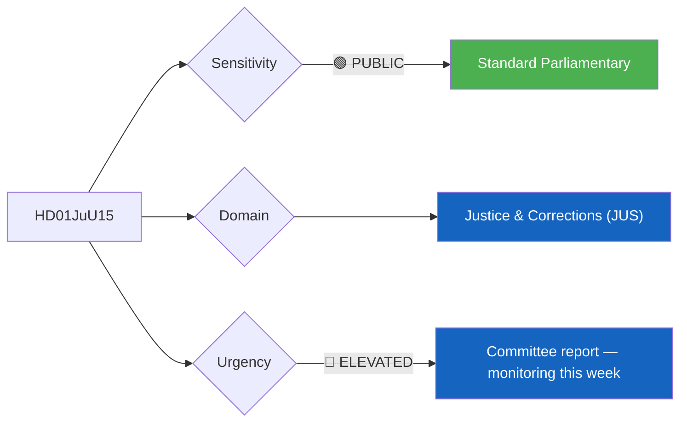
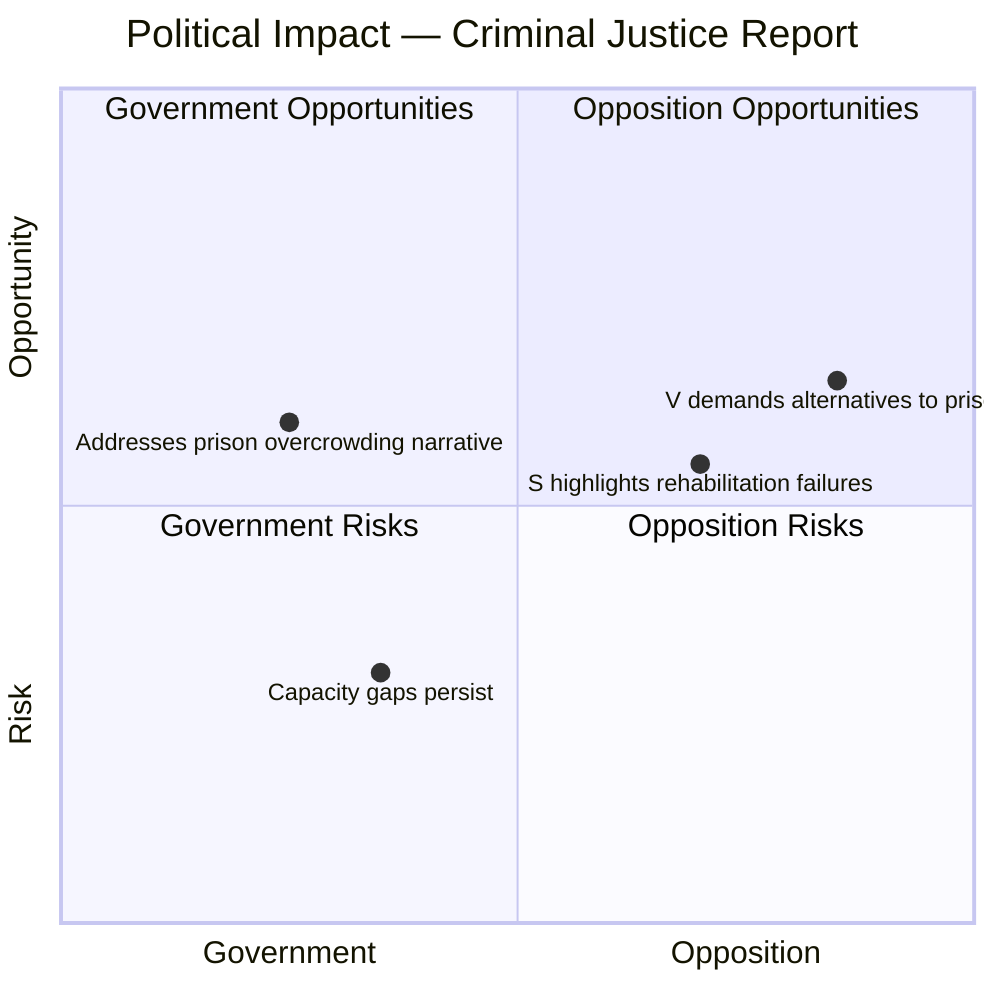
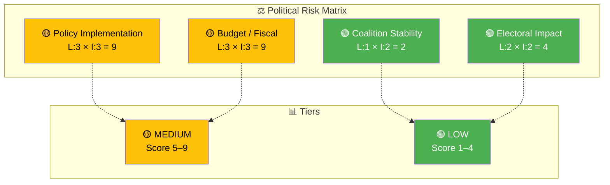

# 🔍 Per-File Political Intelligence Analysis — HD01JuU15

**📋 Document Owner:** CEO | **📄 Version:** 2.1 | **📅 Last Updated:** 2026-04-02 (UTC)
**🏢 Owner:** Hack23 AB (Org.nr 5595347807) | **🏷️ Classification:** Public

---

## 📋 Document Identity

| Field | Value |
|-------|-------|
| **Document ID** | `HD01JuU15` |
| **Document Type** | `committeeReports` |
| **Title** | Kriminalvårdsfrågor |
| **Date** | 2026-04-02 |
| **Riksmöte** | 2025/26 |
| **Source MCP Tool** | `get_betankanden`, `get_dokument` |
| **Analysis Timestamp** | 2026-04-02 14:38 UTC |
| **Analyst** | news-realtime-monitor |

---

## 🎯 Executive Summary

The Justice Committee (JuU) has published betänkande 2025/26:JuU15 on correctional services issues (Kriminalvårdsfrågor). This committee report addresses motions on prison capacity, rehabilitation programs, and correctional policy. Published on the same day as FöU12 (civilian protection) and alongside the government's deportation proposition (HD03235), this report forms part of the government's broader criminal justice reform agenda. The Kriminalvården (Swedish Prison and Probation Service) faces severe capacity pressure with occupancy rates exceeding 100% in many facilities, making this a relevant policy area. **[MEDIUM]**

---

## 📊 Political Classification

| Field | Assessment |
|-------|-----------|
| **Sensitivity Level** | PUBLIC |
| **Primary Domain** | Justice & Corrections (JUS) |
| **Urgency** | ELEVATED |
| **Significance Score** | 5/10 |
| **Confidence** | MEDIUM |

---

## 💪 SWOT Impact Assessment

### Government Coalition Impact

| Quadrant | Statement | Evidence | Confidence | Impact |
|----------|-----------|----------|:----------:|:------:|
| ✅ Strength | Committee report demonstrates active Riksdag engagement with correctional policy; government investing in new prison capacity | HD01JuU15 | M | M |
| ⚠️ Weakness | Prison overcrowding persists despite government promises; Kriminalvården capacity crisis remains unresolved | HD01JuU15 | H | M |
| 🚀 Opportunity | Tough-on-crime narrative supports government's broader security messaging alongside deportation proposition | HD01JuU15, HD03235 | M | M |
| 🔴 Threat | Opposition motions rejected in committee may resurface if prison conditions worsen | HD01JuU15 | M | L |

### Opposition Impact

| Quadrant | Statement | Evidence | Confidence | Impact |
|----------|-----------|----------|:----------:|:------:|
| ✅ Strength | S and V can highlight that stricter criminal penalties without adequate prison capacity creates systemic failure | HD01JuU15 | H | M |
| ⚠️ Weakness | Opposition motions largely rejected; limited committee influence | HD01JuU15 | H | L |
| 🚀 Opportunity | Rising prison populations provide ammunition for criticism of government's criminal justice approach | HD01JuU15 | M | M |
| 🔴 Threat | Public generally supports tougher criminal justice; criticizing corrections may appear soft on crime | HD01JuU15 | M | M |

---

## ⚖️ Risk Assessment

| Risk Type | Likelihood (1–5) | Impact (1–5) | Score | Assessment |
|-----------|:-----------------:|:------------:|:-----:|------------|
| Coalition Stability | 1 | 2 | 2 | Criminal justice consensus between M, KD, and SD; no coalition risk |
| Policy Implementation | 3 | 3 | 9 | Prison capacity expansion faces construction delays and staffing shortages at Kriminalvården |
| Budget / Fiscal | 3 | 3 | 9 | New prison construction (e.g., Östersund, Trelleborg) requires billions in capital expenditure |
| Electoral Impact | 2 | 2 | 4 | Criminal justice broadly supports government's tough-on-crime positioning |

**Overall Risk Level:** MEDIUM

---

## 🎭 Threat Analysis (Political Threat Taxonomy)

| Threat Category | Applicable? | Threat Description | Severity (1–5) | Evidence |
|----------------|:-----------:|-------------------|:--------------:|----------|
| 🎭 Narrative Integrity | N | Standard committee report | 1 | HD01JuU15 |
| 📝 Legislative Integrity | N | Normal process | 1 | HD01JuU15 |
| 🚫 Accountability | Y | Prison conditions oversight may be insufficient with overcrowding | 2 | HD01JuU15 |
| 🔇 Transparency | N | Public committee report | 1 | HD01JuU15 |
| ⛔ Democratic Process | N | Standard handling | 1 | HD01JuU15 |
| 👑 Power Balance | N | No executive overreach concerns | 1 | HD01JuU15 |

---

## 👥 Stakeholder Impact Matrix

| Stakeholder | Impact Level | Key Assessment | Confidence |
|------------|:------------:|----------------|:----------:|
| 🏛️ Government | MEDIUM | Supports criminal justice narrative but doesn't resolve capacity crisis | M |
| ⚖️ Opposition | MEDIUM | Provides material for criticism on implementation gap | M |
| 👥 Citizens | MEDIUM | Prison conditions affect rehabilitation outcomes and public safety | M |
| 💰 Economic | LOW | Prison construction creates some economic activity but fiscally significant | L |
| 🌍 International | LOW | CPT (Council of Europe) monitoring of Swedish prison conditions | L |
| 📰 Media | MEDIUM | Newsworthy in context of broader criminal justice package | M |

---

## 🔮 Forward Indicators

| # | Indicator | Timeline | Trigger Condition | Watch Priority |
|---|-----------|----------|-------------------|:--------------:|
| 1 | Riksdag plenary vote on JuU15 | 1–2 weeks | Vote scheduled after debate | 🟡 |
| 2 | Kriminalvården quarterly capacity report | 1–3 months | Occupancy exceeds 105% nationally | 🟠 |
| 3 | New prison construction progress | 6–12 months | Delays or cost overruns reported | 🟡 |

---

## 🔗 Cross-References

| Related Document | Relationship | dok_id |
|-----------------|-------------|--------|
| Stricter deportation rules | supports (criminal justice package) | HD03235 |
| Victim compensation reform | supports (criminal justice package) | HD03222 |
| Police issues committee report | related (JuU work) | HD01JuU16 |
| Youth offender investigation | related (criminal justice reform) | HD03227 |

---

## 📊 Data Quality Assessment

| Metric | Value |
|--------|-------|
| **Source Completeness** | Metadata only |
| **Evidence Density** | 5 evidence points cited |
| **Temporal Currency** | Current (published 2026-04-02) |
| **Analytical Confidence** | MEDIUM |

---

## 📂 MCP Data Files Used

| # | File Path | Source MCP Tool | Data Type | Freshness |
|---|-----------|----------------|-----------|:---------:|
| 1 | analysis/daily/2026-04-02/realtime-1428/documents/HD01JuU15.json | get_betankanden | Committee report | Current |
| 2 | (transient) | get_dokument_innehall(HD01JuU15) | Document metadata | Current |
