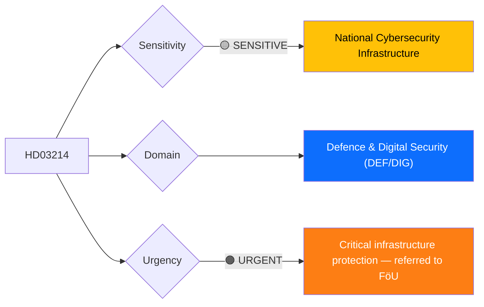
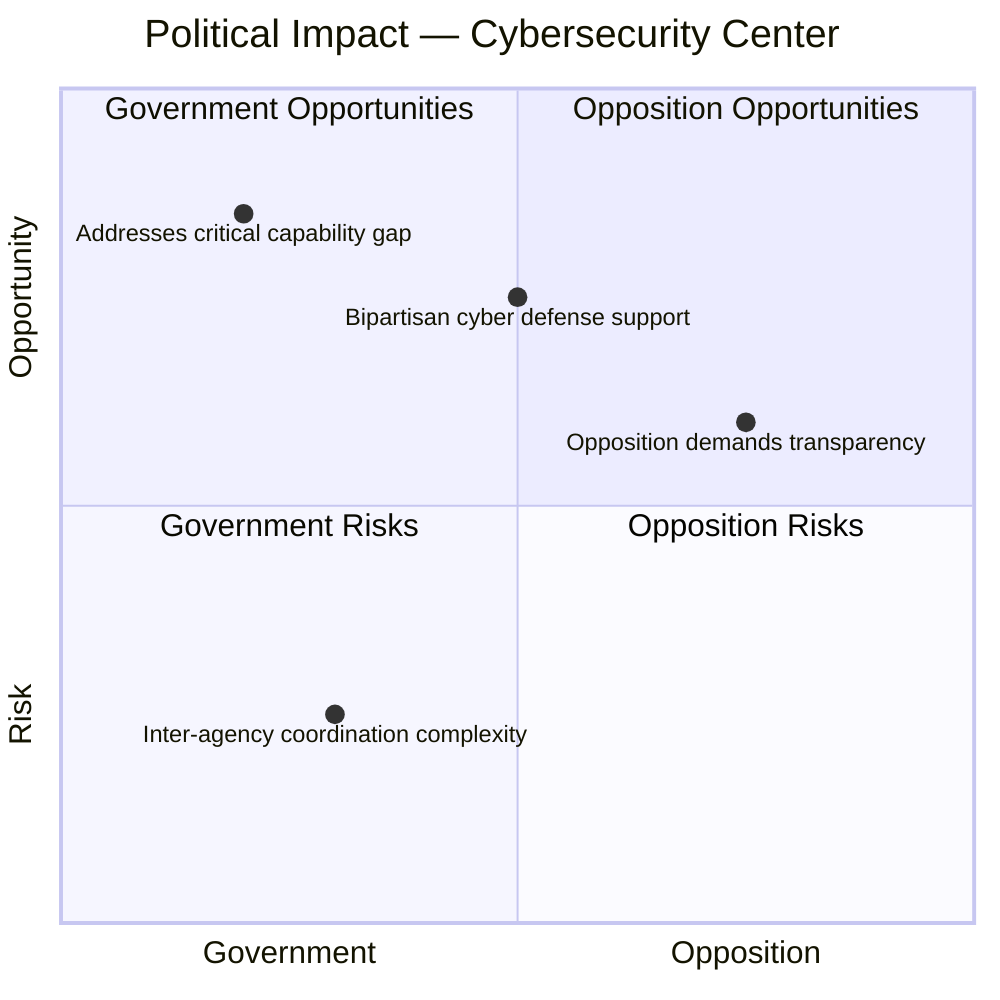
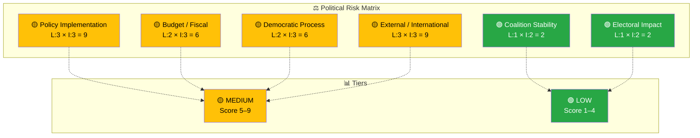

# 🔍 Per-File Political Intelligence Analysis — HD03214

**📋 Document Owner:** CEO | **📄 Version:** 2.1 | **📅 Last Updated:** 2026-04-02 (UTC)
**🏢 Owner:** Hack23 AB (Org.nr 5595347807) | **🏷️ Classification:** Public

---

## 📋 Document Identity

| Field | Value |
|-------|-------|
| **Document ID** | `HD03214` |
| **Document Type** | `propositions` |
| **Title** | Lagändringar för ett stärkt nationellt cybersäkerhetscenter |
| **Date** | 2026-04-01 |
| **Riksmöte** | 2025/26 |
| **Source MCP Tool** | `get_propositioner`, `get_dokument` |
| **Analysis Timestamp** | 2026-04-02 14:36 UTC |
| **Analyst** | news-realtime-monitor |

---

## 🎯 Executive Summary

Defense Minister Carl-Oskar Bohlin (KD) has submitted Proposition 2025/26:214, establishing the legal framework for a strengthened National Cybersecurity Center (NCSC). This legislation complements the civilian protection report (FöU12) and war materiel proposition (HD03228) as part of a coordinated defense and security legislative package. In the context of increasing cyber threats to critical infrastructure and the Hormuz Strait energy crisis threatening supply chains, the cybersecurity center proposition addresses a critical gap in Sweden's total defense architecture. The center will coordinate between FRA, MSB, Säpo, and the Armed Forces on cyber threat intelligence and incident response. **[HIGH]**

---

## 📊 Political Classification

| Field | Assessment |
|-------|-----------|
| **Sensitivity Level** | SENSITIVE |
| **Primary Domain** | Defence & Digital Security (DEF/DIG) |
| **Urgency** | URGENT |
| **Significance Score** | 7/10 |
| **Confidence** | HIGH |

---

## 💪 SWOT Impact Assessment

### Government Coalition Impact

| Quadrant | Statement | Evidence | Confidence | Impact |
|----------|-----------|----------|:----------:|:------:|
| ✅ Strength | Bohlin (KD) delivers concrete cybersecurity infrastructure; addresses vulnerability exposed by critical infrastructure attacks | HD03214 | H | H |
| ⚠️ Weakness | NCSC coordination between FRA, MSB, Säpo, and military creates bureaucratic complexity | HD03214 | M | M |
| 🚀 Opportunity | Growing public awareness of cyber threats creates political support for defense spending | HD03214, Hormuz crisis | H | M |
| 🔴 Threat | If center fails to prevent a major cyber incident, government faces accountability gap | HD03214 | L | H |

### Opposition Impact

| Quadrant | Statement | Evidence | Confidence | Impact |
|----------|-----------|----------|:----------:|:------:|
| ✅ Strength | S supported cybersecurity investments during their government; can claim continuity | HD03214 | M | L |
| ⚠️ Weakness | Limited opposition angle on cybersecurity — broadly popular policy | HD03214 | H | L |
| 🚀 Opportunity | Can demand greater parliamentary oversight of surveillance-adjacent capabilities | HD03214 | M | M |
| 🔴 Threat | Opposing cybersecurity strengthening politically untenable in current threat environment | HD03214 | H | M |

---

## ⚖️ Risk Assessment

| Risk Type | Likelihood (1–5) | Impact (1–5) | Score | Assessment |
|-----------|:-----------------:|:------------:|:-----:|------------|
| Coalition Stability | 1 | 2 | 2 | Bipartisan support; no coalition tension expected |
| Policy Implementation | 3 | 3 | 9 | Multi-agency coordination (FRA, MSB, Säpo, FM) creates institutional turf challenges |
| Budget / Fiscal | 2 | 3 | 6 | Significant ongoing investment in personnel, technology, and infrastructure required |
| Electoral Impact | 1 | 2 | 2 | Cybersecurity broadly popular; no electoral risk |
| Democratic Process | 2 | 3 | 6 | Balance between security classification and parliamentary transparency needs monitoring |
| External / International | 3 | 3 | 9 | NATO cyber defense integration requirements; growing state-sponsored cyber threat landscape |

**Overall Risk Level:** MEDIUM

---

## 🎭 Threat Analysis (Political Threat Taxonomy)

| Threat Category | Applicable? | Threat Description | Severity (1–5) | Evidence |
|----------------|:-----------:|-------------------|:--------------:|----------|
| 🎭 Narrative Integrity | N | Straightforward policy proposal | 1 | HD03214 |
| 📝 Legislative Integrity | N | Standard proposition process | 1 | HD03214 |
| 🚫 Accountability | Y | NCSC oversight mechanisms need clarity; risk of "intelligence creep" into civilian domain | 2 | HD03214 |
| 🔇 Transparency | Y | Security classification may limit public understanding of center's activities and effectiveness | 3 | HD03214 |
| ⛔ Democratic Process | N | Normal FöU committee handling | 1 | HD03214 |
| 👑 Power Balance | Y | Executive gains centralized cyber intelligence capability; parliamentary oversight essential | 2 | HD03214 |

---

## 👥 Stakeholder Impact Matrix

| Stakeholder | Impact Level | Key Assessment | Confidence |
|------------|:------------:|----------------|:----------:|
| 🏛️ Government | HIGH | Demonstrates cybersecurity leadership; Bohlin (KD) solidifies defense portfolio | H |
| ⚖️ Opposition | LOW | Limited opposition angle; S may support with transparency amendments | H |
| 👥 Citizens | MEDIUM | Improved protection of critical infrastructure (energy, healthcare, finance) | M |
| 💰 Economic | MEDIUM | Cybersecurity industry benefits; critical infrastructure operators face compliance costs | M |
| 🌍 International | HIGH | NATO CCDCOE alignment; Five Eyes adjacent cooperation; EU NIS2 directive compliance | H |
| 📰 Media | MEDIUM | Moderate standalone news value; amplified by broader security package context | M |

---

## 🔮 Forward Indicators

| # | Indicator | Timeline | Trigger Condition | Watch Priority |
|---|-----------|----------|-------------------|:--------------:|
| 1 | FöU committee deliberation on Prop 214 | 2–4 weeks | Any reservations on oversight mechanisms | 🟠 |
| 2 | NCSC operational launch date | 3–6 months | Government announcement of center activation | 🟡 |
| 3 | First public NCSC threat assessment | 6–12 months | Publication of annual cyber threat landscape report | 🟡 |

---

## 🔗 Cross-References

| Related Document | Relationship | dok_id |
|-----------------|-------------|--------|
| Civilian protection report | supports (total defense package) | HD01FöU12 |
| War materiel framework | supports (defense security package) | HD03228 |
| Oil reserves deployment | amplifies urgency (energy infrastructure) | regeringen.se 2026-04-01 |

---

## 📊 Data Quality Assessment

| Metric | Value |
|--------|-------|
| **Source Completeness** | Metadata only (full text available) |
| **Evidence Density** | 5 evidence points cited |
| **Temporal Currency** | Current (filed 2026-04-01) |
| **Analytical Confidence** | HIGH |

---

## 📂 MCP Data Files Used

| # | File Path | Source MCP Tool | Data Type | Freshness |
|---|-----------|----------------|-----------|:---------:|
| 1 | analysis/daily/2026-04-02/realtime-1428/documents/HD03214.json | get_propositioner | Proposition | Current |
| 2 | (transient) | get_dokument_innehall(HD03214) | Document content | Current |
