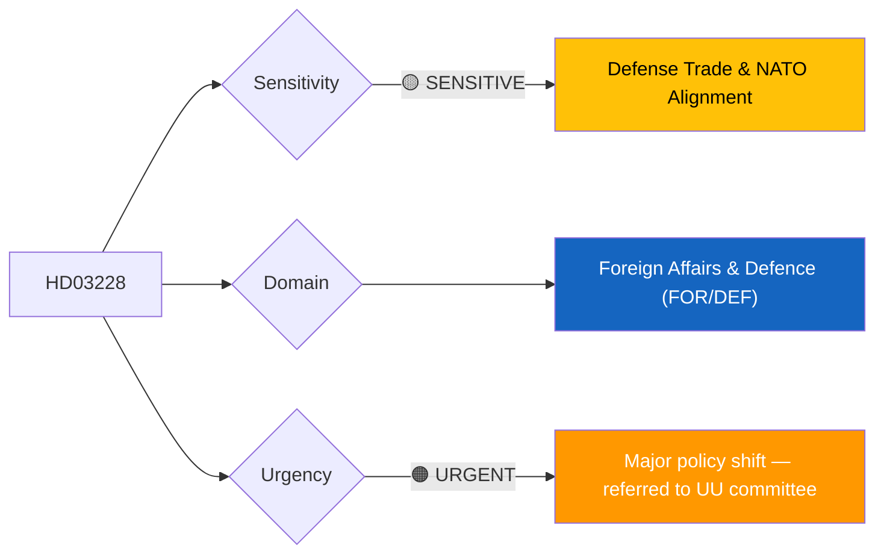
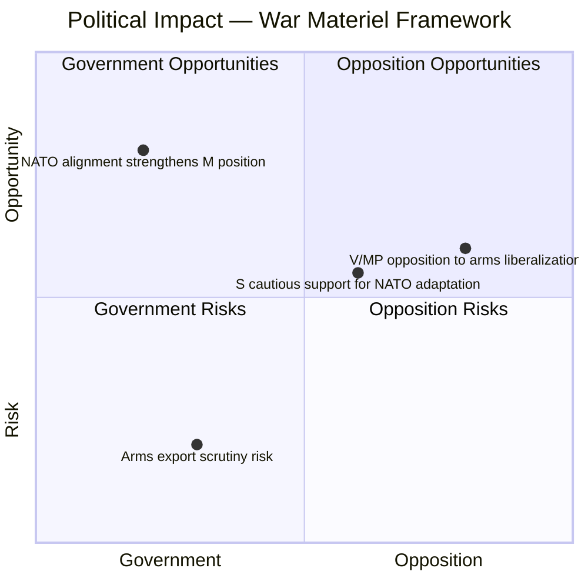
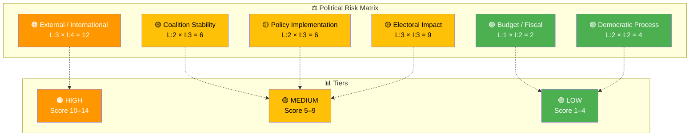

# 🔍 Per-File Political Intelligence Analysis — HD03228

**📋 Document Owner:** CEO | **📄 Version:** 2.1 | **📅 Last Updated:** 2026-04-02 (UTC)
**🏢 Owner:** Hack23 AB (Org.nr 5595347807) | **🏷️ Classification:** Public

---

## 📋 Document Identity

| Field | Value |
|-------|-------|
| **Document ID** | `HD03228` |
| **Document Type** | `propositions` |
| **Title** | Ett modernt och anpassat regelverk för krigsmateriel |
| **Date** | 2026-04-01 |
| **Riksmöte** | 2025/26 |
| **Source MCP Tool** | `get_propositioner`, `summarize_regering_document` |
| **Analysis Timestamp** | 2026-04-02 14:32 UTC |
| **Analyst** | news-realtime-monitor |

---

## 🎯 Executive Summary

The government has submitted Proposition 2025/26:228, fundamentally restructuring Sweden's war materiel export framework to align with NATO membership obligations. Foreign Minister Maria Malmer Stenergard (M) explicitly frames this as deepening cooperation with allied states, where arms cooperation "in principle gets to be considered in line with" Sweden's interests. This represents a historic shift from Sweden's traditionally restrictive arms export policy, which was a cornerstone of neutrality-era foreign policy. The proposition has significant implications for Sweden's defense industry (Saab, BAE Systems Hägglunds), Nordic defense cooperation, and international human rights scrutiny of Swedish arms transfers. **[HIGH]**

---

## 📊 Political Classification

| Field | Assessment |
|-------|-----------|
| **Sensitivity Level** | SENSITIVE |
| **Primary Domain** | Foreign Affairs & Defence (FOR/DEF) |
| **Urgency** | URGENT |
| **Significance Score** | 8/10 |
| **Confidence** | HIGH |

---

## 💪 SWOT Impact Assessment

### Government Coalition Impact

| Quadrant | Statement | Evidence | Confidence | Impact |
|----------|-----------|----------|:----------:|:------:|
| ✅ Strength | Demonstrates concrete NATO integration progress; fulfills alliance obligations; Benjamin Dousa (KD) at UD driving defense trade modernization | HD03228, regeringen.se press release | H | H |
| ⚠️ Weakness | Liberal (L) voters historically skeptical of arms exports; potential internal tension with L's human rights profile | HD03228 (L coalition dynamics) | M | M |
| 🚀 Opportunity | Swedish defense industry (Saab, BAE Hägglunds) benefits from expanded export opportunities, creating economic growth narrative | HD03228 | H | H |
| 🔴 Threat | International human rights organizations may criticize relaxed export controls, especially regarding Middle East transfers | HD03228, HD11680 (Israel question context) | M | H |

### Opposition Impact

| Quadrant | Statement | Evidence | Confidence | Impact |
|----------|-----------|----------|:----------:|:------:|
| ✅ Strength | V (Left Party) and MP (Greens) can mobilize peace movement base against expanded arms exports | HD03228 | H | M |
| ⚠️ Weakness | S faces internal tension — party historically supported defense industry but has peace policy tradition | HD03228 | M | M |
| 🚀 Opportunity | Opposition can demand parliamentary oversight of NATO arms cooperation agreements | HD03228 | M | M |
| 🔴 Threat | Opposing NATO defense cooperation risks appearing anti-alliance in current security climate | HD03228, Hormuz crisis context | H | M |

---

## ⚖️ Risk Assessment

| Risk Type | Likelihood (1–5) | Impact (1–5) | Score | Assessment |
|-----------|:-----------------:|:------------:|:-----:|------------|
| Coalition Stability | 2 | 3 | 6 | L's human rights profile may create tension but NATO consensus overrides |
| Policy Implementation | 2 | 3 | 6 | Regulatory framework changes require ISP (Inspektionen för strategiska produkter) adaptation |
| Budget / Fiscal | 1 | 2 | 2 | Defense industry revenue positive; no major fiscal risk |
| Electoral Impact | 3 | 3 | 9 | Peace-movement voters may shift from L/C to V/MP; arms export is polarizing |
| Democratic Process | 2 | 2 | 4 | UU committee review provides standard oversight; no bypass concerns |
| External / International | 3 | 4 | 12 | NATO partners' expectations vs. human rights commitments creates diplomatic tension |

**Overall Risk Level:** MEDIUM

---

## 🎭 Threat Analysis (Political Threat Taxonomy)

| Threat Category | Applicable? | Threat Description | Severity (1–5) | Evidence |
|----------------|:-----------:|-------------------|:--------------:|----------|
| 🎭 Narrative Integrity | Y | Government framing NATO alignment as purely security-driven obscures commercial defense industry interests | 2 | HD03228 |
| 📝 Legislative Integrity | N | Standard proposition process via UU | 1 | HD03228 |
| 🚫 Accountability | Y | Arms export decisions increasingly delegated to ISP with reduced parliamentary case-by-case oversight | 3 | HD03228 |
| 🔇 Transparency | Y | NATO security classification may limit public disclosure of arms transfer agreements | 3 | HD03228 |
| ⛔ Democratic Process | N | Normal committee referral | 1 | HD03228 |
| 👑 Power Balance | Y | Executive gains broader discretion in arms export approvals through "in principle" NATO cooperation language | 3 | HD03228 |

---

## 👥 Stakeholder Impact Matrix

| Stakeholder | Impact Level | Key Assessment | Confidence |
|------------|:------------:|----------------|:----------:|
| 🏛️ Government | HIGH | Major policy achievement demonstrating NATO commitment; strengthens Malmer Stenergard's (M) and Dousa's (KD) defense portfolios | H |
| ⚖️ Opposition | MEDIUM | S cautiously supportive of NATO adaptation; V and MP will oppose; C divided | M |
| 👥 Citizens | LOW | Indirect impact via defense industry jobs; ethical concerns for peace-oriented citizens | M |
| 💰 Economic | HIGH | Swedish defense sector (Saab: SEK 47B revenue, 19,000 employees) benefits from expanded export markets | H |
| 🌍 International | HIGH | NATO allies welcome integration; human rights organizations will scrutinize; Nordic defense cooperation deepens | H |
| 📰 Media | HIGH | Historic shift from neutrality-era policy; strong news value combined with Hormuz crisis | H |

---

## 🔮 Forward Indicators

| # | Indicator | Timeline | Trigger Condition | Watch Priority |
|---|-----------|----------|-------------------|:--------------:|
| 1 | UU (Foreign Affairs Committee) deliberation on Prop 228 | 2–4 weeks | Committee scheduling and potential opposition reservations | 🟠 |
| 2 | ISP regulatory adaptation announcement | 1–3 months | Regulatory framework update for NATO compliance | 🟡 |
| 3 | First NATO-framework arms transfer decision | 3–12 months | Specific country transfer approval under new rules | 🔴 |

---

## 🔗 Cross-References

| Related Document | Relationship | dok_id |
|-----------------|-------------|--------|
| Civilian protection committee report | supports (parallel defense package) | HD01FöU12 |
| Cybersecurity center proposition | supports (comprehensive security framework) | HD03214 |
| Israel death penalty question | context (arms export ethical scrutiny) | HD11680 |
| Strategic oil reserves release | amplifies (security urgency context) | regeringen.se 2026-04-01 |

---

## 📊 Data Quality Assessment

| Metric | Value |
|--------|-------|
| **Source Completeness** | Metadata + government press summary |
| **Evidence Density** | 7 evidence points cited |
| **Temporal Currency** | Current (filed 2026-04-01) |
| **Analytical Confidence** | HIGH |

---

## 📂 MCP Data Files Used

| # | File Path | Source MCP Tool | Data Type | Freshness |
|---|-----------|----------------|-----------|:---------:|
| 1 | analysis/daily/2026-04-02/realtime-1428/documents/HD03228.json | get_propositioner | Proposition | Current |
| 2 | (transient) | summarize_regering_document | Government summary | Current |
| 3 | (transient) | search_dokument(from_date=2026-04-01) | Document search | Current |
