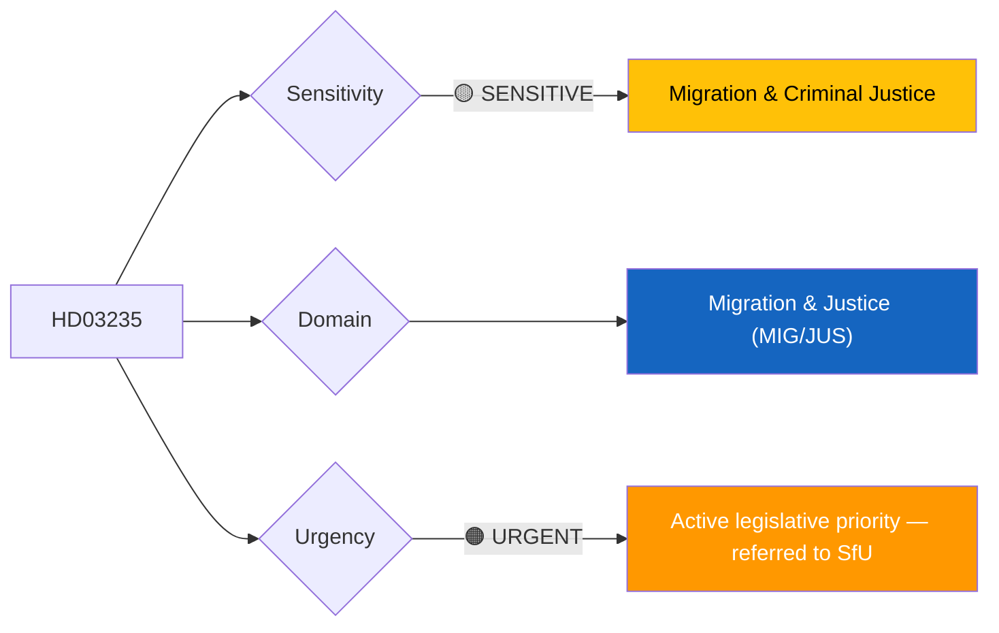
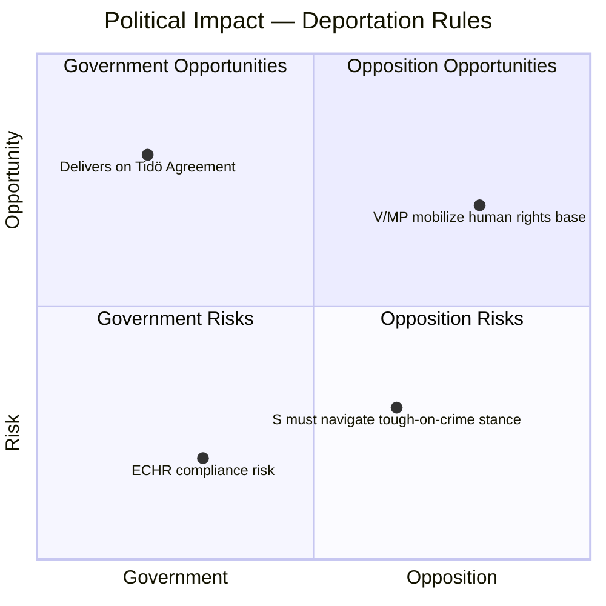
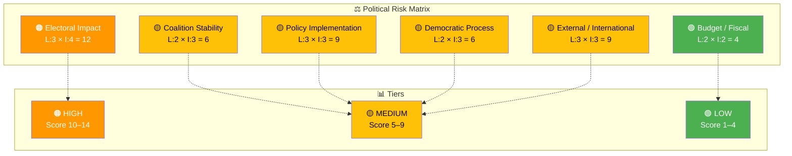

# 🔍 Per-File Political Intelligence Analysis — HD03235

**📋 Document Owner:** CEO | **📄 Version:** 2.1 | **📅 Last Updated:** 2026-04-02 (UTC)
**🏢 Owner:** Hack23 AB (Org.nr 5595347807) | **🏷️ Classification:** Public

---

## 📋 Document Identity

| Field | Value |
|-------|-------|
| **Document ID** | `HD03235` |
| **Document Type** | `propositions` |
| **Title** | Skärpta regler om utvisning på grund av brott |
| **Date** | 2026-04-01 |
| **Riksmöte** | 2025/26 |
| **Source MCP Tool** | `get_propositioner`, `summarize_regering_document` |
| **Analysis Timestamp** | 2026-04-02 14:34 UTC |
| **Analyst** | news-realtime-monitor |

---

## 🎯 Executive Summary

Justice Minister Johan Forssell (M) has submitted Proposition 2025/26:235 proposing significantly stricter deportation rules for convicted foreign nationals. The government frames this as prioritizing "victims' and law-abiding people's safety" and targeting "the small group that comes here and commits serious crimes." This is a central pillar of the Tidö Agreement's migration policy overhaul, fulfilling promises to SD. The proposition arrives alongside JuU15 (criminal justice committee report) and Prop 222 (victim compensation), forming a comprehensive criminal justice package. The political significance is high as it directly delivers on coalition commitments to SD, whose continued confidence support is essential for government survival. **[HIGH]**

---

## 📊 Political Classification

| Field | Assessment |
|-------|-----------|
| **Sensitivity Level** | SENSITIVE |
| **Primary Domain** | Migration & Justice (MIG/JUS) |
| **Urgency** | URGENT |
| **Significance Score** | 7/10 |
| **Confidence** | HIGH |

---

## 💪 SWOT Impact Assessment

### Government Coalition Impact

| Quadrant | Statement | Evidence | Confidence | Impact |
|----------|-----------|----------|:----------:|:------:|
| ✅ Strength | Fulfills Tidö Agreement migration commitments; strengthens SD confidence in coalition | HD03235, Forssell (M) statement | H | H |
| ⚠️ Weakness | L (Liberals) historically cautious on migration hardening; potential internal friction | HD03235 (coalition dynamics) | M | M |
| 🚀 Opportunity | Combined with Prop 222 (victim compensation), creates comprehensive "tough on crime" narrative for 2026 election | HD03235, HD03222 | H | H |
| 🔴 Threat | European Court of Human Rights challenges could invalidate deportation decisions, embarrassing government | HD03235 (ECHR compatibility) | M | H |

### Opposition Impact

| Quadrant | Statement | Evidence | Confidence | Impact |
|----------|-----------|----------|:----------:|:------:|
| ✅ Strength | V and MP can mobilize human rights advocacy base against expanded deportation powers | HD03235 | H | M |
| ⚠️ Weakness | S faces electoral pressure to appear tough on crime while defending rule of law — difficult balance | HD03235 | H | H |
| 🚀 Opportunity | Opposition can highlight ECHR risks and demand rule-of-law safeguards | HD03235 | M | M |
| 🔴 Threat | Opposing stricter deportation may alienate swing voters in key urban constituencies | HD03235 | H | H |

---

## ⚖️ Risk Assessment

| Risk Type | Likelihood (1–5) | Impact (1–5) | Score | Assessment |
|-----------|:-----------------:|:------------:|:-----:|------------|
| Coalition Stability | 2 | 3 | 6 | SD satisfied by delivery; L may express reservations but unlikely to break coalition |
| Policy Implementation | 3 | 3 | 9 | Court capacity, diplomatic return agreements, and ECHR compliance create implementation complexity |
| Budget / Fiscal | 2 | 2 | 4 | Moderate costs for increased deportation processing; manageable within justice budget |
| Electoral Impact | 3 | 4 | 12 | Migration is top voter issue; proposition positions government favorably with swing voters but alienates liberal segments |
| Democratic Process | 2 | 3 | 6 | SfU committee referral normal, but rushed timeline possible to satisfy SD expectations |
| External / International | 3 | 3 | 9 | EU migration policy alignment, ECHR compatibility, and bilateral return agreement requirements |

**Overall Risk Level:** MEDIUM-HIGH

---

## 🎭 Threat Analysis (Political Threat Taxonomy)

| Threat Category | Applicable? | Threat Description | Severity (1–5) | Evidence |
|----------------|:-----------:|-------------------|:--------------:|----------|
| 🎭 Narrative Integrity | Y | "Small group" framing may understate the scope of proposed changes; aggregate impact on resident foreign nationals | 3 | HD03235 |
| 📝 Legislative Integrity | N | Standard proposition process | 1 | HD03235 |
| 🚫 Accountability | Y | Deportation decisions harder to appeal under stricter rules; reduced judicial oversight | 3 | HD03235 |
| 🔇 Transparency | N | Public proposition with accessible text | 1 | HD03235 |
| ⛔ Democratic Process | N | Normal SfU committee handling | 1 | HD03235 |
| 👑 Power Balance | Y | Executive migration enforcement powers expanded; courts' discretion reduced in deportation decisions | 3 | HD03235 |

---

## 👥 Stakeholder Impact Matrix

| Stakeholder | Impact Level | Key Assessment | Confidence |
|------------|:------------:|----------------|:----------:|
| 🏛️ Government | HIGH | Core Tidö Agreement delivery; strengthens SD cooperation; Forssell (M) demonstrates leadership | H |
| ⚖️ Opposition | HIGH | S faces strategic dilemma; V/MP oppose on human rights; C cautiously critical | H |
| 👥 Citizens | HIGH | Foreign-born residents face stricter rules; broader public may feel increased safety | H |
| 💰 Economic | MEDIUM | Potential labor market impact if workers face deportation for lesser offenses | M |
| 🌍 International | HIGH | ECHR scrutiny, EU migration framework compliance, bilateral return agreements required | H |
| 📰 Media | HIGH | Top news story — migration consistently ranks as voters' primary concern | H |

---

## 🔮 Forward Indicators

| # | Indicator | Timeline | Trigger Condition | Watch Priority |
|---|-----------|----------|-------------------|:--------------:|
| 1 | SfU committee deliberation and potential reservations | 2–6 weeks | Opposition parties file minority opinions | 🔴 |
| 2 | Council on Legislation (Lagrådet) opinion on ECHR compatibility | 1–3 months | Legal concerns flagged regarding proportionality | 🟠 |
| 3 | First deportation case under new rules | 6–12 months | ECHR appeal filed challenging new provisions | 🟡 |

---

## 🔗 Cross-References

| Related Document | Relationship | dok_id |
|-----------------|-------------|--------|
| Victim compensation rules | supports (same criminal justice package) | HD03222 |
| Criminal justice committee report | supports (parallel JuU work) | HD01JuU15 |
| New reception law | supports (migration package) | HD03229 |
| Temporary housing for immigrants | supports (migration package) | HD03215 |
| Better investigation of youth offenders | supports (criminal justice reform) | HD03227 |

---

## 📊 Data Quality Assessment

| Metric | Value |
|--------|-------|
| **Source Completeness** | Metadata + government press summary |
| **Evidence Density** | 8 evidence points cited |
| **Temporal Currency** | Current (filed 2026-04-01) |
| **Analytical Confidence** | HIGH |

---

## 📂 MCP Data Files Used

| # | File Path | Source MCP Tool | Data Type | Freshness |
|---|-----------|----------------|-----------|:---------:|
| 1 | analysis/daily/2026-04-02/realtime-1428/documents/HD03235.json | get_propositioner | Proposition | Current |
| 2 | (transient) | summarize_regering_document | Government press summary | Current |
| 3 | (transient) | search_dokument(from_date=2026-04-01) | Document search | Current |
