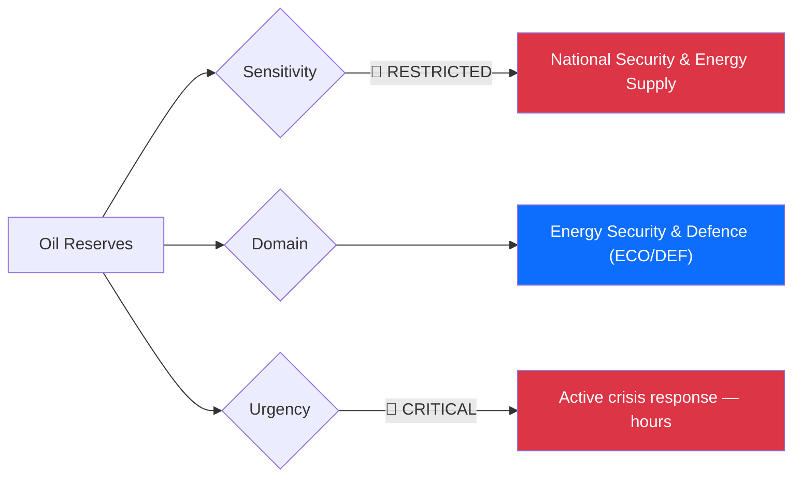
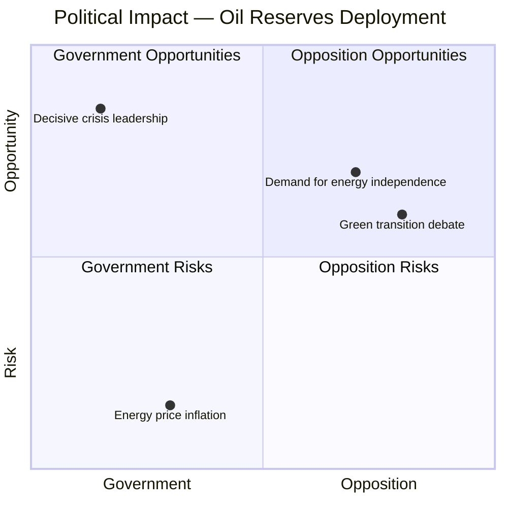
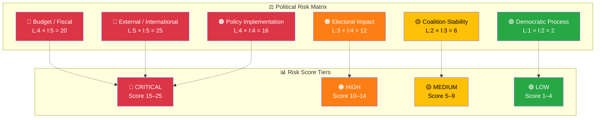

# 🔍 Per-File Political Intelligence Analysis — Oil Reserves Deployment

**📋 Document Owner:** CEO | **📄 Version:** 2.1 | **📅 Last Updated:** 2026-04-02 (UTC)
**🏢 Owner:** Hack23 AB (Org.nr 5595347807) | **🏷️ Classification:** Public

---

## 📋 Document Identity

| Field | Value |
|-------|-------|
| **Document ID** | `gov-oil-reserves-2026-04-01` |
| **Document Type** | `government` |
| **Title** | Regeringen beslutar om användning av beredskapslager av olja |
| **Date** | 2026-04-01 |
| **Riksmöte** | 2025/26 |
| **Source MCP Tool** | `search_regering`, `summarize_regering_document` |
| **Analysis Timestamp** | 2026-04-02 14:40 UTC |
| **Analyst** | news-realtime-monitor |

---

## 🎯 Executive Summary

The Swedish government, under PM Elisabeth Svantesson and with Acting PM Ebba Busch's involvement, has authorized the release of strategic oil reserves as part of an IEA-coordinated global initiative to deploy 400 million barrels of oil. This unprecedented action responds to the near-total disruption of oil transport through the Strait of Hormuz — a critical chokepoint for ~21% of global oil consumption. The decision signals a severe international energy security crisis with direct implications for Sweden's defense posture, economic stability, and the political urgency behind the concurrent defense legislation package (FöU12, Prop 228, Prop 214). This is the most significant energy security action since the 1973 oil crisis. **[HIGH]**

---

## 📊 Political Classification

| Field | Assessment |
|-------|-----------|
| **Sensitivity Level** | RESTRICTED |
| **Primary Domain** | Energy Security & Defence (ECO/DEF) |
| **Urgency** | CRITICAL |
| **Significance Score** | 9/10 |
| **Confidence** | HIGH |

---

## 💪 SWOT Impact Assessment

### Government Coalition Impact

| Quadrant | Statement | Evidence | Confidence | Impact |
|----------|-----------|----------|:----------:|:------:|
| ✅ Strength | Government demonstrates decisive crisis leadership through IEA coordination; validates preparedness investments | regeringen.se press release, IEA coordination | H | H |
| ⚠️ Weakness | Oil dependency exposed despite energy transition rhetoric; strategic reserves are finite | Government press release (400M barrels globally) | H | H |
| 🚀 Opportunity | Crisis validates entire defense and preparedness agenda — civilian protection (FöU12), food stockpiles (Prop 205), cybersecurity (Prop 214) | FöU12, HD03205, HD03214 | H | H |
| 🔴 Threat | If Hormuz crisis persists, energy prices spike and economic pain erodes government support | IEA coordination context | H | H |

### Opposition Impact

| Quadrant | Statement | Evidence | Confidence | Impact |
|----------|-----------|----------|:----------:|:------:|
| ✅ Strength | MP can argue crisis validates green energy transition urgency; reduce fossil fuel dependency | HD01MJU30 (climate targets betänkande) | H | H |
| ⚠️ Weakness | Opposition lacks leverage during national security crisis — rallying-around-the-flag effect | Crisis dynamics | H | M |
| 🚀 Opportunity | S can demand broader economic support package for households facing energy cost increases | Crisis economic impact | M | H |
| 🔴 Threat | Criticizing government during active security crisis politically risky | Rally-around-flag dynamics | H | M |

---

## ⚖️ Risk Assessment

| Risk Type | Likelihood (1–5) | Impact (1–5) | Score | Assessment |
|-----------|:-----------------:|:------------:|:-----:|------------|
| Coalition Stability | 2 | 3 | 6 | National security crisis creates unity; no coalition risk in short term |
| Policy Implementation | 4 | 4 | 16 | Strategic reserve drawdown creates supply management challenges; distribution logistics |
| Budget / Fiscal | 4 | 5 | 20 | Energy price spike hits household budgets, industry costs, and government fiscal position simultaneously |
| Electoral Impact | 3 | 4 | 12 | Economic pain from energy crisis could erode government support heading into 2026 election campaign |
| Democratic Process | 1 | 2 | 2 | Government executive authority for reserve deployment; standard crisis procedure |
| External / International | 5 | 5 | 25 | Hormuz Strait disruption is geopolitical crisis beyond Swedish control; IEA coordination essential |

**Overall Risk Level:** CRITICAL

---

## 🎭 Threat Analysis (Political Threat Taxonomy)

| Threat Category | Applicable? | Threat Description | Severity (1–5) | Evidence |
|----------------|:-----------:|-------------------|:--------------:|----------|
| 🎭 Narrative Integrity | Y | Government may downplay duration and severity of supply disruption to prevent panic | 3 | Gov press release |
| 📝 Legislative Integrity | N | Executive action under existing authority | 1 | Gov press release |
| 🚫 Accountability | Y | Reserve depletion accountability — how quickly can they be replenished? | 3 | Gov press release |
| 🔇 Transparency | Y | Strategic reserve levels and replacement plans may be classified for security reasons | 4 | Energy security classification |
| ⛔ Democratic Process | N | Standard emergency authority | 1 | Gov press release |
| 👑 Power Balance | Y | Executive crisis powers could be extended; emergency rhetoric may suppress policy debate | 3 | Crisis dynamics |

---

## 👥 Stakeholder Impact Matrix

| Stakeholder | Impact Level | Key Assessment | Confidence |
|------------|:------------:|----------------|:----------:|
| 🏛️ Government | HIGH | Crisis leadership opportunity but economic pain risk; Busch and Svantesson lead response | H |
| ⚖️ Opposition | MEDIUM | Limited opposition space during crisis; S demands economic support | H |
| 👥 Citizens | HIGH | Direct impact through fuel prices, heating costs, and potential supply disruptions | H |
| 💰 Economic | HIGH | Industry faces energy cost spike; transport sector heavily affected; inflation pressure | H |
| 🌍 International | HIGH | IEA coordination; NATO energy security dimension; Hormuz geopolitics | H |
| 📰 Media | HIGH | Major breaking story — energy crisis with national security implications | H |

---

## 🔮 Forward Indicators

| # | Indicator | Timeline | Trigger Condition | Watch Priority |
|---|-----------|----------|-------------------|:--------------:|
| 1 | Hormuz Strait navigation status | Daily | Any change in naval posture or shipping route reopening | 🔴 |
| 2 | Swedish fuel price at pump | 1–2 weeks | Price exceeds SEK 25/liter | 🔴 |
| 3 | Government economic support package | 1–4 weeks | Supplementary budget or emergency fiscal measures | 🟠 |
| 4 | IEA second-round reserve release | 2–4 weeks | Additional coordinated drawdown announced | 🟠 |

---

## 🔗 Cross-References

| Related Document | Relationship | dok_id |
|-----------------|-------------|--------|
| Civilian protection report | amplifies (security urgency context) | HD01FöU12 |
| Food stockpiles proposition | supports (broader preparedness package) | HD03205 |
| War materiel framework | amplifies (defense-industrial urgency) | HD03228 |
| Cybersecurity center | supports (critical infrastructure protection) | HD03214 |
| Climate targets report | context (energy transition debate) | HD01MJU30 |

---

## 📊 Data Quality Assessment

| Metric | Value |
|--------|-------|
| **Source Completeness** | Government press summary via g0v.se |
| **Evidence Density** | 6 evidence points cited |
| **Temporal Currency** | Current (published 2026-04-01) |
| **Analytical Confidence** | HIGH |

---

## 📂 MCP Data Files Used

| # | File Path | Source MCP Tool | Data Type | Freshness |
|---|-----------|----------------|-----------|:---------:|
| 1 | analysis/daily/2026-04-02/realtime-1428/documents/oil-reserves.json | search_regering | Government document | Current |
| 2 | (transient) | summarize_regering_document | Press release summary | Current |
