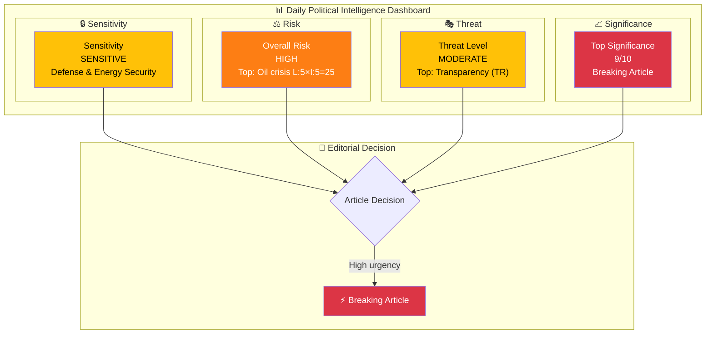
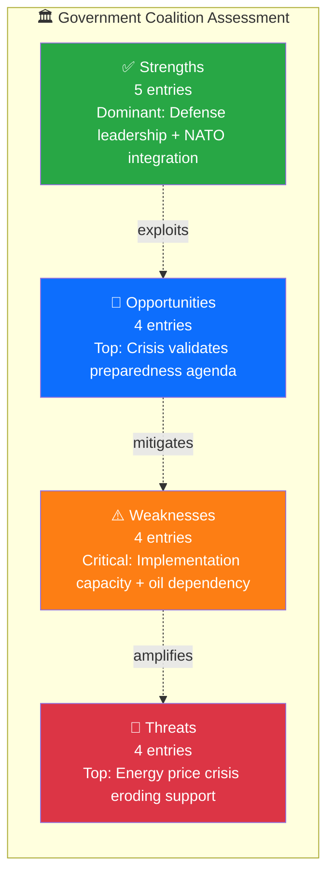

# 🧩 Political Intelligence Synthesis — 2026-04-02

**📋 Document Owner:** CEO | **📄 Version:** 2.1 | **📅 Last Updated:** 2026-04-02 (UTC)
**🏢 Owner:** Hack23 AB (Org.nr 5595347807) | **🏷️ Classification:** Public

---

## 📋 Synthesis Context

| Field | Value |
|-------|-------|
| **Synthesis ID** | SYN-2026-04-02-001 |
| **Analysis Date** | 2026-04-02 14:42 UTC |
| **Documents Analyzed** | 6 |
| **Analysis Period** | 2026-04-01 00:00 – 2026-04-02 14:42 UTC |
| **Produced By** | news-realtime-monitor |
| **Overall Confidence** | HIGH |

---

## 📊 Intelligence Dashboard

---

## 🏆 Top Findings by Significance

| Rank | dok_id | Title | Significance | Risk Tier | SWOT Impact | Recommendation |
|:----:|--------|-------|:-----------:|:---------:|:-----------:|----------------|
| 1 | gov-oil-reserves | Beredskapslager av olja (Strategic Oil Reserves) | 9/10 | 🔴 CRITICAL | T dominant — external threat | Breaking |
| 2 | HD01FöU12 | Civilian Protection During Heightened Preparedness | 8/10 | 🟠 HIGH | S+O dominant — government opportunity | Breaking |
| 3 | HD03228 | War Materiel Framework for NATO | 8/10 | 🟠 HIGH | S dominant — NATO integration | Breaking |
| 4 | HD03235 | Stricter Deportation Rules for Criminals | 7/10 | 🟠 HIGH | S+T mixed — coalition delivery vs ECHR risk | Priority |
| 5 | HD03214 | National Cybersecurity Center | 7/10 | 🟡 MEDIUM | O dominant — bipartisan opportunity | Priority |
| 6 | HD01JuU15 | Criminal Justice Committee Report | 5/10 | 🟡 MEDIUM | W+O mixed — implementation gap | Monitor |

---

## 💪 Aggregated SWOT Summary

| Quadrant | Count | Highest-Impact Entry | Evidence |
|----------|:-----:|---------------------|----------|
| ✅ Strengths | 5 | Decisive defense leadership across FöU12 + Prop 228 + Prop 214 + oil reserves response | HD01FöU12, HD03228, HD03214, gov-oil-reserves |
| ⚠️ Weaknesses | 4 | Structural oil dependency exposed despite energy transition investments | gov-oil-reserves, HD01MJU30 |
| 🚀 Opportunities | 4 | Hormuz crisis validates entire defense/preparedness legislative agenda | HD01FöU12, HD03228, HD03214, HD03205 |
| 🔴 Threats | 4 | Energy price spike + ECHR deportation challenges create dual-front political vulnerability | gov-oil-reserves, HD03235 |

**SWOT Balance Assessment:** The government coalition is operating from a position of legislative strength — delivering on defense, security, and criminal justice simultaneously — but faces a critical external threat from the Hormuz energy crisis. If energy prices spike significantly and persist, economic pain could offset the political benefit of decisive security leadership, particularly heading into the 2026 election season.

---

## ⚖️ Risk Landscape Summary

| Risk Category | Score Range | Highest Risk | Trend vs. Previous |
|--------------|:----------:|-------------|:------------------:|
| Coalition Stability | 2–6 | gov-oil-reserves: economic strain risk | → |
| Policy Implementation | 6–16 | Oil reserves distribution + municipal defense capacity | ↑ |
| Budget / Fiscal | 2–20 | Energy crisis fiscal impact: L:4×I:5=20 | ↑ |
| Electoral | 2–12 | Migration + energy prices as voter concerns | ↑ |
| Democratic Process | 2–6 | Standard committee processes | → |
| External / International | 9–25 | Hormuz Strait crisis: L:5×I:5=25 | ↑ |

**Overall Risk Level:** HIGH

---

## 🎭 Threat Summary

| Threat Category | Threat Level | Key Finding |
|----------------|:------------:|-------------|
| 🎭 Narrative Integrity | MODERATE | Government may overstate defense readiness and understate energy crisis duration |
| 📝 Legislative Integrity | LOW | Standard legislative processes maintained |
| 🚫 Accountability | MODERATE | Arms export oversight and oil reserve accountability gaps |
| 🔇 Transparency | HIGH | Security classification limiting scrutiny of defense expenditure and energy reserves |
| ⛔ Democratic Process | LOW | Normal parliamentary procedures |
| 👑 Power Balance | MODERATE | Executive crisis powers and discretionary arms export authority expanding |

**Overall Threat Level:** MODERATE

---

## 👥 Stakeholder Impact Overview

| Stakeholder | Impact | Direction | Key Driver |
|------------|:------:|:---------:|------------|
| 🏘️ Citizens | H | negative | Energy prices + civil defense obligations; positive: improved security |
| 🏛️ Government | H | positive | Defense leadership + crisis response; risk: economic backlash |
| 🗳️ Opposition | M | mixed | Limited crisis opposition space; S demands economic support |
| 🏭 Business | H | negative | Energy cost spike + compliance costs; positive: defense industry |
| 🤝 Civil Society | M | mixed | Peace movement vs. security consensus; human rights scrutiny |
| 🌍 International | H | negative | Hormuz geopolitics; positive: NATO integration signals |

---

## 🎯 Narrative Direction

Sweden faces an extraordinary convergence of security challenges — the Hormuz Strait energy crisis has triggered the largest coordinated oil reserve deployment since the 1970s, while parliament simultaneously processes the most significant defense legislation package since NATO accession. The Defense Committee's civilian protection report (FöU12), the war materiel framework overhaul (Prop 228), and the cybersecurity center legislation (Prop 214) collectively represent a fundamental transformation of Sweden's total defense posture. Combined with the government's criminal justice package — stricter deportation rules (Prop 235) and correctional reform (JuU15) — this week marks a decisive policy moment for the Tidö coalition. The central political tension is whether the government can maintain its security leadership narrative while managing the economic fallout of the energy crisis.

**Primary Narrative Angle:** Sweden deploys strategic oil reserves as parliament fast-tracks historic defense and security legislation package
**Secondary Angles:** NATO arms framework overhaul marks end of Swedish neutrality-era export policy; Criminal justice hardening fulfills Tidö Agreement promises to SD
**Confidence:** HIGH

---

## 🔮 Forward Indicators

| # | Indicator | Timeline | Source | Watch Priority |
|---|-----------|----------|--------|:--------------:|
| 1 | Hormuz Strait navigation status and fuel prices | Daily | IEA, SPI, government statements | 🔴 |
| 2 | FöU12 plenary vote (scheduled April 14 per agenda) | 1–2 weeks | Riksdag calendar H6D1plan | 🔴 |
| 3 | Government economic support package announcement | 1–4 weeks | Regeringskansliet, finance ministry | 🟠 |
| 4 | UU/SfU committee deliberation on Prop 228/235 | 2–6 weeks | Committee meeting schedules | 🟠 |
| 5 | SD public satisfaction with Tidö delivery pace | 2–4 weeks | SD party communications, media statements | 🟡 |

---

## 📋 Analysis Artifacts Inventory

| File | Status | Key Output |
|------|:------:|-----------|
| `synthesis-summary.md` | ✅ | Overall risk: HIGH; Breaking recommended |
| Per-file `HD01FoU12-analysis.md` | ✅ | Defense: significance 8/10 |
| Per-file `HD03228-analysis.md` | ✅ | NATO arms: significance 8/10 |
| Per-file `HD03235-analysis.md` | ✅ | Deportation: significance 7/10 |
| Per-file `HD03214-analysis.md` | ✅ | Cyber: significance 7/10 |
| Per-file `HD01JuU15-analysis.md` | ✅ | Criminal justice: significance 5/10 |
| Per-file `oil-reserves-analysis.md` | ✅ | Oil crisis: significance 9/10 |

---

## 📂 MCP Data Files Used

| # | Data Source | File / Tool Path | Retrieved |
|---|-----------|-----------------|-----------|
| 1 | riksdag-regering-mcp | search_dokument(from_date=2026-04-01, to_date=2026-04-02, limit=30) | 2026-04-02 14:28 UTC |
| 2 | riksdag-regering-mcp | get_propositioner(rm=2025/26, limit=20) | 2026-04-02 14:28 UTC |
| 3 | riksdag-regering-mcp | get_betankanden(rm=2025/26, limit=20) | 2026-04-02 14:28 UTC |
| 4 | riksdag-regering-mcp | search_voteringar(rm=2025/26, limit=20) | 2026-04-02 14:28 UTC |
| 5 | riksdag-regering-mcp | search_anforanden(rm=2025/26, limit=20) | 2026-04-02 14:28 UTC |
| 6 | riksdag-regering-mcp | search_regering(dateFrom=2026-04-01, dateTo=2026-04-02, limit=30) | 2026-04-02 14:28 UTC |
| 7 | riksdag-regering-mcp | get_dokument(HD01FöU12, HD03228, HD03235, HD03214, HD01JuU15) | 2026-04-02 14:30 UTC |
| 8 | riksdag-regering-mcp | summarize_regering_document (3 documents) | 2026-04-02 14:30 UTC |

---

**Document Control:**
- **Template Path:** `/analysis/templates/synthesis-summary.md`
- **Version:** 2.1
- **Classification:** Public
- **Next Review:** 2026-06-30
