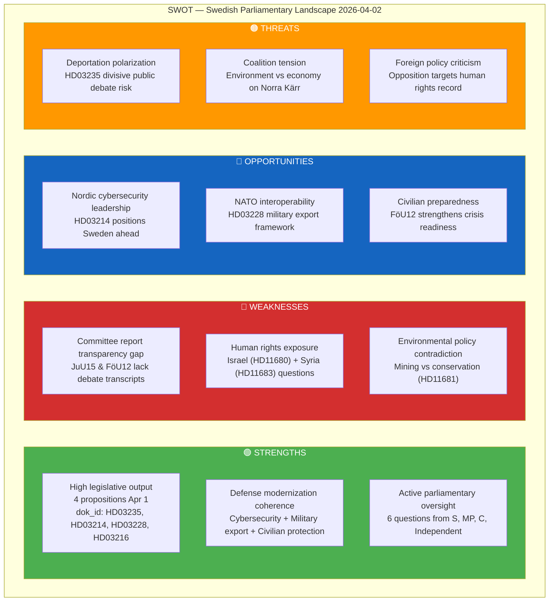

# Political SWOT Analysis — 2026-04-02

**SWT-ID**: SWT-2026-04-02-001
**Generated**: 2026-04-02 18:15 UTC
**Riksmöte**: 2025/26
**Documents Analyzed**: 9
**Confidence**: MEDIUM

---

## SWOT Quadrant Map

## Detailed Evidence Tables

### Strengths — Evidence

| ID | Finding | dok_id | Evidence | Confidence |
|----|---------|--------|----------|------------|
| S1 | Government legislative productivity | HD03235, HD03214, HD03228, HD03216 | 4 propositions submitted Apr 1 covering justice, defense, foreign affairs, healthcare | [HIGH] |
| S2 | Defense sector coherence | HD03214, HD03228, HD01FöU12 | Cybersecurity center + military export reform + civilian protection report in same period | [HIGH] |
| S3 | Active parliamentary oversight | HD11678-HD11683, HD10428 | 6 written questions + 1 interpellation filed Apr 2 from 4 parties | [HIGH] |

### Weaknesses — Evidence

| ID | Finding | dok_id | Evidence | Confidence |
|----|---------|--------|----------|------------|
| W1 | Transparency gap | HD01JuU15, HD01FöU12 | Committee reports published without accessible debate transcripts | [MEDIUM] |
| W2 | Human rights exposure | HD11680, HD11683 | Opposition questions on Israel death penalty law and Syrian minority persecution | [MEDIUM] |
| W3 | Environmental policy tension | HD11681, HD11682 | Mining concession at Norra Kärr biosfärsområde; Environmental Objectives Committee mandate unclear | [MEDIUM] |

### Opportunities — Evidence

| ID | Finding | dok_id | Evidence | Confidence |
|----|---------|--------|----------|------------|
| O1 | Cybersecurity leadership | HD03214 | National cybersecurity center legislation strengthens Sweden's digital defense posture | [HIGH] |
| O2 | NATO alignment | HD03228 | Military equipment export framework modernization enables alliance cooperation | [HIGH] |
| O3 | Crisis preparedness | HD01FöU12 | Civilian protection strengthened at heightened preparedness levels | [MEDIUM] |

### Threats — Evidence

| ID | Finding | dok_id | Evidence | Confidence |
|----|---------|--------|----------|------------|
| T1 | Deportation debate | HD03235 | Stricter deportation rules proposition signals potential polarization | [HIGH] |
| T2 | Coalition environment tension | HD11681 | MP question to KD minister on mining vs. Vättern biosphere area | [MEDIUM] |
| T3 | Foreign policy criticism | HD11679, HD11680, HD11683 | Three foreign affairs questions targeting government human rights positions | [MEDIUM] |

## Key SWOT Implications

The government's legislative agenda on April 1-2 demonstrates a **security-first** strategic posture with defense, cybersecurity, and criminal justice dominating. Opposition is leveraging foreign policy and environmental accountability to probe coalition cohesion. [MEDIUM confidence]
