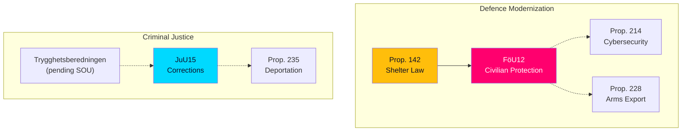

# 🔗 Cross-Reference Map — Committee Reports

## 📋 Cross-Reference Context

| Field | Value |
|-------|-------|
| **Map ID** | XRF-2026-04-02-CR01 |
| **Map Date** | 2026-04-03 04:54 UTC |
| **Documents Mapped** | 2 |
| **Produced By** | news-committee-reports |

---

## 📊 Cross-References

### HD01FöU12 ↔ Related Documents

| Reference | Relationship | Significance |
|-----------|-------------|:------------:|
| Prop. 2025/26:142 | Parent proposition | HIGH |
| Prop. 2025/26:214 (Cybersecurity Center) | Defence modernization cluster | MEDIUM |
| Prop. 2025/26:228 (Arms Export Rules) | Defence policy package | MEDIUM |

### HD01JuU15 ↔ Related Documents

| Reference | Relationship | Significance |
|-----------|-------------|:------------:|
| Prop. 2025/26:235 (Deportation Rules) | JuU criminal justice cluster | MEDIUM |
| Trygghetsberedningen (pending SOU) | Referenced in Reservation 1 | HIGH |

---

## 🔀 Thematic Clusters

---

**Document Control:** Cross-reference map generated 2026-04-03 04:54 UTC. Classification: PUBLIC.
