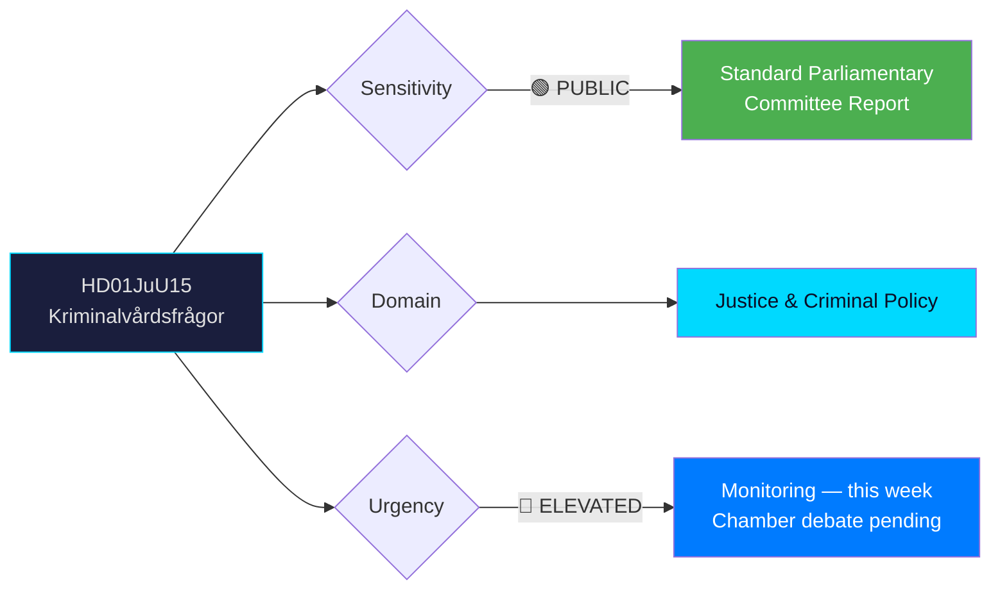
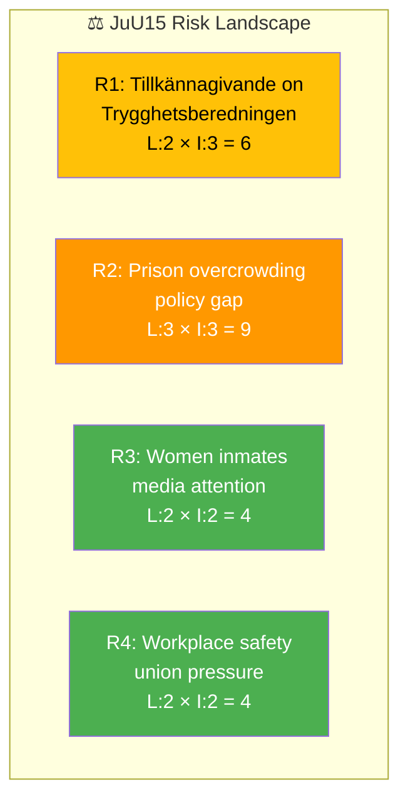

# 🔍 Per-File Political Intelligence Analysis

## 📋 Document Identity

| Field | Value |
|-------|-------|
| **Document ID** | `HD01JuU15` |
| **Document Type** | `committeeReports` |
| **Title** | Kriminalvårdsfrågor (Criminal Corrections Issues) |
| **Date** | 2026-04-02 |
| **Riksmöte** | 2025/26 |
| **Committee** | JuU (Justice Committee) |
| **Source MCP Tool** | `get_betankanden` |
| **Analysis Timestamp** | 2026-04-03 04:50 UTC |
| **Analyst** | news-committee-reports |

---

## 🎯 Executive Summary

The Justice Committee (JuU) recommends rejecting all 76 motion demands on criminal corrections policy, citing ongoing government investigations and preparation work. The committee report reveals a sharp government-opposition divide: S, V, C, and MP filed 8 reservations covering prison expansion, women inmates' needs, workplace safety in corrections, and the implementation of Trygghetsberedningen's (Security Preparedness Commission) proposals. The joint opposition reservation on Trygghetsberedningen signals potential for a unified tillkännagivande demand, which could embarrass the government on a high-profile security topic. **[MEDIUM]**

---

## 📊 Political Classification

| Dimension | Value | Rationale |
|-----------|-------|-----------|
| **Sensitivity** | 🟢 PUBLIC | Standard committee report on motion batch |
| **Domain** | Justice & Criminal Policy | Prison policy, corrections reform, rehabilitation |
| **Urgency** | 🔵 ELEVATED | 8 reservations indicate active political conflict; chamber debate pending |
| **Significance** | 6/10 | High opposition unity (4-party joint reservation) on government security agenda |

---

## 💼 SWOT Analysis

### ✅ Strengths — Government Coalition

| # | Statement | Evidence (dok_id) | Confidence | Impact | Entry Date |
|---|-----------|-------------------|:----------:|:------:|:----------:|
| S1 | Government maintains committee majority to reject all 76 motions | HD01JuU15 — all points recommended for rejection | HIGH | Medium | 2026-04-02 |
| S2 | Cites "ongoing investigations" as shield — active policy development narrative | HD01JuU15 — committee reasoning references pågående utrednings- och beredningsarbete | MEDIUM | Medium | 2026-04-02 |
| S3 | No cross-party defections from government bloc (M, KD, L, SD support) | HD01JuU15 — reservations only from S, V, C, MP | HIGH | High | 2026-04-02 |

### ❌ Weaknesses — Government Coalition

| # | Statement | Evidence (dok_id) | Confidence | Impact | Entry Date |
|---|-----------|-------------------|:----------:|:------:|:----------:|
| W1 | 76 unanswered motion demands signal policy delivery gap in corrections | HD01JuU15 — all motions rejected without counter-proposals | MEDIUM | Medium | 2026-04-02 |
| W2 | No concrete timeline for Trygghetsberedningen implementation visible | HD01JuU15 — Reservation 1 (S, V, C, MP) demands tillkännagivande on implementation | MEDIUM | High | 2026-04-02 |

### 🔄 Opportunities — Opposition Bloc

| # | Statement | Evidence (dok_id) | Confidence | Impact | Entry Date |
|---|-----------|-------------------|:----------:|:------:|:----------:|
| O1 | 4-party joint reservation (S, V, C, MP) on Trygghetsberedningen — potential unified tillkännagivande | HD01JuU15, Reservation 1 | HIGH | High | 2026-04-02 |
| O2 | Women's corrections reform (V, C, MP reservation) aligns with broader gender equality narrative | HD01JuU15, Reservation 4, 8 | MEDIUM | Medium | 2026-04-02 |

### ⚠️ Threats — Democratic Function

| # | Statement | Evidence (dok_id) | Confidence | Impact | Entry Date |
|---|-----------|-------------------|:----------:|:------:|:----------:|
| T1 | Mass rejection of 76 motions risks perception of parliamentary scrutiny being sidelined | HD01JuU15 — all points rejected en masse | LOW | Medium | 2026-04-02 |
| T2 | Single-cell policy debate (Reservation 6) ties to human rights obligations — potential international scrutiny | HD01JuU15, Reservation 6 (V, MP) | LOW | Low | 2026-04-02 |

---

## ⚠️ Risk Assessment

| Risk ID | Risk Description | Likelihood (1-5) | Impact (1-5) | L×I Score | Confidence |
|---------|-----------------|:-----------------:|:------------:|:---------:|:----------:|
| R1 | Opposition forces tillkännagivande on Trygghetsberedningen in chamber vote | 2 | 3 | 6 | MEDIUM |
| R2 | Prison overcrowding escalation without policy response damages government credibility | 3 | 3 | 9 | MEDIUM |
| R3 | Women inmates' conditions become media focal point (V, C, MP reservation) | 2 | 2 | 4 | LOW |
| R4 | Workplace safety concerns (ban on solo client-facing work) gain union support | 2 | 2 | 4 | LOW |

---

## 👥 Stakeholder Impact (8 Groups)

| Stakeholder Group | Impact | Assessment | Evidence |
|-------------------|:------:|------------|----------|
| **Citizens** | Medium | Prison capacity constraints affect rehabilitation outcomes; 76 motions on corrections signal public concern | HD01JuU15 — broad motion scope |
| **Government Coalition** | Positive | Successfully rejects all opposition demands; maintains policy initiative on criminal justice | HD01JuU15 — unanimous committee majority |
| **Opposition Bloc** | Mixed | 8 reservations demonstrate engagement but all likely rejected; Trygghetsberedningen reservation shows unity | HD01JuU15 — Reservations 1-8 |
| **Business/Industry** | Low | Limited direct impact; prison construction contracts remain on existing timeline | Indirect — no named business impacts |
| **Civil Society** | Medium | Women's rights organizations expected to amplify Reservation 4, 8 (V, C, MP on women inmates) | HD01JuU15, Reservations 4, 8 |
| **International/EU** | Low | Single-cell policy debate (Reservation 6) could attract Council of Europe CPT attention | HD01JuU15, Reservation 6 |
| **Judiciary/Constitutional** | Low | Standard legislative process; no constitutional implications identified | HD01JuU15 — routine committee report |
| **Media/Public Opinion** | Medium | Prison policy highly visible in Swedish media; Trygghetsberedningen follow-up is newsworthy | HD01JuU15, Reservation 1 |

---

## 🔮 Forward Indicators

| # | What to Watch | Trigger | Timeline | Confidence |
|---|---------------|---------|----------|:----------:|
| F1 | Chamber debate and vote on JuU15 — will opposition force roll-call on Reservation 1? | Scheduling of JuU15 debate in kammaren | Within 2 weeks | HIGH |
| F2 | Trygghetsberedningen final report delivery — triggers policy response pressure | Government response to SOU | Q2-Q3 2026 | MEDIUM |
| F3 | Kriminalvården capacity statistics — prison occupancy rates nearing 100% | Monthly Kriminalvården statistics | Ongoing | HIGH |

---

**Document Control:** Analysis generated 2026-04-03 04:50 UTC by news-committee-reports workflow. Classification: PUBLIC. Valid until 2026-04-16.
