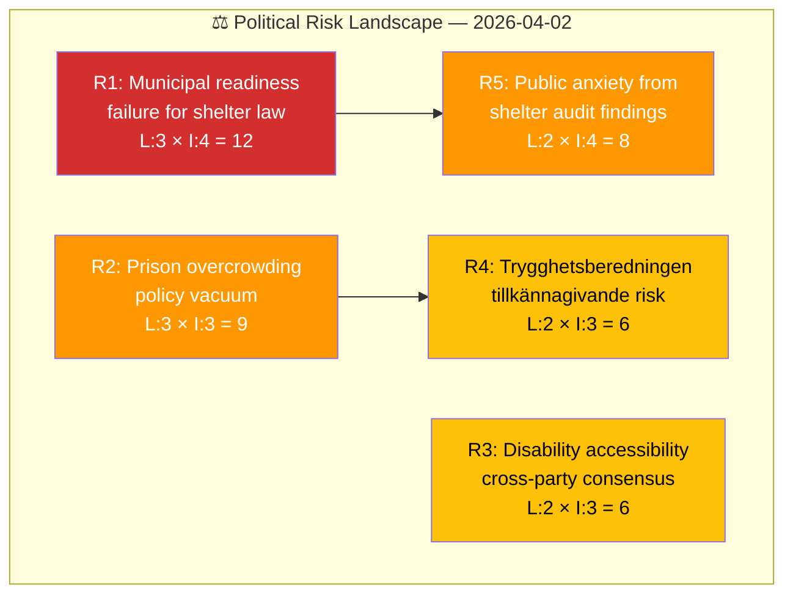
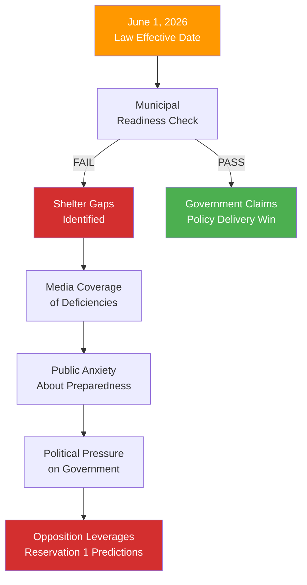

# ⚠️ Political Risk Assessment — Committee Reports

## 📋 Risk Context

| Field | Value |
|-------|-------|
| **Risk Assessment ID** | RSK-2026-04-02-CR01 |
| **Assessment Date** | 2026-04-03 04:53 UTC |
| **Assessment Period** | 2026-04-02 committee reports |
| **Produced By** | news-committee-reports |
| **Political Context** | M-KD-L minority government with SD supply-and-confidence agreement. Pending chamber votes on JuU15, FöU12. Civil defence reform and criminal justice policy in focus. |
| **Riksmöte** | 2025/26 |
| **Overall Risk Level** | MEDIUM |

---

## 🗂️ Risk Inventory

### Risk Heat Map

### Risk Register

| Risk ID | Risk Description | Source | Likelihood (1-5) | Impact (1-5) | L×I Score | Risk Level | Confidence |
|---------|-----------------|--------|:-----------------:|:------------:|:---------:|:----------:|:----------:|
| R1 | Municipal shelter readiness failure by June 1, 2026 | HD01FöU12 | 3 | 4 | 12 | HIGH | MEDIUM |
| R2 | Prison overcrowding escalation without policy response | HD01JuU15 | 3 | 3 | 9 | MEDIUM | MEDIUM |
| R3 | Disability accessibility becomes cross-party consensus forcing government concession | HD01FöU12 | 2 | 3 | 6 | MEDIUM | MEDIUM |
| R4 | Opposition forces tillkännagivande on Trygghetsberedningen implementation | HD01JuU15 | 2 | 3 | 6 | MEDIUM | MEDIUM |
| R5 | Public anxiety spike from shelter condition audits | HD01FöU12 | 2 | 4 | 8 | MEDIUM | LOW |

---

## 🔗 Cascading Risk Chain

---

## 🔮 Forward Indicators

| # | Indicator | Trigger | Timeline | Confidence |
|---|-----------|---------|----------|:----------:|
| 1 | MSB shelter inventory audit results | Agency publication | April-May 2026 | HIGH |
| 2 | Kriminalvården monthly occupancy statistics | Agency reporting | Monthly | HIGH |
| 3 | Chamber vote dynamics on FöU12 and JuU15 | Kammarens scheduling | 1-2 weeks | HIGH |
| 4 | Municipal budget allocation for shelter upgrades | Municipal council decisions | Q2 2026 | MEDIUM |

---

**Document Control:** Risk assessment generated 2026-04-03 04:53 UTC. Classification: PUBLIC.
