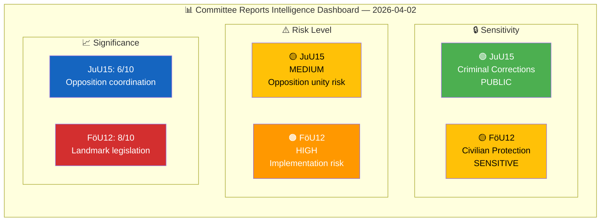
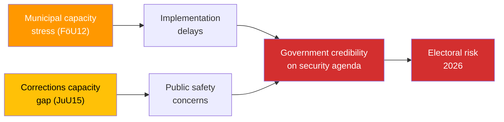

# 🧩 Political Intelligence Synthesis — Committee Reports

## 📋 Synthesis Context

| Field | Value |
|-------|-------|
| **Synthesis ID** | SYN-2026-04-02-CR01 |
| **Analysis Date** | 2026-04-03 04:52 UTC |
| **Documents Analyzed** | 2 |
| **Analysis Period** | 2026-04-02 committee reports |
| **Produced By** | news-committee-reports |
| **Overall Confidence** | MEDIUM |

---

## 📊 Intelligence Dashboard

---

## 🔑 Cross-Document Patterns

### Theme 1: Defence-Security Modernization Cluster

Both reports form part of the government's broader security modernization agenda. FöU12 directly implements Prop. 2025/26:142 on civilian protection, while JuU15 addresses criminal corrections infrastructure that is part of the government's "trygghet" (safety/security) narrative. The government is simultaneously expanding physical civilian shelter capacity (FöU12) and rejecting demands for expanded criminal corrections capacity (JuU15) — a prioritization signal: defence over criminal justice reform.

### Theme 2: Opposition Unity Patterns

Both reports feature joint S, V, C, MP reservations (8 in JuU15, 6 in FöU12), indicating sustained opposition coordination. Notably:
- **JuU15 Reservation 1** (S, V, C, MP jointly) on Trygghetsberedningen — full opposition unity
- **FöU12 Reservations 2-4** — V, C, and MP independently raise disability accessibility, suggesting genuine cross-party concern rather than coordinated opposition

### Theme 3: Implementation Capacity Stress

Both reports expose municipal/agency implementation capacity as a systemic concern:
- **FöU12**: June 1, 2026 deadline for shelter law — 2-month window for municipalities
- **JuU15**: Prison capacity constraints acknowledged but 76 reform motions rejected

---

## 🏆 Document Significance Ranking

| Rank | dok_id | Title | Score | Rationale |
|------|--------|-------|:-----:|-----------|
| 1 | HD01FöU12 | Stronger Protection for Civilians During Heightened Preparedness | 8/10 | Landmark legislation creating new civil defence framework; direct citizen and municipal impact; NATO context; June 2026 implementation deadline |
| 2 | HD01JuU15 | Criminal Corrections Issues | 6/10 | 76 motions rejected with 8 reservations; opposition unity on Trygghetsberedningen; signals policy delivery gap in corrections |

---

## 🔄 Aggregate SWOT

### Government Coalition — Combined Assessment

| Quadrant | Key Finding | Evidence |
|----------|-------------|----------|
| **Strengths** | Successfully advances major civil defence legislation while maintaining committee control on criminal justice | FöU12 endorsed; JuU15 all motions rejected |
| **Weaknesses** | Implementation capacity questionable — tight June 2026 deadline for FöU12; 76 unanswered corrections demands in JuU15 | FöU12 Reservation 1; JuU15 motion rejection |
| **Opportunities** | Civil protection law strengthens NATO credibility; security policy wins heading into 2026 election cycle | FöU12 modernization; broader defence investment narrative |
| **Threats** | Disability accessibility triple-flag (V, C, MP independently) could become cross-party consensus issue; corrections overcrowding risks | FöU12 Reservations 2-4; JuU15 capacity pressures |

---

## ⚠️ Risk Interconnections

---

## 🔮 Forward Intelligence

| # | What to Watch | Trigger | Timeline | Confidence |
|---|---------------|---------|----------|:----------:|
| 1 | Chamber votes on FöU12 and JuU15 — watch for roll-call dynamics | Kammarens scheduling | 1-2 weeks | HIGH |
| 2 | MSB shelter readiness reporting ahead of June 1 law effective date | MSB press release or riksdag inquiry | April-May 2026 | HIGH |
| 3 | Trygghetsberedningen final report — could reset criminal justice debate | SOU publication | Q2-Q3 2026 | MEDIUM |
| 4 | Kriminalvården monthly capacity statistics — approaching 100% occupancy? | BRÅ/Kriminalvården reporting | Monthly | HIGH |
| 5 | Related defence propositions: Prop. 2025/26:214 (cybersecurity), Prop. 2025/26:228 (arms export) | FöU committee processing | Q2 2026 | MEDIUM |

---

**Document Control:** Synthesis generated 2026-04-03 04:52 UTC by news-committee-reports. Classification: PUBLIC. Valid until 2026-04-16.
