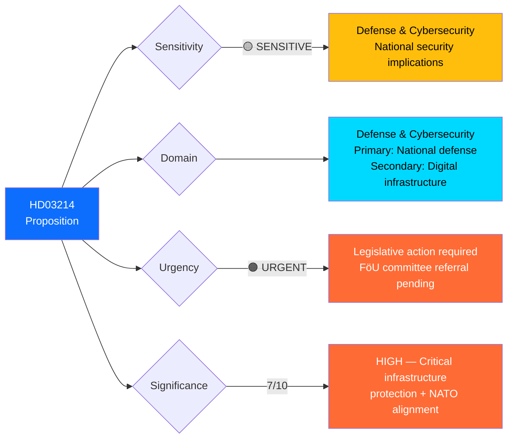

# 🏷️ Political Classification Results — Deep Inspection 2026-04-03

**Generated**: 2026-04-03 22:42 UTC (enriched from per-document analysis)
**Documents Analyzed**: 1
**Focus**: Prop. 2025/26:214 — National Cybersecurity Center
**Confidence**: HIGH

---

## 📊 Classification Decision Tree

---

## 📋 Document Classification Table

| dok_id | Title | Type | Sensitivity | Domain | Urgency | Significance | Coalition Impact |
|--------|-------|:----:|:-----------:|--------|:-------:|:------------:|:----------------:|
| `HD03214` | Lagändringar för ett stärkt nationellt cybersäkerhetscenter | Proposition | 🟡 SENSITIVE | Defense & Cybersecurity | 🟠 URGENT | **7/10** | Positive |

---

## 📊 Classification Details: HD03214

| Dimension | Assessment | Evidence | Confidence |
|-----------|------------|----------|:----------:|
| **Sensitivity** | SENSITIVE | National cybersecurity legislation with defense implications; not classified but sensitive | HIGH |
| **Primary Domain** | Defense & Cybersecurity | Strengthening National Cybersecurity Center through legislative framework | HIGH |
| **Secondary Domain** | Digital Infrastructure | Critical infrastructure protection, incident reporting requirements | HIGH |
| **Urgency** | URGENT | Pending FöU committee referral; legislative session timeline | MEDIUM |
| **Significance Score** | 7/10 | Critical infrastructure protection + NATO cyber defense alignment + cross-party consensus | HIGH |
| **Political Temperature** | WARM | Consensus area — limited debate expected | HIGH |
| **Coalition Impact** | Positive | Demonstrates government defense reform agenda coherence | HIGH |
| **Opposition Relevance** | Low | Cybersecurity is largely non-partisan; minor privacy debate from V/MP | HIGH |

---

## 🏛️ Policy Domain Mapping

| Domain | Primary/Secondary | Committee | Minister |
|--------|:-----------------:|-----------|---------|
| Defense & Cybersecurity | Primary | FöU (Försvarsutskottet) | Carl-Oskar Bohlin (M) |
| Digital Infrastructure | Secondary | TU (Trafikutskottet) overlap | — |
| National Security | Context | JuU (Justitieutskottet) overlap | — |

---

## Data Quality Notes

Classification based on per-document analysis of `HD03214` (Prop. 2025/26:214). Policy domain inference follows the Riksdag committee mapping protocol. **[HIGH confidence]**
