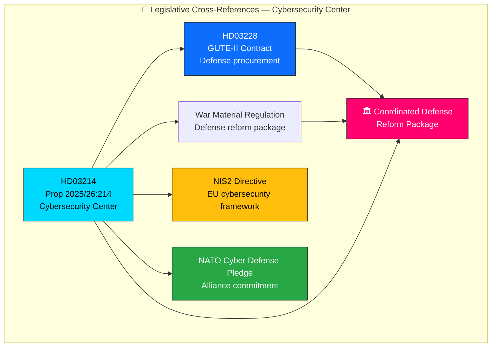

# 🔗 Cross-Reference Map — Deep Inspection 2026-04-03

**Generated**: 2026-04-03 22:42 UTC (enriched from per-document analysis)
**Documents Analyzed**: 1
**Focus**: Prop. 2025/26:214 — National Cybersecurity Center
**Confidence**: HIGH

---

## 📊 Cross-Reference Network

---

## 📋 Cross-Document Relationships

| Source | Target | Relationship Type | Evidence | Confidence |
|--------|--------|:-----------------:|----------|:----------:|
| `HD03214` | `HD03228` | **Policy Package** | Both part of coordinated defense reform package | HIGH |
| `HD03214` | War Material Regulation | **Policy Package** | Defense reform coordination, same legislative session | HIGH |
| `HD03214` | NIS2 Directive | **EU Compliance** | Cybersecurity center legislation aligns with EU NIS2 implementation requirements | MEDIUM |
| `HD03214` | NATO Cyber Defense Pledge | **Alliance Commitment** | Demonstrates compliance with NATO cyber defense commitments | HIGH |

---

## 📊 Relationship Summary

| Metric | Value |
|--------|:-----:|
| **Total Cross-References** | 4 |
| **Policy Package Links** | 2 |
| **EU/International Links** | 2 |
| **Intra-Parliamentary Links** | 1 (FöU committee referral chain) |

---

## 🔮 Predicted Future Cross-References

| Expected Document | Type | Timeline | Basis | Confidence |
|-------------------|------|----------|-------|:----------:|
| FöU committee report on HD03214 | Committee Report | Q2-Q3 2026 | Standard legislative process | HIGH |
| FRA/MSB coordination framework | Agency agreement | Q2 2026 | Implementation requirement | MEDIUM |
| Autumn budget cybersecurity allocation | Budget proposition | Q4 2026 | Funding for expanded mandate | MEDIUM |

---

## Data Quality Notes

Cross-reference mapping based on per-document analysis of `HD03214` (Prop. 2025/26:214). Policy package relationships identified from coordinated defense reform context. EU/International links based on policy alignment analysis. **[HIGH confidence]**
